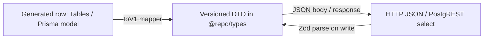

# API versioning and shared DTOs

Status: **Plan**  
Last updated: 2026-08-16 (composition-root prerequisite)  
Scope: `@repo/types`, `apps/api` HTTP contract, `apps/web` RSC + client fetches

How Alice should version the Express API and keep **one contract** (DTOs + Zod) for mutations, route handlers, and Next.js Supabase reads — without putting RSC list pages behind an extra HTTP hop.

Related:

- [TRD.md](./TRD.md) — app boundaries (RSC reads vs Express mutations)
- [DI.md](./DI.md) — composition root in `apps/api` (**prerequisite** for versioning)
- [DATABASE.md](../guides/DATABASE.md) — `Tables<>` vs Prisma; web must not import `@repo/db`
- [PERFORMANCE.md](../guides/PERFORMANCE.md) — why RSC still talks to Supabase directly
- Allowlist (already schema-first in types): [ACCESS_ALLOWLIST.md](../features/access/ACCESS_ALLOWLIST.md)
- [SONAR.md](../guides/SONAR.md) — duplication gate on copied v1/v2 modules

---

## Prerequisite — finish the composition root (step 1)

Do **not** mount `/api/v1` / `/api/v2` until every product domain is wired through `apps/api/src/config/composition.ts` the way work-items, sprints, and chat already are ([DI.md](./DI.md)).

Today `routing.ts` still default-imports singleton routers for attachments, comments, notifications, profile, projects, teams, users, access allowlist, and saved views. Versioning on that graph forces a second copy of `export const usersService = new UsersService()` (or a second file that imports the first). SonarCloud flags that as duplicated blocks; it also makes v2 accidentally hold a **second** Prisma/Supabase client.

### Why the composition root is the versioning switchboard

The root builds **one** repository and **one** shared domain service per process, then hands them into **versioned route factories**:

```text
composition.ts
  usersRepository     × 1
  usersService        × 1   ← shared use-case (or usersServiceV2 only if rules change)
  createUsersV1Router(usersService)
  createUsersV2Router(usersService | usersServiceV2)
routing.ts
  /api/users      → users.v1Router   (alias)
  /api/v1/users   → users.v1Router
  /api/v2/users   → users.v2Router
```

Without that:

- v2 authors copy `users.route.ts` + `users.service.ts` + `users.repository.ts` to a `v2/` folder (Sonar duplication, two query implementations).
- Cross-domain calls (chat → work items) cannot inject “the” work-item service into both API versions.
- Tests cannot stub one service and mount v1 and v2 routers against it.

With it, versioning is extra **factories and mounts**, not extra persistence.

### Sonar: how we avoid duplicated v1/v2 code

Sonar’s duplication metric (and the pre-commit [prescan](../guides/SONAR.md)) will fail a PR that pastes a 40-line handler into `users.v2.route.ts`. Use the composition root plus these rules:

| Mechanism                             | What to do                                                                           | What not to do                                                         |
| ------------------------------------- | ------------------------------------------------------------------------------------ | ---------------------------------------------------------------------- |
| **One repo, one (or two) services**   | `new UsersRepository(db)` once in `createUsersConfig()`; inject into v1 and v2       | `UsersRepositoryV1` / `V2` with the same `findMany`                    |
| **Route factories, not copied files** | `createUsersRouter({ service, toDto, bodySchema })` parameterized by version         | Copy-paste `users.route.ts` → `users.v2.route.ts` with renamed symbols |
| **Shared HTTP helpers**               | Status mapping, lock errors, pagination parse in one module; both versions import it | Duplicate `try/catch` + `res.status(409)` blocks in each version       |
| **DTOs / mappers in `@repo/types`**   | `toUserV1` / `toUserV2` next to schemas                                              | Inline `const dto = { id: row.id, … }` twice in two routers            |
| **Alias, don’t clone, for v1**        | Mount the **same** `v1Router` at `/api` and `/api/v1`                                | Two routers that differ only by mount path                             |

Threshold reminder: ≥10 duplicated lines / ~100 identical tokens is what Sonar treats as a clone. A v2 route that only swaps schema + mapper should stay well under that if factories exist.

**Done when:** every `routing.ts` `app.use('/api/…')` comes from `composition.ts` (no remaining `import xRouter from '../routes/api/…/x.route'` default singleton), matching the [DI migration checklist](./DI.md#5-migration-checklist-next-domain). Then start DTO folders and `/api/v1`.

---

## 1. Recommendation: schema-first dual export

**Best approach for Alice:** one Zod schema is the source of truth; TypeScript DTOs are **`z.infer`** of that schema. Export both from `@repo/types`.

```ts
export const createUserBodySchema = z.object({/* … */});
export type CreateUserBody = z.infer<typeof createUserBodySchema>;
```

That is a dual export, not two sources. Do **not** hand-write `CreateUserInput` in `apps/web` and a second Zod object in `apps/api` — they will drift (this already happens for users: `createUserSchema` lives in `@repo/types`, while `users.service.base.ts` redeclares `CreateUserInput`).

| Approach                              | Use?              | Why                                                                   |
| ------------------------------------- | ----------------- | --------------------------------------------------------------------- |
| Zod schema + `z.infer` (schema-first) | **Yes — default** | Runtime parse and compile-time types cannot disagree                  |
| Hand-written `type` + matching Zod    | No                | Duplicate contract; the type is usually wrong first                   |
| `Tables<'x'>` as the public API       | No                | Leaks columns (tokens, internal flags); couples clients to migrations |
| Zod `.parse` on every RSC list row    | No (hot path)     | Extra CPU on large pages; use a typed mapper instead                  |

`@repo/types` already depends on Zod 4. Web and API already import it. Putting input schemas there does not add a new runtime.

---

## 2. Layering: row vs DTO vs wire

Keep three names distinct:



| Layer        | Owner                          | Example                                      |
| ------------ | ------------------------------ | -------------------------------------------- |
| Generated DB | `pnpm db generate`             | `Tables<'work_items'>`, Prisma `work_items`  |
| **v1 DTO**   | `@repo/types` (`src/api/v1/…`) | `WorkItemListItemV1`, `CreateWorkItemBodyV1` |
| Transport    | Express JSON or PostgREST      | Same shape as the DTO after mapping          |

**Rules**

1. Clients (web UI, future `/api/v1` consumers) depend on **DTOs**, not generated tables.
2. Generated types are allowed **inside mappers** (`toWorkItemListItemV1(row: Tables<'work_items'>): WorkItemListItemV1`).
3. DTOs **omit** secrets and write-only fields (Jira/GitHub tokens, service-role-only columns).
4. RSC selects only the columns the DTO needs (existing `USER_PROJECTION` / list-select pattern). The mapper is the last line of defense if the select is too wide.

---

## 3. Where Zod runs (and where it does not)

Trust boundary is the **API process**, not the browser.

| Place                                 | Zod?                               | Notes                                                           |
| ------------------------------------- | ---------------------------------- | --------------------------------------------------------------- |
| Express route (body / query / params) | **Always** `safeParse`             | Never skip because the form already validated                   |
| Next forms / client                   | Same **input** schema `safeParse`  | UX only; still re-parse on the API                              |
| RSC supabase-js reads                 | **No** full Zod parse of lists     | `toXxxV1(row)` + TypeScript; optional `safeParse` in unit tests |
| Browser → Express mutations           | Types from `z.infer`; parse on API | `apiFetch<ResponseDTO<WorkItemV1>>`                             |
| Env / infra                           | Stay in `apps/*/env.ts`            | Not product DTOs                                                |

HTTP-only extras (path `id`, `If-Match` / `expected_updated_at` already in `@repo/types`) can live as small schema **extends** in the route file:

```ts
const createUserRequestSchema = createUserBodySchema.extend({
  redirectTo: z.url(),
});
```

Keep that extend in `apps/api` when the field is not part of the public resource DTO.

---

## 4. Input vs output DTOs

**Inputs (writes):** Zod-first. Create / update / lock / query-string filters.

**Outputs (reads):** Type + mapper first. Add a Zod object only when we need:

- a documented OpenAPI-style contract, or
- a test that fixtures match v1, or
- a breaking v2 reshape.

Do not require `workItemListItemV1Schema.parse(row)` on every `/work-items` RSC load.

Shared envelope stays `ResponseDTO<T>` in `@repo/types/connection` until versioning replaces it with a v1 error shape (optional later: `{ data, error: { code, message } }`).

---

## 5. Cleaning the API with DTOs

Target route handler:

1. Parse wire JSON with the shared schema → typed body.
2. Call the **version’s** application service (see §5.1) with that DTO — no `req.body` leaking inward.
3. Map persistence result → **output** DTO for that version.
4. `res.json` the DTO (or `ResponseDTO`).

Repositories stay unversioned (one database). Routes are always part of the public version. Services fork only when behavior changes, not whenever JSON keys change.

Existing good examples to copy:

- `packages/types/src/access-allowlist.ts` — create/update schemas + `z.infer`
- `packages/types/src/users.ts` / `projects.ts` — create schemas already in types; API re-exports from `*.schemas.ts`
- `packages/types/src/users.ts` `USER_PROJECTION` — select lists aligned with a DTO-sized row

Existing debt to retire as we touch domains:

- Duplicate hand-written inputs (`CreateUserInput` in web vs `createUserSchema`)
- Fat Zod files only in `apps/api/.../*.schemas.ts` (work items, comments, sprints, attachments, saved views, profile)
- Returning whole `Tables<'x'>` from `apiFetch` / RSC services

### 5.1 What is versioned (not only the data model)

Versioning is the **public API**: URL, headers, status codes, DTOs, **and** any behavior those clients rely on. The database is usually **not** versioned in parallel (one schema, additive migrations).

| Layer                     | Version when…                                                                                                        | Share across v1/v2 when…                                                   |
| ------------------------- | -------------------------------------------------------------------------------------------------------------------- | -------------------------------------------------------------------------- |
| **DTOs / Zod**            | Field rename, drop, reshape, new required input                                                                      | Additive optional fields on the same version                               |
| **Routes**                | Path, method, query, status, error envelope, or which use-case they call                                             | Same handler mounted at `/api` and `/api/v1` only as a **temporary alias** |
| **Services**              | Orchestration or rules change for that version (e.g. v2 invite no longer emails; v2 list pagination is cursor-based) | Identical use-case; only the wire shape changed (map in the route)         |
| **Repositories / Prisma** | Almost never — persistence is one model                                                                              | Always, unless a version needs a genuinely different store                 |

```text
/api/v1/users  →  usersV1Router  →  parse UserV1  →  userService (shared)  →  toUserV1
/api/v2/users  →  usersV2Router  →  parse UserV2  →  userServiceV2 or shared + toUserV2
                                                      └── same userRepository
```

**Default (most “v2” work):** new **route** + new DTOs + mappers; **keep** the domain service. Example: v1 returns `assignee_id`; v2 returns nested `assignee: { id, name }`. Same `listUsers` service, different `toUserV*`.

**Fork the service** when the _meaning_ of the operation changes, not just JSON keys:

- v1 `DELETE` hard-deletes; v2 archives
- v1 page/limit; v2 cursor
- v1 create user always invites; v2 create is dry-run unless `sendInvite: true`
- v2 drops an endpoint or splits one resource into two

Then: `users.v2.service.ts` (or a versioned facade) still uses the **same repository**. Do not copy Prisma queries per version.

**Fork the route even when the service is shared.** `/api/v1/...` and `/api/v2/...` are different public contracts. Aliasing unversioned `/api/...` to v1 is compatibility, not “routes are unversioned.”

Anti-pattern: `WorkItemServiceV1` and `WorkItemServiceV2` that both run the same `prisma.work_items.findMany`. That is DTO mapping wearing a service costume.

---

## 6. Next.js / RSC usage (no extra hop)

RSC keeps reading Supabase directly ([PERFORMANCE.md](../guides/PERFORMANCE.md) §2.4). Versioning does **not** mean `fetch(NEXT_PUBLIC_API_URL + '/v1/...')` from the server component.

```text
RSC:  supabase select → toWorkItemListItemV1[] → page props
Web:  POST /api/v1/work-items  (Express) with CreateWorkItemBodyV1
```

Same DTO type on both sides. Client mutation services import `CreateWorkItemBodyV1` from `@repo/types`, not a local interface.

---

## 7. URL versioning (`apps/api`)

Plan: **URI prefix**, additive.

| Today            | Target v1                                                                       |
| ---------------- | ------------------------------------------------------------------------------- |
| `/api/workItems` | `/api/v1/work-items` (or keep camelCase in v1 and fix in v2 — decide per slice) |
| `/api/users`     | `/api/v1/users`                                                                 |

Mount in `routing.ts`:

```ts
routesConfig.use('/api/v1/users', usersV1Router);
```

v1 period: keep **unversioned** `/api/...` as aliases of the **v1 routers** (deprecation header optional). Remove aliases only when no in-repo client uses them. v2 gets its own routers; do not point `/api/v2` at v1 handlers.

Do **not** version Next `app/api/*` for product CRUD. Express remains the HTTP API ([TRD](./TRD.md)).

---

## 8. Proposed package layout

```text
packages/types/src/
  api/
    v1/
      index.ts          # re-export v1 DTOs
      users.ts
      work-items.ts
      …
    mappers/            # or colocated toXxxV1 next to schemas
  generated/            # unchanged; not a public app import for UI
```

Export from `packages/types/src/index.ts` as `export * from './api/v1/index.js'` once a domain is ready — or a subpath `@repo/types/api/v1` to keep the root barrel smaller.

File recipe (per resource):

```ts
// Input
export const createWorkItemBodyV1Schema = z.object({/* */});
export type CreateWorkItemBodyV1 = z.infer<typeof createWorkItemBodyV1Schema>;

// Output (type + mapper; optional schema for tests)
export type WorkItemListItemV1 = { /* pick/omit */ };
export function toWorkItemListItemV1(
  row: Tables<'work_items'>
): WorkItemListItemV1 {
  /* */
}
```

Utility types (`Partial`, `Pick`) on inferred inputs are fine for PATCH (`updateXSchema = createXSchema.partial()`), as `createProjectSchema` already does.

---

## 9. Compatibility and v2

- **v1 additive:** new optional fields are OK; renaming/removing is a new version.
- **v2:** new module `api/v2/` **and** `/api/v2/...` routers. v1 schemas and v1 routes stay until sunset.
- Mappers can fork: `toWorkItemListItemV2` may hide fields v1 still exposes.
- Add `*.v2.service.ts` only for the operations whose rules changed; leave the rest on the shared service.

---

## 10. Rollout

| Step  | Work                                                                                                                           | Status      |
| ----- | ------------------------------------------------------------------------------------------------------------------------------ | ----------- |
| 0     | This plan                                                                                                                      | **Now**     |
| **1** | **Prerequisite:** finish composition-root wiring for remaining API domains ([DI.md](./DI.md))                                  | Not started |
| 2     | Folder `packages/types/src/api/v1/` + export policy                                                                            | After 1     |
| 3     | Pilot: **users** — delete web `CreateUserInput`; use `z.infer`; mapper for list/detail; `createUsersV1Router` from composition | After 1–2   |
| 4     | Pilot: **access allowlist** — already schema-first; add output DTOs + `/api/v1` alias                                          | After 1     |
| 5     | Work items — move `workItems.schemas.ts` into types; RSC list uses list DTO (router already composed)                          | After 1–2   |
| 6     | Remaining domains’ DTOs as each is touched                                                                                     | After 1     |
| 7     | Mount `/api/v1` (and later `/api/v2`) from composition exports; deprecate unversioned paths                                    | After 3–5   |
| 8     | Mark this doc **Living**                                                                                                       | After 7     |

Step 1 is a **gate**: do not introduce versioned URLs while domains still self-construct services. Pilot order after that: users + allowlist (schemas already in types) before work items (largest Zod file).

---

## 11. Testing

- Unit-test schemas in `packages/types` or existing API tests; one parse fixture per write DTO.
- Web form tests keep using the **same** schema (allowlist form already does).
- Mapper tests: a `Tables` fixture → DTO has no token fields and stable keys.
- Do not add Zod parse to Cypress for list pages.

---

## 12. Non-goals (v1 of this plan)

- OpenAPI generation (can follow once schemas live in `api/v1`)
- Moving Express into Next Route Handlers
- Validating every RSC row with Zod
- Breaking URL changes without aliases
- Versioned routes while domains still use module-level `new XService()` singletons (complete [composition root](./DI.md) first)
