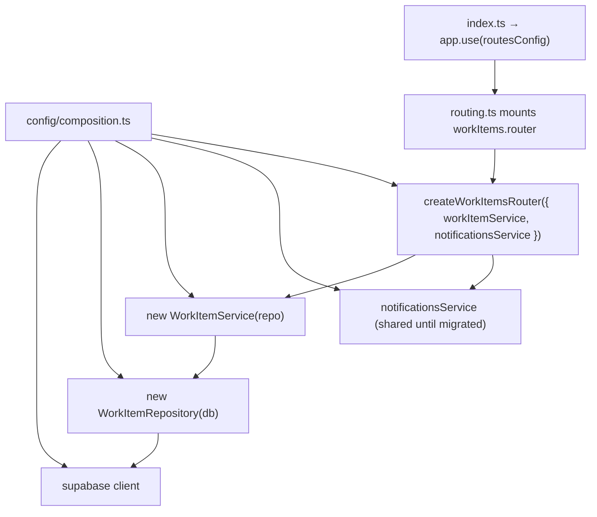

# API dependency injection (composition root)

**Status:** Plan (Living for work-items, sprints, and chat slices)  
**Scope:** `apps/api` only — Express routers, services, repositories  
**Last updated:** August 10, 2026

Related: [TRD.md](./TRD.md), [API_VERSIONING.md](./API_VERSIONING.md) (shared DTOs / `/api/v1`).

## 1. Why

Today most API domains wire themselves with **module-level singletons**:

```ts
export const workItemRepository = new WorkItemRepository();
export const workItemService = new WorkItemService();
// route imports workItemService at module load
```

That works for a single process and is fine while services stay **stateless**. It becomes brittle when we want to:

- Unit-test a route/service with fakes (without mocking the module graph)
- Swap clients (e.g. Supabase) at the edge of the process
- Self-host or run multiple workers with a clear boot boundary
- Avoid accidentally parking request/session state on a shared instance

We are not introducing Nest, Inversify, or a DI container. The pattern is **manual composition root + constructor injection**.

## 2. Principles

1. **Composition root** — `apps/api/src/config/composition.ts` builds domain graphs once per process; `routing.ts` mounts them; `index.ts` stays thin.
2. **Constructor injection** — repositories take `db`; services take repositories; routers take services via a factory.
3. **Process singletons are intentional** — shared HTTP clients (`supabase`, `authClient`) and the built service graph live once per process. They must remain **stateless** (no request Maps, no session fields).
4. **No per-request services** — do not `new WorkItemService()` inside handlers.
5. **Migrate by slice** — convert one domain at a time; other routes may keep module singletons until touched. **All product domains must be composed before API URL versioning** ([API_VERSIONING.md](./API_VERSIONING.md) prerequisite).
6. **Narrow deps** — prefer `Pick<Service, 'method'>` (or a small interface) at the router boundary so tests can pass stubs.

## 3. Target shape



| Layer                   | Responsibility                         | Receives                          |
| ----------------------- | -------------------------------------- | --------------------------------- |
| Repository              | Supabase / data access                 | `SupabaseClient<Database>`        |
| Service                 | Domain orchestration                   | Repository instance(s)            |
| Route factory           | HTTP, validation, status codes         | Service(s) (+ cross-cutting deps) |
| `config/composition.ts` | Wire domains; export injection configs | Shared clients + peer services    |
| `config/routing.ts`     | Mount routers; export `routesConfig`   | Composed routers from composition |
| `index.ts`              | Middleware + `app.use(routesConfig)`   | —                                 |

## 4. Migrated slices (reference)

### Work-items (first)

| Piece            | Path                                                                             |
| ---------------- | -------------------------------------------------------------------------------- |
| Repository       | `apps/api/src/routes/api/workItems/workItems.repository.ts`                      |
| Service          | `apps/api/src/routes/api/workItems/workItems.service.ts`                         |
| Route factory    | `apps/api/src/routes/api/workItems/workItems.route.ts` → `createWorkItemsRouter` |
| Injection config | `apps/api/src/config/composition.ts` → `workItems`                               |
| Route mount      | `apps/api/src/config/routing.ts` → `workItems.router`                            |
| Boot             | `apps/api/src/index.ts` → `app.use(routesConfig)`                                |

Notifications stay on the existing module singleton for now; the work-items router **receives** it so assign side-effects remain testable without rewriting notifications.

### Sprints

| Piece            | Path                                                                      |
| ---------------- | ------------------------------------------------------------------------- |
| Repositories     | `sprints.repository.ts` (`SprintsRepository`, `SprintBurndownRepository`) |
| Services         | `sprints.service.ts`                                                      |
| Route factory    | `createSprintsRouter`                                                     |
| Injection config | `composition.ts` → `sprints`                                              |
| Route mount      | `routing.ts` → `sprints.router`                                           |

### Chat

| Piece            | Path                                                           |
| ---------------- | -------------------------------------------------------------- |
| Repository       | `apps/api/src/routes/api/chat/chat.repository.ts`              |
| Service          | `apps/api/src/routes/api/chat/chat.service.ts` → `ChatService` |
| Route factory    | `createChatRouter`                                             |
| Injection config | `composition.ts` → `chat`                                      |
| Route mount      | `routing.ts` → `chat.router`                                   |

Chat receives `workItemService` and `sprintsService` from the composition root for tool mutations (avoids importing `composition.ts` from the service). Projects create/list still use the projects module singletons until that domain is migrated. Pure helpers (`chatHistoryToMarkdown`, `markdownToChatHistory`, `sanitizeLog`) stay module-level.

## 5. Migration checklist (next domain)

When converting e.g. projects or attachments:

1. Add a constructor to the repository (`db: SupabaseClient<Database>`).
2. Add a constructor to the service (inject repository).
3. Replace `export default router` with `createXRouter(deps)`.
4. Add a `createXConfig()` + export (e.g. `projects`) in `config/composition.ts`.
5. Mount `x.router` from `routing.ts` instead of the old default import.
6. Remove bottom-of-file `export const xService = new …` once nothing imports it.
7. Leave unrelated domains on singletons.

### Do not in the first pass for a domain

- Per-request service creation
- Injecting Zod schemas / pure helpers
- Rewriting every cross-domain dependency in the same PR (pass existing singletons)
- Changing `apps/web` — this is API-only

## 6. Testing sketch

```ts
const fakeRepo = { getById: async () => ({ id: '…' /* … */ }) };
const workItemService = new WorkItemService(fakeRepo as WorkItemRepository);
const notificationsService = {
  createAssignNotification: async () => {},
};
const router = createWorkItemsRouter({ workItemService, notificationsService });
// mount on a test Express app and assert status / body
```

## 7. Multi-instance note

Process singletons are safe across multiple hosts **only if they hold no in-memory business state**. Prefer Postgres / Redis for anything that must be shared. DI makes the boot graph explicit; it does not by itself make stateful singletons safe.

## Related

- [TRD.md](./TRD.md) — system architecture
- [INFRASTRUCTURE.md](../guides/INFRASTRUCTURE.md) — hosting notes
