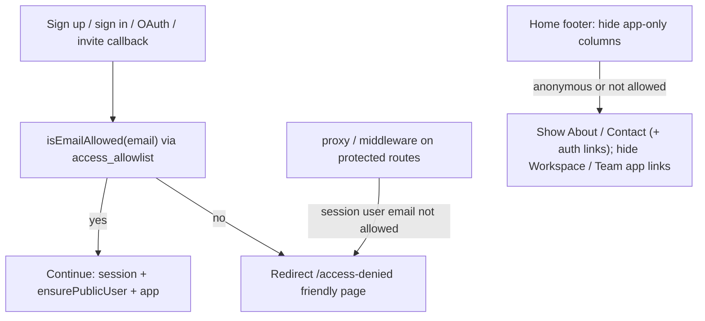
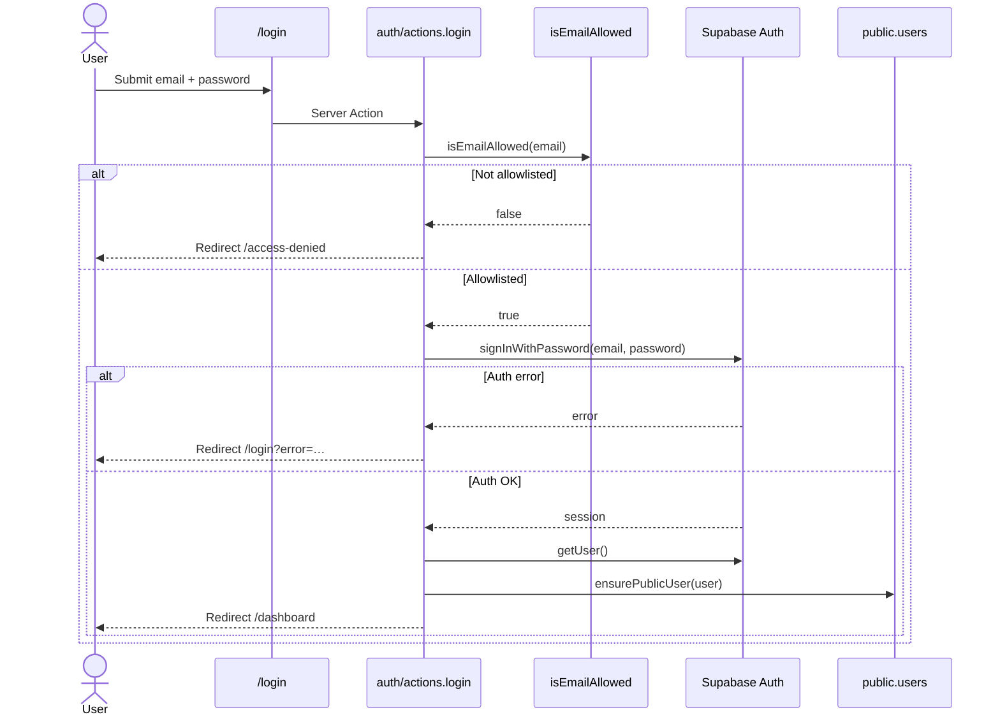
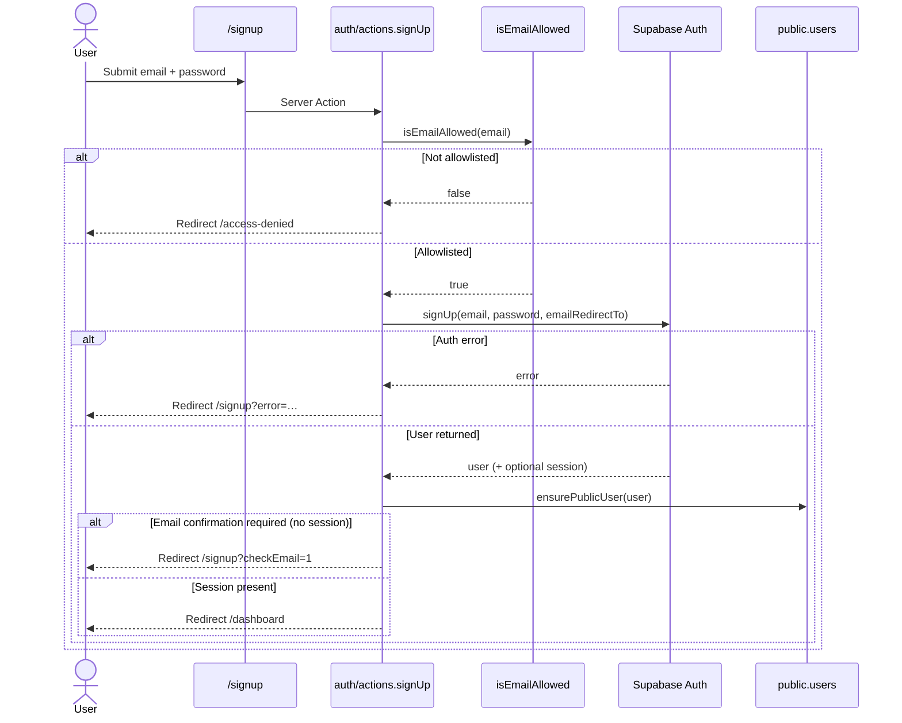
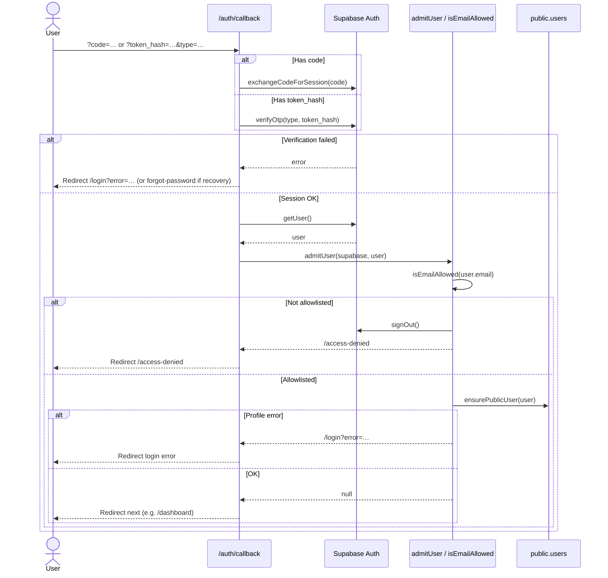
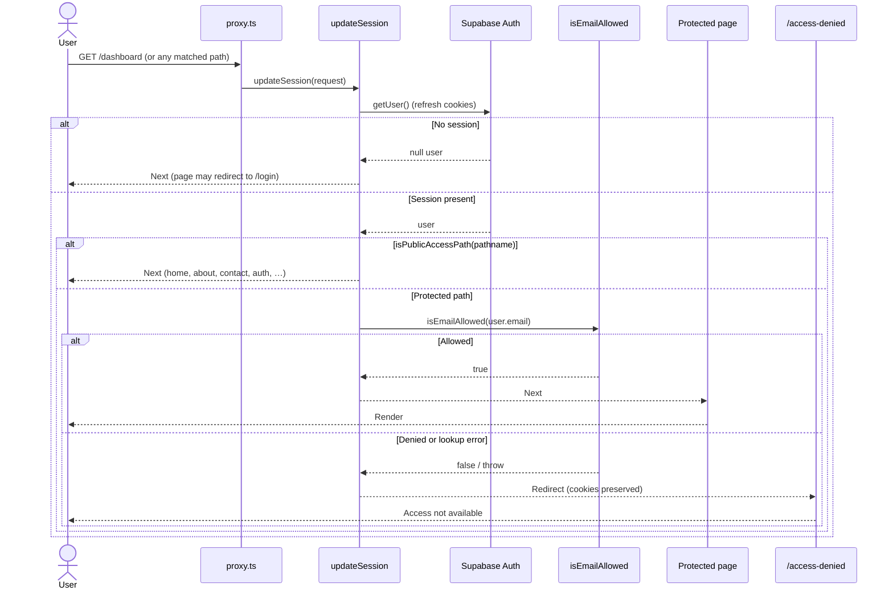
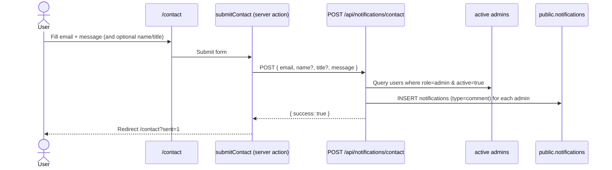

# Email domain & allowlist access gate

Status: **Living**

Restrict who can use Alice to approved company email domains, plus optional
exact-email exceptions (external clients / specially allowed users). Unapproved
identities get a friendly access-denied page; product URLs stay gated; home
footer hides app-only links for those users.

Related:

- Auth: [AUTHENTICATION.md](../../auth/AUTHENTICATION.md)
- RBAC (roles after admission): [RBAC_AUTHORIZATION_SKELETON.md](../../auth/RBAC_AUTHORIZATION_SKELETON.md)
- Users registry: [USER_MANAGEMENT.md](../users/USER_MANAGEMENT.md)
- Notifications inbox: dashboard notifications + `notifications` table
- Home footer: `apps/web/app/_components/home/home-footer.tsx`
- Auth callback: `apps/web/app/auth/callback/route.ts`
- Session proxy: `apps/web/proxy.ts` → `lib/supabase/middleware.ts`

---

## Goals

- Only emails matching an **approved domain** or an **exact allowlisted email**
  may complete sign-up / sign-in and use the app.
- Support time-boxed access via `expires_at` (null = no expiry).
- Deny everywhere meaningful: auth callback, middleware/proxy for protected
  routes, and hide privileged home-footer links for disallowed users.
- Public marketing/support surfaces stay reachable: `/`, `/about`, `/contact`
  (and auth pages as needed to complete or explain denial).
- Contact / access-request path notifies admins in-app via `/contact`
  (`POST /api/notifications/contact`).

## Non-goals (v1)

- Full multi-tenant “organization” product model (teams, billing, org switcher)
- Supabase Auth Hook / Edge Function as the only gate (app gate is primary;
  Auth hooks optional later)
- Auto-provisioning of allowlist from SSO IdP
- Blocking at DNS / email-provider level
- Replacing RBAC — this is **admission**; roles still apply after admission

---

## Naming: not `organizations`

**Avoid `organizations`.** In this product that name implies tenants, membership,
and org settings. This feature is an **admission allowlist** (domains + emails),
including one-off external addresses that are not “an organization.”

| Candidate               | Verdict                                             |
| ----------------------- | --------------------------------------------------- |
| `organizations`         | Reject — overloaded; poor fit for email exceptions  |
| `allowed_domains` alone | Incomplete — no exact-email rows                    |
| `access_allowlist`      | **Preferred** — clear purpose; one table, two kinds |
| `email_allowlist`       | Good alternative if we want email-centric naming    |
| `login_allowlist`       | OK; slightly narrower than “app access”             |

**Locked recommendation:** table `access_allowlist` (Prisma model
`access_allowlist` / `AccessAllowlist`).

Each row is either a **domain** rule or an **email** rule.

---

## Proposed schema

```text
access_allowlist
  id            UUID PK
  kind          enum: domain | email
  value         text  -- domain: "acme.com" | email: "client@partner.com"
  label         text? -- optional display note ("Acme corp", "Pilot client")
  expires_at    timestamptz?  -- null = never expires
  status        RecordStatus  -- active | inactive | archived | deleted
  created_by    UUID?
  created_at    timestamptz
  updated_by    UUID?
  updated_at    timestamptz
```

Constraints / indexes:

- Unique `(kind, lower(value))` among `status = active` (or unique on
  `kind + lower(value)` and treat inactive as soft-disable)
- Normalize: store domains and emails **lowercase**, strip leading `@` on domains
- Check: `kind = email` ⇒ `value` looks like an email; `kind = domain` ⇒ no `@`

### Match rules

Given login email `user@SomeOrgName.com` (normalize to lowercase):

1. Ignore rows where `status != active` or (`expires_at` is set and `expires_at <= now()`).
2. **Allow** if any `kind = email` row has `value = user@someorgname.com`.
3. **Allow** if any `kind = domain` row has `value = someorgname.com`
   (exact domain match on the part after `@`; no parent-domain guessing in v1
   unless we later add explicit subdomain rows).
4. Otherwise **deny**.

Examples that must work:

| Allowlist row                           | Login                  | Result                            |
| --------------------------------------- | ---------------------- | --------------------------------- |
| domain `someorgname.com`                | `****@someOrgName.com` | Allow                             |
| email `theGuy123@someOrgName.com`       | same                   | Allow (even if domain not listed) |
| email `theGirl321@someOtherOrgName.com` | same                   | Allow                             |
| domain `acme.com` only                  | `outsider@gmail.com`   | Deny                              |

---

## Enforcement points



### 1. Auth entry (sign up / sign in / callback) — **implemented**

Shared gate: `isEmailAllowed` in `apps/web/lib/access-allowlist.ts`.
Wired in `apps/web/app/auth/actions.ts` and `apps/web/app/auth/callback/route.ts`.

- **Email/password sign-up**: check **before** `supabase.auth.signUp` so no Auth
  user is created for denied emails. Deny → `/access-denied`.
- **Email/password sign-in**: check **before** `signInWithPassword` so no session
  is established for denied emails. Deny → `/access-denied`.
- **OAuth / invite / email confirm**: in `/auth/callback`, after
  `exchangeCodeForSession` / `verifyOtp` and `getUser()`, `admitUser` runs
  allowlist **before** `ensurePublicUser`. Deny → `signOut` + `/access-denied`.

#### Sign-in sequence



#### Sign-up sequence



#### Auth callback sequence (OAuth / invite / confirm)



### 2. Global redirect for protected URLs — **implemented**

Any deep link (`/dashboard`, `/work-items`, …) for a **signed-in** but **not
allowlisted** user (or expired row) redirects to `/access-denied`.

Implemented in `apps/web/lib/supabase/middleware.ts` (`updateSession`, called
from `proxy.ts`):

- `isPublicAccessPath(pathname)` in `apps/web/lib/access-allowlist.ts`
- **Public (no admission required):**
  `/`, `/about`, `/contact`, `/login`, `/signup`, `/forgot-password`,
  `/reset-password`, `/access-denied`, and everything under `/auth/*`
- **Protected:** everything else — when a session user exists, run
  `isEmailAllowed`; on deny (or lookup failure), redirect to `/access-denied`
  while preserving refreshed session cookies
- **Anonymous** on protected paths: pass through (pages still redirect to
  `/login` as today)

`/reset-password` stays public so invite/recovery can finish after callback
admission (callback already gates allowlist before sending users there).

#### Middleware sequence



### 3. Friendly access-denied page — **implemented**

Route: `/access-denied` (`apps/web/app/access-denied/page.tsx`).

- Short explanation (“Your email isn’t approved for this workspace yet.”)
- Primary CTA: **Contact admin** → `/contact`
- Secondary: **Back to home** → `/`
- If a session exists: **Sign out** (clears cookies via `auth/actions.signOut`)
- If anonymous: link to **Sign in**

### 4. Home footer — **implemented**

`apps/web/app/_components/home/home-footer.tsx` accepts `showAppLinks`.
The home page (`app/page.tsx`) sets it via `isEmailAllowed(user.email)` when
signed in.

| Column                            | Anonymous / not allowlisted | Allowlisted signed-in |
| --------------------------------- | --------------------------- | --------------------- |
| Workspace (dashboard, board, …)   | **Hidden**                  | Shown                 |
| Team (users, manager, …)          | **Hidden**                  | Shown                 |
| Account (login / signup / forgot) | Shown                       | Shown                 |
| Company (about, contact)          | Shown                       | Shown                 |

---

## Access requests (open discussion)

How admins learn someone needs access is **not locked**. Candidates:

| Option                                  | Flow                                                           | Pros                         | Cons                           |
| --------------------------------------- | -------------------------------------------------------------- | ---------------------------- | ------------------------------ |
| **A. Contact → admin notification**     | Contact form writes `notifications` (or mail) to admins        | Fits “about/contact allowed” | Need admin user ids; spam risk |
| **B. Dedicated request on denied page** | Form stores `access_requests` table; admins review in Users UI | Clear audit trail            | More schema/UI                 |
| **C. Manual only**                      | User emails admin outside app; admin inserts allowlist row     | Simplest v1                  | No in-app trail                |

**Lean recommendation:** v1 = **A or C**; v1.1 = **B** if request volume grows.
**Locked decision (implemented):** **A. Contact → admin notification.**



Admin tooling: **`/users?tab=allowlist`** (admins only) — create / edit / soft-delete
`access_allowlist` rows (domain or email, optional label + expiry, status).
Seed at least one company domain for prod.

---

## API / security notes

- Allowlist reads for the gate may use service-role or a tight RLS policy
  (authenticated read of active rows is OK; writes admin-only).
- Never trust client-only checks; middleware + callback are mandatory.
- Expired rows: treat as absent; optionally soft-disable via `status`.
- Invited users: invite email must already satisfy allowlist **or** admin
  creates an email-kind row when inviting an external client.

---

## Rollout checklist

1. ~~Agree table name (`access_allowlist`) + `kind` enum; Prisma model + migration.~~
   **Done (schema + SQL):** `AccessAllowlistKind`, model `access_allowlist`, migration
   `packages/db/prisma/migrations/add_access_allowlist/`. Apply with
   `pnpm db migrate:deploy` then `pnpm db generate` if not already applied.
2. ~~Seed / insert initial company domain(s).~~
   **Done:** seed inserts/refreshes domain `alice.dev` (covers `@alice.dev` seed users)
   via `seedAccessAllowlist` in `packages/db/src/seed.ts`.
3. ~~Shared helper `isEmailAllowed(email)` (normalize + domain/email + expiry).~~
   **Done:** `apps/web/lib/access-allowlist.ts` — `normalizeEmail`,
   `extractEmailDomain`, `isAllowlistExpired`, `isEmailAllowed` (service-role
   lookup; server-only).
4. ~~Wire helper into sign-up, sign-in, and `/auth/callback`.~~
   **Done:** `login` / `signUp` gate before Auth calls; callback `admitUser`
   gates after session exchange (sign-out + `/access-denied` on deny). See
   sequence diagrams under **Enforcement points §1**.
5. ~~Add `/access-denied` page with friendly copy + link to contact / request.~~
   **Done:** `apps/web/app/access-denied/page.tsx` — Contact + home CTAs;
   sign-out when session present.
6. ~~Extend `proxy` / session middleware: public paths vs redirect to denied.~~
   **Done:** `isPublicAccessPath` + `enforceAllowlistGate` in
   `lib/supabase/middleware.ts` (via `proxy.ts`). See sequence under
   **Enforcement points §2**.
7. ~~Home footer: hide Workspace / Team (and other app-only) links when not allowed.~~
   **Done:** `HomeFooter` `showAppLinks` prop; home page gates via
   `isEmailAllowed`.
8. ~~Contact (or request form) → in-app admin notification (if option A).~~
   **Done:** `/contact` form + `submitContact` server action calls
   `POST /api/notifications/contact`; API inserts in-app notifications for
   all active admins.
9. ~~Admin CRUD for allowlist (can follow in a second PR).~~
   **Done:** Express endpoints under `GET/POST/PUT/DELETE /api/accessAllowlist`
   plus web service wrappers in `apps/web/app/access-allowlist/_services/`.
   Admin UI: `/users?tab=allowlist` tabbed panel (`UsersWorkspace` +
   `AccessAllowlistRegistry`).
10. ~~Docs → **Living**; link from auth README + users README.~~
    **Done:** this doc is **Living**; indexed from
    [features/access/README.md](./README.md),
    [auth/README.md](../../auth/README.md), and
    [features/users/README.md](../users/README.md).

---

## Unit tests (Vitest)

Coverage lives under `apps/web/tests/access/` (see also
[TESTING_DEVELOPMENT_FLOW.md](../../guides/TESTING_DEVELOPMENT_FLOW.md)):

| Spec                                 | SUT                                                                                | Focus                                                                                 |
| ------------------------------------ | ---------------------------------------------------------------------------------- | ------------------------------------------------------------------------------------- |
| `access-allowlist.test.ts`           | `isPublicAccessPath`, `normalizeEmail`, `extractEmailDomain`, `isAllowlistExpired` | Public path set, email normalize/reject, domain extract, expiry edge cases            |
| `access-allowlist-gate.test.ts`      | `isEmailAllowed`                                                                   | Email/domain hits, expiry deny, invalid email short-circuit, DB error                 |
| `access-allowlist-schema.test.ts`    | `@repo/types` allowlist Zod                                                        | Domain requires TLD (`fff` reject / `fff.com` accept); email shape                    |
| `accessAllowlist.service.test.ts`    | `createAccessAllowlistService`                                                     | List/create/update/delete paths via fake `apiFetch` (incl. search + pagination query) |
| `access-allowlist-form.test.tsx`     | `AccessAllowlistForm`                                                              | Zod domain/email alerts, create/edit submit, no HTML `required`                       |
| `access-allowlist-registry.test.tsx` | `AccessAllowlistRegistry`                                                          | Debounced search, pagination, add dialog, delete confirm                              |
| `home-footer.test.tsx`               | `HomeFooter`                                                                       | Hide/show Workspace + Team when `showAppLinks`                                        |
| `contact-request-schema.test.ts`     | `contactRequestSchema`                                                             | Shared Zod contact payload validation                                                 |

Shared factory / mocks:

- `apps/web/tests/factories/accessAllowlist.factory.ts`
- `apps/web/tests/mocks/supabase-admin.ts` — admin client stub + allowlist row helpers

Run:

```bash
pnpm --filter web vitest --run tests/access
```

API route/service unit tests are deferred until `apps/api/tests` scaffolding lands
(follow `.cursor/rules/08-qa-dev-manager.mdc`).

---

## Open decisions

| Topic                        | Candidates                                  | Notes                                          |
| ---------------------------- | ------------------------------------------- | ---------------------------------------------- |
| Table name                   | **`access_allowlist` (locked)**             | Avoid `organizations`                          |
| Subdomains                   | Exact domain only vs include `*.parent.com` | Prefer exact in v1                             |
| Denied path                  | **`/access-denied` (locked)**               | Implemented                                    |
| Request handling             | **Contact notify (Option A)**               | Implemented                                    |
| Recovery / invite            | **`/reset-password` public** (locked)       | Callback still gates allowlist before redirect |
| Footer for allowed signed-in | Full footer vs still hide Account signup    | Product polish                                 |

Remaining polish only — core admission gate is shipped.
