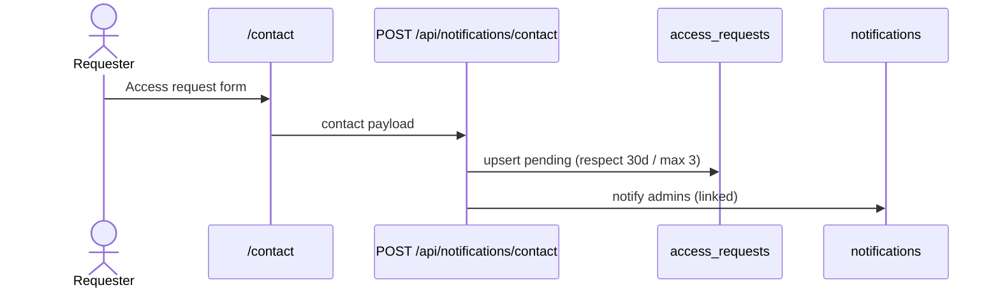

# Access requests

Canonical admission requests from the `/contact` form (subject **Access request**). Admins review them under **Users → Requests**; granting access creates an email allowlist row and resolves the request.

Related: [ACCESS_ALLOWLIST.md](./ACCESS_ALLOWLIST.md)

## Limits (hardcoded in `@repo/types`)

| Constant                             | Value      | Meaning                                                              |
| ------------------------------------ | ---------- | -------------------------------------------------------------------- |
| `ACCESS_REQUEST_MAX_SUBMISSIONS`     | **3**      | Max submissions per email in the rolling window                      |
| `ACCESS_REQUEST_ROLLING_WINDOW_DAYS` | **30**     | Rolling window for the submission cap                                |
| `ACCESS_REQUEST_IDEMPOTENCY_MS`      | **1 hour** | Resubmitting inside this window updates message only (no count bump) |

Shared cap applies to all request kinds (`admission`, `project_expansion`).

## Data model

Table: `access_requests`

| Field                         | Purpose                                           |
| ----------------------------- | ------------------------------------------------- |
| `requester_email`             | Normalized contact email                          |
| `requester_name`              | Optional display name                             |
| `message`                     | Latest request body                               |
| `kind`                        | `admission` \| `project_expansion`                |
| `status`                      | `pending` \| `granted` \| `denied`                |
| `request_count`               | Submissions counted in the current rolling window |
| `resolved_by` / `resolved_at` | Admin who closed the request                      |

Notifications: `type = access_request`, `related_item_id = access_requests.id` (one per active admin).

## User flow

## Admin flow

Route: `/users?tab=requests` (paginated registry).

Deep link (from inbox or row action):

`/users?tab=requests&requestId={uuid}&addEmail={email}`

| Request status | Dialog                                          |
| -------------- | ----------------------------------------------- |
| `pending`      | Opens **Add allowlist entry** (email prefilled) |
| `granted`      | “Access already granted by another admin”       |
| `denied`       | “This request was denied”                       |

### Grant

Saving an active **email** allowlist row (create or reactivate) automatically:

1. Sets matching pending request → `granted`
2. Archives linked admin notifications

### Deny

Explicit action: `POST /api/accessRequests/:id/deny` (admin only)

1. Sets request → `denied`
2. Archives linked notifications

## API

| Method | Path                           | Auth   | Purpose                         |
| ------ | ------------------------------ | ------ | ------------------------------- |
| POST   | `/api/notifications/contact`   | Public | Submit contact / access request |
| POST   | `/api/accessRequests/:id/deny` | Admin  | Deny pending request            |

List/read uses Supabase from the web RSC layer (`listAccessRequests`), same pattern as allowlist.

## Tests

| File                                                        | Covers                              |
| ----------------------------------------------------------- | ----------------------------------- |
| `apps/api/tests/access/accessRequests.service.test.ts`      | Submission limits, deny, grant hook |
| `apps/web/tests/dashboard/dashboard-notifications.test.tsx` | Inbox → Requests deep link          |

## Rollout

1. Apply migration `add_access_requests`
2. Deploy API + web
3. Legacy `comment` notifications without `related_item_id` still open the inline dialog; new requests use the Requests tab deep link
