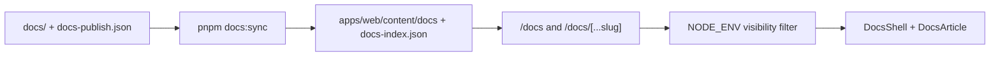

# In-app documentation (`/docs`)

Status: **Living**

Authenticated users can browse the repo `docs/` tree inside the app at `/docs`,
with section navigation, Ctrl/Cmd+K search, Mermaid diagrams, and previous/next
paging — similar to a product docs site.

Related:

- Source markdown: repo-root [`docs/`](../../README.md)
- Sync script: `apps/web/scripts/docs-sync.mjs`
- Shared helpers: `apps/web/lib/docs/docs-shared.ts`
- UI routes: `apps/web/app/docs/`
- Dashboard sticky chrome: `DashboardShell` `stickyHeader` prop

---

## Goals

- Keep a single source of truth at repo-root `docs/` (not duplicated under `src/`).
- Surface docs to **all authenticated users** (no admin-only gate in v1).
- In **production** (`NODE_ENV=production`), show only pages listed in
  [`docs-publish.json`](../../docs-publish.json) (user guide).
- In **development** (`pnpm dev`), show the full repo `docs/` tree for engineers.
- Make docs searchable (Ctrl/Cmd+K on `/docs/*`) and easy to navigate (sidebar + pager).
- Render GFM markdown and Mermaid fenced blocks (` ```mermaid `) in-app.
- Keep the docs index and dashboard header stable while the article scrolls.

## Non-goals (v1)

- Public (unauthenticated) docs hosting or SEO indexing (`robots: noindex`)
- Editing docs from the UI
- Full-text search outside `/docs` routes
- Moving `docs/` into the Next.js app source tree

---

## Architecture



### Production vs development visibility

| Environment                        | Signal                 | `/docs` sidebar                                 |
| ---------------------------------- | ---------------------- | ----------------------------------------------- |
| Local dev                          | `NODE_ENV=development` | Full repo docs tree                             |
| Production build / Docker / Vercel | `NODE_ENV=production`  | User-guide topics from `docs-publish.json` only |

Implementation:

- [`docs/docs-publish.json`](../../docs-publish.json) — curated topics and pages (JSON Schema:
  [`docs-publish.schema.json`](../../docs-publish.schema.json)).
- [`docs/user-guide/`](../../user-guide/) — product-facing markdown (first production set).
- `docs:sync` tags each index entry with `audience: user-guide | dev` from the manifest.
- `apps/web/lib/docs/docs-visibility.server.ts` — `isDocsDevMode()` (`NODE_ENV !== 'production'`).
- `apps/web/app/docs/_lib/docs.ts` — filters index, nav, search, static params, and slug 404s.

To add a production page:

1. Author markdown under `docs/user-guide/…`.
2. Append the path to a topic in `docs/docs-publish.json` (set `order`).
3. Run `pnpm --filter web docs:sync` (or restart `pnpm dev`).

Dev-only docs (architecture, guides, feature specs) stay in their existing folders;
they appear locally but not in production sidebars or search.

### Role-based user-guide visibility (runtime)

User-guide pages listed in `docs-publish.json` may set `minimumRole` (`member` |
`manager` | `admin`). All pages are synced at build; **filtering is per request**
using `getUserRole()` and the same `roleAtLeast` hierarchy as `apps/web/lib/rbac/`.

| `minimumRole`      | Visible to             |
| ------------------ | ---------------------- |
| `member` (default) | member, manager, admin |
| `manager`          | manager, admin         |
| `admin`            | admin only             |

- Implementation: `apps/web/lib/docs/docs-role-filter.ts`, async loaders in
  `apps/web/app/docs/_lib/docs.ts`.
- `/docs` routes use `dynamic = 'force-dynamic'` so gated content is not baked at
  build time.
- Direct URLs to pages above the viewer's role return **404** (not empty content).

P0 skeleton generator: `apps/web/scripts/docs-user-guide-skeleton.mjs`.

### Build-time sync

- `predev` / `prebuild` run `pnpm --filter web docs:sync`.
- Copies markdown into `apps/web/content/docs` and writes `docs-index.json`
  (title, section, excerpt, searchable body text).
- Generated content is gitignored; keep `apps/web/content/README.md`.

### Runtime

| Piece              | Role                                                                                    |
| ------------------ | --------------------------------------------------------------------------------------- |
| `DocsPageFrame`    | Wraps `DashboardShell` (`sidebarDefaultOpen={false}`, `stickyHeader`) + `DocsShell`     |
| `DocsShell`        | Fixed index rail + independent `ScrollArea`; article scrolls in the main pane           |
| `DocsArticle`      | `react-markdown` + `remark-gfm`, relative `.md` link rewrite, Mermaid via `DocsMermaid` |
| `DocsSearchDialog` | Command palette over the index (`@repo/ui` Command)                                     |
| `DocsPager`        | Previous / next in section reading order                                                |

`DashboardShell` with `stickyHeader` pins the dashboard header **outside** the
scroll container (viewport-locked `h-svh`), so `/docs/*` keeps the navbar in
place while other dashboard pages default to a scrolling header.

---

## Key routes & code

| Area                 | Path                                                                                                      |
| -------------------- | --------------------------------------------------------------------------------------------------------- |
| Docs home            | `/docs` → `apps/web/app/docs/page.tsx`                                                                    |
| Doc page             | `/docs/[...slug]` → `apps/web/app/docs/[...slug]/page.tsx`                                                |
| Components           | `apps/web/app/docs/_components/`                                                                          |
| Server loaders       | `apps/web/app/docs/_lib/docs.ts`                                                                          |
| Sync + index helpers | `apps/web/lib/docs/docs-shared.ts`, `apps/web/lib/docs/docs-publish.ts`, `apps/web/scripts/docs-sync.mjs` |
| Publish manifest     | `docs/docs-publish.json`, `docs/docs-publish.schema.json`                                                 |
| Visibility           | `apps/web/lib/docs/docs-visibility.server.ts`                                                             |

---

## Authoring notes

- Prefer `# Title` as the first heading — used for index titles.
- Link to other docs with relative `.md` paths; the renderer rewrites them to `/docs/...`.
- Mermaid sequence / flowchart / ER diagrams work in fenced `mermaid` blocks.
- After editing repo `docs/`, restart or re-run `docs:sync` so `content/` updates.

---

## Tests

- Unit: `apps/web/tests/docs/` (shared helpers, publish manifest, search dialog, adjacent docs).
