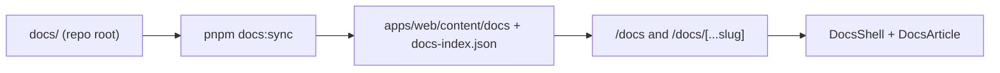

# In-app documentation (`/docs`)

Status: **Living**

Authenticated users can browse the repo `docs/` tree inside the app at `/docs`,
with section navigation, Ctrl/Cmd+K search, Mermaid diagrams, and previous/next
paging — similar to a product docs site.

Related:

- Source markdown: repo-root [`docs/`](../../README.md)
- Sync script: `apps/web/scripts/docs-sync.mjs`
- Shared helpers: `apps/web/lib/docs/docs-shared.ts`
- UI routes: `apps/web/app/docs/`
- Dashboard sticky chrome: `DashboardShell` `stickyHeader` prop

---

## Goals

- Keep a single source of truth at repo-root `docs/` (not duplicated under `src/`).
- Surface the full docs tree to **all authenticated users** (no admin-only gate in v1).
- Make docs searchable (Ctrl/Cmd+K on `/docs/*`) and easy to navigate (sidebar + pager).
- Render GFM markdown and Mermaid fenced blocks (` ```mermaid `) in-app.
- Keep the docs index and dashboard header stable while the article scrolls.

## Non-goals (v1)

- Public (unauthenticated) docs hosting or SEO indexing (`robots: noindex`)
- Editing docs from the UI
- Full-text search outside `/docs` routes
- Moving `docs/` into the Next.js app source tree

---

## Architecture



### Build-time sync

- `predev` / `prebuild` run `pnpm --filter web docs:sync`.
- Copies markdown into `apps/web/content/docs` and writes `docs-index.json`
  (title, section, excerpt, searchable body text).
- Generated content is gitignored; keep `apps/web/content/README.md`.

### Runtime

| Piece              | Role                                                                                    |
| ------------------ | --------------------------------------------------------------------------------------- |
| `DocsPageFrame`    | Wraps `DashboardShell` (`sidebarDefaultOpen={false}`, `stickyHeader`) + `DocsShell`     |
| `DocsShell`        | Fixed index rail + independent `ScrollArea`; article scrolls in the main pane           |
| `DocsArticle`      | `react-markdown` + `remark-gfm`, relative `.md` link rewrite, Mermaid via `DocsMermaid` |
| `DocsSearchDialog` | Command palette over the index (`@repo/ui` Command)                                     |
| `DocsPager`        | Previous / next in section reading order                                                |

`DashboardShell` with `stickyHeader` pins the dashboard header **outside** the
scroll container (viewport-locked `h-svh`), so `/docs/*` keeps the navbar in
place while other dashboard pages default to a scrolling header.

---

## Key routes & code

| Area                 | Path                                                                 |
| -------------------- | -------------------------------------------------------------------- |
| Docs home            | `/docs` → `apps/web/app/docs/page.tsx`                               |
| Doc page             | `/docs/[...slug]` → `apps/web/app/docs/[...slug]/page.tsx`           |
| Components           | `apps/web/app/docs/_components/`                                     |
| Server loaders       | `apps/web/app/docs/_lib/docs.ts`                                     |
| Sync + index helpers | `apps/web/lib/docs/docs-shared.ts`, `apps/web/scripts/docs-sync.mjs` |

---

## Authoring notes

- Prefer `# Title` as the first heading — used for index titles.
- Link to other docs with relative `.md` paths; the renderer rewrites them to `/docs/...`.
- Mermaid sequence / flowchart / ER diagrams work in fenced `mermaid` blocks.
- After editing repo `docs/`, restart or re-run `docs:sync` so `content/` updates.

---

## Tests

- Unit: `apps/web/tests/docs/` (shared helpers, search dialog filtering, adjacent docs).
