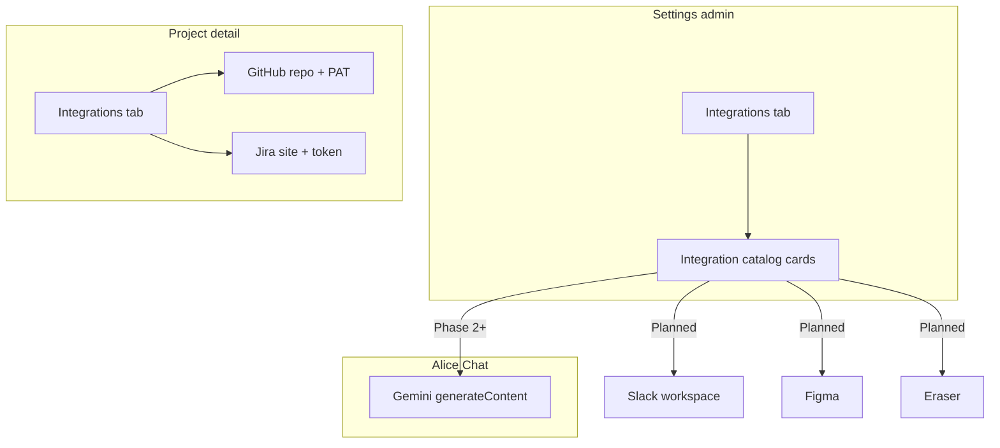

# Settings — Integrations (admin)

Status: **Plan** (Integrations tab + mock UI; persistence and OAuth flows not implemented)

Admins configure **workspace-wide** AI agents and tool integrations from **`/settings?tab=integrations`**. This is separate from **project-scoped** integrations (GitHub, Jira on `/projects/[id]?tab=integrations`).

Related:

- Index: [README.md](./README.md)
- Account settings: [features/profile/EDIT_PROFILE.md](../profile/EDIT_PROFILE.md)
- Alice Chat: [features/chat/AI_CHATBOT.md](../chat/AI_CHATBOT.md)
- Project GitHub/Jira: [features/projects/GITHUB_INTEGRATION.md](../projects/GITHUB_INTEGRATION.md), [JIRA_INTEGRATION.md](../projects/JIRA_INTEGRATION.md)
- RBAC: [auth/RBAC_AUTHORIZATION_SKELETON.md](../../auth/RBAC_AUTHORIZATION_SKELETON.md)

---

## Goals

- Single **Integrations** entry in the Settings sidebar for **admin** users only.
- Surface a **catalog** of AI agents and workspace tools with clear status: **Active**, **Mock UI**, **Planned**.
- Start with **mock UI** for most providers; wire **Alice Chat (Gemini)** against the existing server config (`GEMINI_API_KEY`, `CHAT_MODELS`) as read-only context plus a placeholder for future workspace-level overrides.
- Keep project-level dev-tool integrations (GitHub, Jira) on the project detail page — do not duplicate them here.

## Non-goals (this phase)

- OAuth flows, webhooks, or encrypted credential storage for Slack / Figma / Eraser
- Per-user integration tokens (workspace admin configures once)
- Replacing `GEMINI_API_KEY` in `apps/api` with a DB-backed workspace secret (future)
- Non-admin visibility of the Integrations tab (hidden in nav; URL coerces to General)

---

## Access control

| Layer            | Behavior                                                                                                        |
| ---------------- | --------------------------------------------------------------------------------------------------------------- |
| Settings sidebar | **Integrations** nav item rendered only when `dbUser.role === 'admin'`                                          |
| URL              | `/settings?tab=integrations` requested by non-admin → coerce to `general` (same pattern as Users allowlist tab) |
| Future API       | Workspace integration mutations will use `requireAdmin` on Express routes                                       |

Managers and members continue to use self-service tabs (General, Security, Notifications, Preferences) only.

---

## Surfaces

```text
/settings?tab=integrations     ← workspace AI & tools (admin)
/projects/[id]?tab=integrations ← GitHub + Jira (project members with access)
/chat                          ← Alice assistant (uses server Gemini config today)
```



---

## Integration catalog (phased)

### Phase 0 — Mock UI (now)

| Integration             | Category                | UI status                                                            | Backend                                                                   |
| ----------------------- | ----------------------- | -------------------------------------------------------------------- | ------------------------------------------------------------------------- |
| **Alice Chat (Gemini)** | AI / LLM                | Mock workspace panel + read-only model list from `CHAT_MODELS`       | **Live** via `apps/api` + `GEMINI_API_KEY` (server env, not workspace DB) |
| **Slack**               | Workspace conversations | Mock connect / channel picker                                        | None                                                                      |
| **Eraser**              | Diagramming             | Mock “Link workspace”                                                | None                                                                      |
| **Figma**               | UI design               | Mock “Connect Figma”                                                 | None                                                                      |
| **Suggested agents**    | Reference list          | Cards: Linear, Notion, Miro, Microsoft Teams, OpenAI workspace, etc. | Planned                                                                   |

### Phase 1 — Alice Chat workspace settings

- Persist default model + optional system prompt extensions in DB (`workspace_settings` or `integration_configs` table TBD).
- Admin UI writes config; `ChatService` reads workspace row before calling Gemini.
- Keep `GEMINI_API_KEY` server-side only (`apps/api` env).

### Phase 2 — OAuth integrations

- Slack: bot token, default channel, notify on work-item events (ties to notifications).
- Figma / Eraser: link files or boards to epics/stories (design ↔ work-item references).

### Phase 3 — Additional AI agents

- Multi-provider LLM registry (OpenAI, Anthropic) alongside Gemini in `@repo/types` `CHAT_MODELS`.
- Optional routing rules (e.g. “coding tasks → model A”).

---

## UI structure

Settings sidebar adds **Integrations** (admin only). Content sections:

1. **AI & chat** — Alice Chat / Gemini card (model dropdown mirrors chat UI; save is mock until Phase 1).
2. **Workspace & conversations** — Slack (mock).
3. **Design & diagramming** — Figma, Eraser (mock).
4. **Coming soon** — grid of suggested integrations with short descriptions.

Card pattern reuses project integration visuals (`Card`, status `Badge`, disabled primary actions with “Coming soon” copy).

Implementation:

- `apps/web/app/settings/_components/settings-integrations-view.tsx`
- `apps/web/app/settings/_components/settings-integration-catalog.ts` — static catalog metadata
- `settings-workspace.tsx` — conditional nav item
- `settings-data.tsx` — admin gate + tab routing
- `lib/search-params.ts` — `integrations` on `SettingsTab`

---

## Data model (future sketch)

Not implemented. Likely shape:

```text
workspace_integration_configs
  id, provider (enum), status, config_json (encrypted), updated_by, updated_at

workspace_integration_secrets
  integration_id, key_name, ciphertext  -- or use existing token-crypto pattern
```

Provider enum candidates: `gemini`, `slack`, `figma`, `eraser`, …

Align with API versioning: mutation Zod in `@repo/types` `api/v1/integrations.ts` when routes land.

---

## Environment (today — Gemini only)

| Variable         | App        | Notes                                 |
| ---------------- | ---------- | ------------------------------------- |
| `GEMINI_API_KEY` | `apps/api` | Required for chat; not exposed to web |
| `GEMINI_API_URL` | `apps/api` | Optional override per model           |

Settings Integrations UI may show **“Server configured”** vs **“Missing API key”** via a future admin-only health endpoint — not in Phase 0 mock.

---

## Testing

| Test                               | Scope                                                 |
| ---------------------------------- | ----------------------------------------------------- |
| `parseSettingsTab('integrations')` | Returns `integrations`                                |
| Settings data                      | Non-admin + `?tab=integrations` → general content     |
| Component smoke                    | Integrations view renders catalog sections (optional) |

---

## Rollout checklist

- [x] Document catalog and RBAC ([SETTINGS_INTEGRATIONS.md](./SETTINGS_INTEGRATIONS.md))
- [x] Integrations tab in Settings sidebar (admin only)
- [x] Mock UI cards for Gemini, Slack, Eraser, Figma + suggested list
- [ ] Admin health: Gemini key present (API)
- [ ] Persist workspace chat model (DB + API)
- [ ] Slack OAuth mock → staging connect
- [ ] Figma / Eraser link flows
