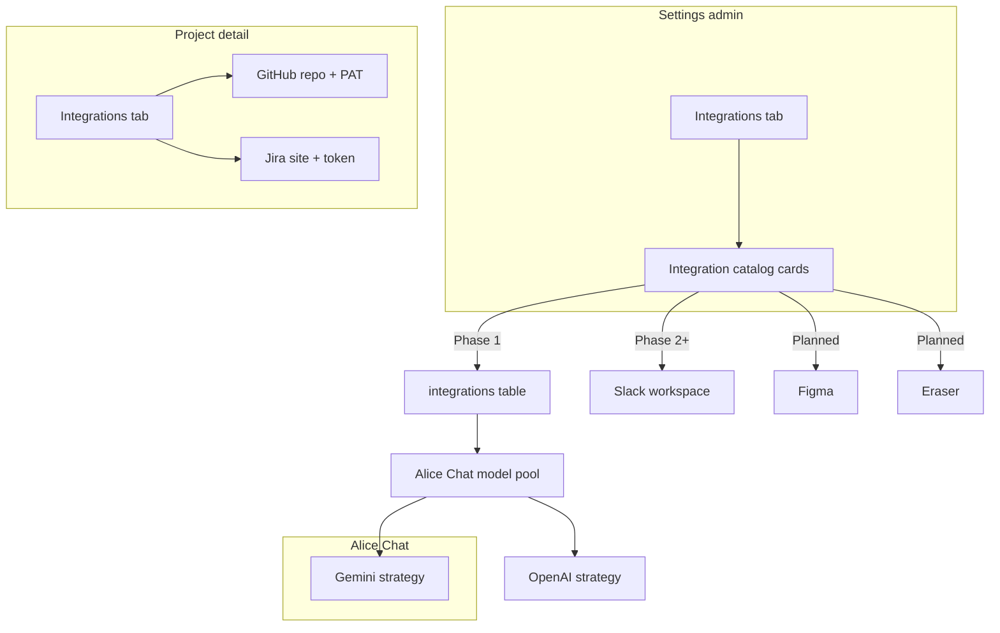
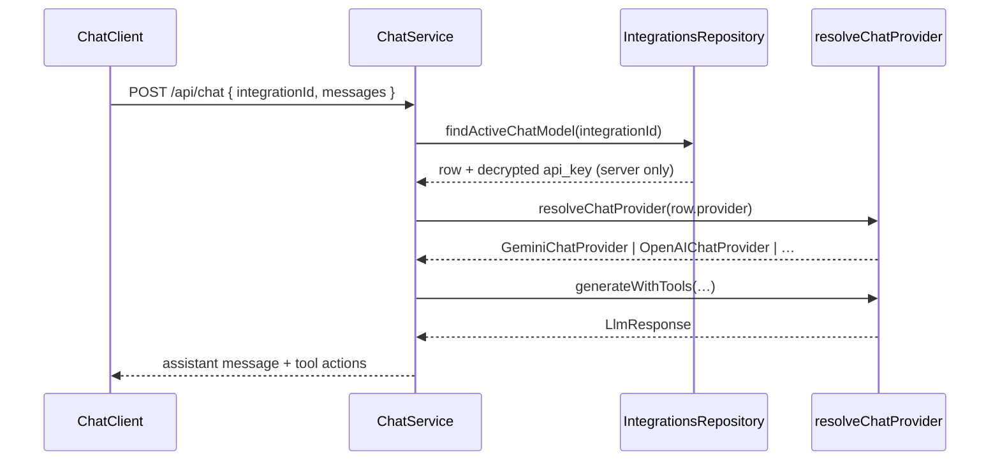

# Settings — Integrations (admin)

Status: **Phase 1 complete** — DB-backed workspace integrations, Settings admin UI, and Alice Chat model pool are live. Phase 2 (Slack OAuth, Figma/Eraser) remains planned.

Admins configure **workspace-wide** AI agents and tool integrations from **`/settings?tab=integrations`**. This is separate from **project-scoped** integrations (GitHub, Jira on `/projects/[id]?tab=integrations`).

Related:

- Index: [README.md](./README.md)
- Account settings: [features/profile/EDIT_PROFILE.md](../profile/EDIT_PROFILE.md)
- Alice Chat: [features/chat/AI_CHATBOT.md](../chat/AI_CHATBOT.md)
- Project GitHub/Jira: [features/projects/GITHUB_INTEGRATION.md](../projects/GITHUB_INTEGRATION.md), [JIRA_INTEGRATION.md](../projects/JIRA_INTEGRATION.md)
- RBAC: [auth/RBAC_AUTHORIZATION_SKELETON.md](../../auth/RBAC_AUTHORIZATION_SKELETON.md)

---

## Goals

- Single **Integrations** entry in the Settings sidebar for **admin** users only.
- Surface a **catalog** of AI agents and workspace tools with clear status: **Active**, **Mock UI**, **Planned**.
- **Phase 1 (done):** Admins configure chat models in Settings; Alice Chat reads active rows from `integrations` (no env bootstrap).
- Keep project-level dev-tool integrations (GitHub, Jira) on the project detail page — do not duplicate them here.

## Non-goals (Phase 0 — done)

- OAuth flows, webhooks, or encrypted credential storage for Slack / Figma / Eraser
- Per-user integration tokens (workspace admin configures once)
- Non-admin visibility of the Integrations tab (hidden in nav; URL coerces to General)

Phase 1+ **does** target DB-backed credentials and multi-model Alice Chat — see [Database persistence](#database-persistence-plan).

---

## Access control

| Layer            | Behavior                                                                                                        |
| ---------------- | --------------------------------------------------------------------------------------------------------------- |
| Settings sidebar | **Integrations** nav item rendered only when `dbUser.role === 'admin'`                                          |
| URL              | `/settings?tab=integrations` requested by non-admin → coerce to `general` (same pattern as Users allowlist tab) |
| Future API       | Workspace integration mutations will use `requireAdmin` on Express routes                                       |

Managers and members continue to use self-service tabs (General, Security, Notifications, Preferences) only.

---

## Surfaces

```text
/settings?tab=integrations     ← workspace AI & tools (admin)
/projects/[id]?tab=integrations ← GitHub + Jira (project members with access)
/chat                          ← Alice assistant (uses server Gemini config today)
```



---

## Integration catalog (phased)

### Phase 0 — Marketplace UI (done)

| Integration          | Category       | UI status                                            | Backend                                                    |
| -------------------- | -------------- | ---------------------------------------------------- | ---------------------------------------------------------- |
| **Google Gemini**    | AI agents      | Admin configure dialog (API key + model)             | **Live** via `integrations` row + Gemini provider strategy |
| **Slack**            | Communication  | Preview card + connect mock                          | None                                                       |
| **Eraser / Figma**   | Design         | Coming-soon cards in catalog                         | None                                                       |
| **Suggested agents** | Reference list | OpenAI, Anthropic, Linear, Notion, Miro, Teams, etc. | Planned                                                    |

Static catalog metadata lives in `settings-integration-catalog.ts` (names, descriptions, filter tabs). **Configured instances** move to the `integrations` table in Phase 1.

### Phase 1 — `integrations` table + Alice Chat model pool

- Add **`integrations`** Postgres table (category column + JSONB `config` on the same row).
- Admin saves API keys and model settings from Settings → Integrations; secrets encrypted in `config` via existing `token-crypto.ts`.
- **`ChatService`** resolves the selected model from DB rows where `category = ai_agent`, using a **provider strategy** (Gemini, OpenAI, Anthropic) instead of a hard-coded `CHAT_MODELS` constant.
- Users pick any **active chat model** from the pool in `/chat` and the navbar drawer.
- No env bootstrap — admins create the first Gemini (or other) row in Settings.

### Phase 2 — OAuth and notification integrations

- Slack: bot token in `config`, default channel, notify on work-item events.
- Figma / Eraser: link files or boards to epics/stories.

### Phase 3 — Routing and automation

- Optional rules (e.g. “coding tasks → model A”).
- Zapier-style triggers using the same `integrations` rows.

---

## UI structure

Settings sidebar adds **Integrations** (admin only). Content sections:

1. **AI & chat** — Alice Chat / Gemini card (model dropdown mirrors chat UI; save is mock until Phase 1).
2. **Workspace & conversations** — Slack (mock).
3. **Design & diagramming** — Figma, Eraser (mock).
4. **Coming soon** — grid of suggested integrations with short descriptions.

Card pattern reuses project integration visuals (`Card`, status `Badge`, disabled primary actions with “Coming soon” copy).

Implementation:

- `apps/web/app/settings/_components/settings-integrations-view.tsx`
- `apps/web/app/settings/_components/settings-integration-catalog.ts` — static catalog metadata
- `settings-workspace.tsx` — conditional nav item
- `settings-data.tsx` — admin gate + tab routing
- `lib/search-params.ts` — `integrations` on `SettingsTab`

---

## Database persistence plan

Alice is a **single workspace per deployment** (no `workspaces` table today). All integration rows are **deployment-wide** — one admin configures tools for everyone, matching Settings → Integrations RBAC.

Project-scoped GitHub/Jira credentials **stay on `projects`** and `jira_connections`; this table is for **workspace-level** tools only (chat models, Slack, Figma, etc.).

### Design principles

| Principle            | Decision                                                                                                                                 |
| -------------------- | ---------------------------------------------------------------------------------------------------------------------------------------- |
| One table            | `integrations` holds every configured integration instance                                                                               |
| Category column      | Indexed enum aligned with Settings filter tabs — simplifies `WHERE category = …`                                                         |
| Config on same row   | Non-secret settings + encrypted secrets in one **`config` JSONB** column (no separate secrets table)                                     |
| Static vs dynamic    | **Catalog** (marketing copy, website URLs) stays in TS; **DB rows** are admin-enabled instances linked by `catalog_id`                   |
| Multiple chat models | **One row per chat model** (e.g. Gemini 3.6, GPT-4o, Claude Sonnet) so users get a **model pool** in Alice Chat                          |
| Encryption           | Reuse `encryptSecret` / `decryptSecret` from `apps/api/src/lib/secrets/token-crypto.ts` (`INTEGRATION_TOKEN_ENCRYPTION_KEY`)             |
| Client contract      | API never returns ciphertext; expose `has_*` booleans (same pattern as `withoutIntegrationSecrets` on projects)                          |
| Access               | Table is **service-role only** (RLS revoke for `anon` / `authenticated`); all reads/writes via `apps/api` + `requireAdmin` for mutations |

### Table schema

```prisma
enum IntegrationCategory {
  ai_agent
  communication
  design
  productivity
}

enum IntegrationStatus {
  active
  disabled
  draft
}

/// Workspace-level integration instance (one row per configured model or OAuth app).
model integrations {
  id          String               @id @default(dbgenerated("gen_random_uuid()")) @db.Uuid
  /// Matches static catalog id, e.g. "alice-gemini", "openai", "slack".
  catalog_id  String
  category    IntegrationCategory
  /// Provider slug for strategy dispatch: gemini | openai | anthropic | slack | …
  provider    String
  /// Admin-facing label, e.g. "Gemini 3.6", "GPT-4o (production)".
  name        String
  status      IntegrationStatus    @default(draft)
  /// Provider-specific JSON; secret fields stored as v1:… ciphertext.
  config      Json                 @default("{}")
  /// Default model for Alice Chat when user has not picked one (ai_agent only).
  is_default  Boolean              @default(false)
  sort_order  Int                  @default(0)
  created_by  String?              @db.Uuid
  created_at  DateTime             @default(now()) @db.Timestamptz(6)
  updated_by  String?              @db.Uuid
  updated_at  DateTime             @updatedAt @db.Timestamptz(6)

  created_by_user users? @relation("IntegrationCreatedBy", fields: [created_by], references: [id], onDelete: SetNull)
  updated_by_user users? @relation("IntegrationUpdatedBy", fields: [updated_by], references: [id], onDelete: SetNull)

  @@index([category, status])
  @@index([catalog_id])
  @@index([provider, status])
}
```

**Partial unique index** (SQL migration, not Prisma-native): at most one `is_default = true` among `category = ai_agent` and `status = active`.

Category values map to Settings filter tabs:

| DB `IntegrationCategory` | Settings filter tab  |
| ------------------------ | -------------------- |
| `ai_agent`               | AI agents            |
| `communication`          | Communication        |
| `design`                 | Design & diagramming |
| `productivity`           | Productivity         |

### `config` JSONB shapes

Validated with Zod discriminated unions in `@repo/types` (`integrations/config.ts`). Secret field names are fixed so the service layer can encrypt/decrypt on write/read.

#### AI agent — chat model (`provider: gemini | openai | anthropic`)

```json
{
  "kind": "chat_model",
  "model": "gemini-3.6-flash",
  "model_version": "3.6",
  "display_label": "Gemini 3.6",
  "api_url": "https://generativelanguage.googleapis.com/v1beta/models/gemini-3.6-flash:generateContent",
  "api_key": "v1:…"
}
```

| Field           | Secret? | Notes                                                                |
| --------------- | ------- | -------------------------------------------------------------------- |
| `kind`          | No      | Always `chat_model` for Alice Chat rows                              |
| `model`         | No      | Provider model id sent to the API                                    |
| `model_version` | No      | Shown in UI; optional patch version                                  |
| `display_label` | No      | Chat dropdown label                                                  |
| `api_url`       | No      | Override endpoint; provider strategy supplies default                |
| `api_key`       | **Yes** | AES-256-GCM `v1:` blob; client sends plaintext only on create/update |

OpenAI example — same shape, different defaults:

```json
{
  "kind": "chat_model",
  "model": "gpt-4o",
  "model_version": "2024-08-06",
  "display_label": "GPT-4o",
  "api_url": "https://api.openai.com/v1/chat/completions",
  "api_key": "v1:…"
}
```

#### Communication — Slack (Phase 2)

```json
{
  "kind": "slack_workspace",
  "team_id": "T01234567",
  "team_name": "Alice HQ",
  "default_channel_id": "C01234567",
  "bot_token": "v1:…"
}
```

#### Design — Figma (Phase 2)

```json
{
  "kind": "figma_oauth",
  "access_token": "v1:…",
  "refresh_token": "v1:…",
  "expires_at": "2026-12-01T00:00:00.000Z"
}
```

Non-secret keys remain plaintext inside JSONB; only values listed in `INTEGRATION_SECRET_KEYS` (types package) are encrypted.

### Query patterns

| Use case                                   | Query                                                                           |
| ------------------------------------------ | ------------------------------------------------------------------------------- |
| Settings marketplace — connected AI agents | `SELECT * FROM integrations WHERE category = 'ai_agent' AND status = 'active'`  |
| Alice Chat model dropdown                  | Same + `config->>'kind' = 'chat_model'`; order by `sort_order`, `name`          |
| Resolve default model                      | `WHERE category = 'ai_agent' AND is_default AND status = 'active' LIMIT 1`      |
| Slack notification worker                  | `WHERE category = 'communication' AND provider = 'slack' AND status = 'active'` |
| Admin edit by catalog card                 | `WHERE catalog_id = $1` (may return 0..n rows for multi-model providers)        |

Chat sends `integration_id` (UUID) on `POST /api/chat` instead of a free-form model string once Phase 1 lands.

### Provider strategy (backend)

Replace the monolithic `callGeminiAPI` path with a small registry in `apps/api`:

```text
apps/api/src/routes/api/integrations/
  integrations.router.ts
  integrations.service.ts      # CRUD, encrypt config secrets, strip for JSON
  integrations.repository.ts
  chat-providers/
    chat-provider.types.ts     # ChatModelProvider interface
    gemini-chat.provider.ts
    openai-chat.provider.ts
    anthropic-chat.provider.ts
    resolve-chat-provider.ts   # provider slug → implementation
```

```typescript
/** Minimal contract — tools + system instruction stay in ChatService. */
interface ChatModelProvider {
  readonly provider: string;
  generateWithTools(input: {
    apiKey: string;
    apiUrl: string;
    model: string;
    contents: ContentTurn[];
    systemInstruction: string;
    tools: unknown;
  }): Promise<LlmResponse>;
}
```

Flow:



`packages/types/src/chat-models.ts` shrinks to **shared DTO types** and default fallbacks; the runtime registry becomes DB-driven.

### API surface (v1)

| Method   | Path                            | Auth          | Purpose                                       |
| -------- | ------------------------------- | ------------- | --------------------------------------------- |
| `GET`    | `/api/integrations`             | Admin         | List rows (secrets stripped)                  |
| `GET`    | `/api/integrations/chat-models` | Authenticated | Active chat models for dropdown (no secrets)  |
| `GET`    | `/api/integrations/:id`         | Admin         | Detail for Settings dialog                    |
| `POST`   | `/api/integrations`             | Admin         | Create row (encrypt secrets in `config`)      |
| `PATCH`  | `/api/integrations/:id`         | Admin         | Update; omit secret fields to leave unchanged |
| `DELETE` | `/api/integrations/:id`         | Admin         | Soft-disable or hard delete (TBD)             |
| `POST`   | `/api/integrations/:id/test`    | Admin         | Health check (optional Phase 1.1)             |

Wire types: `@repo/types/src/api/v1/integrations.ts`.

Response DTO example (chat model):

```typescript
{
  id: "uuid",
  catalog_id: "openai",
  category: "ai_agent",
  provider: "openai",
  name: "GPT-4o",
  status: "active",
  is_default: false,
  config: {
    kind: "chat_model",
    model: "gpt-4o",
    display_label: "GPT-4o",
    has_api_key: true
  }
}
```

### Secret handling

Mirror [GITHUB_INTEGRATION.md](../projects/GITHUB_INTEGRATION.md):

1. **Write** — `integrations.service.ts` walks `config`, runs `encryptSecretIfPresent` on `api_key`, `bot_token`, `access_token`, etc.
2. **Read (API JSON)** — `withoutIntegrationConfigSecrets()` replaces secret strings with `has_api_key: true` (never return `v1:` blobs).
3. **Read (chat)** — decrypt in-process inside `ChatService` only; discard plaintext after the HTTP call to the LLM vendor.
4. **Lazy migration** — plaintext values without `v1:` prefix decrypt as passthrough until rewritten.

Requires `INTEGRATION_TOKEN_ENCRYPTION_KEY` on `apps/api` (already used for GitHub PAT + Jira OAuth).

### Bootstrap from environment

One-time migration or seed script for existing deployments:

```sql
INSERT INTO integrations (catalog_id, category, provider, name, status, config, is_default, sort_order)
VALUES (
  'alice-gemini',
  'ai_agent',
  'gemini',
  'Gemini 3.6',
  'active',
  jsonb_build_object(
    'kind', 'chat_model',
    'model', 'gemini-3.6-flash',
    'model_version', '3.6',
    'display_label', 'Gemini 3.6',
    'api_url', 'https://generativelanguage.googleapis.com/v1beta/models/gemini-3.6-flash:generateContent',
    'api_key', '<encrypted via INTEGRATION_TOKEN_ENCRYPTION_KEY>'
  ),
  true,
  0
);
```

`ChatService` resolution order:

1. Load integration by `integration_id` from request (or workspace default when omitted).
2. If no active row → `400` “No chat model configured”.

### UI wiring (Phase 1)

| Surface                        | Change                                                                                                           |
| ------------------------------ | ---------------------------------------------------------------------------------------------------------------- |
| Settings → Integrations dialog | `POST/PATCH /api/integrations` instead of mock save; show **Connected** when `status = active` and `has_api_key` |
| `/chat` model select           | `GET /api/integrations/chat-models` — list all active `ai_agent` rows                                            |
| Catalog cards                  | Merge static metadata with API rows (`catalog_id` join) for toggle/status                                        |
| Add model                      | Admin can add multiple OpenAI/Gemini rows → instant pool in chat                                                 |

### Implementation sequence

| Step | Deliverable                                                            |
| ---- | ---------------------------------------------------------------------- |
| 1    | Prisma model + migration + RLS (service-role only)                     |
| 2    | `@repo/types` Zod config unions + v1 API DTOs                          |
| 3    | `integrations.*` Express module (repository, service, router)          |
| 4    | `chat-providers/*` + refactor `ChatService` to accept `integration_id` |
| 5    | ~~Seed / env bootstrap~~ — skipped (admin-configured only)             |
| 6    | Settings UI — wire save + list                                         |
| 7    | Chat UI — dynamic model dropdown                                       |
| 8    | Tests: encrypt round-trip, strategy mocks, admin RBAC                  |

### Relationship to project integrations

| Scope                  | Storage today                   | Future                                           |
| ---------------------- | ------------------------------- | ------------------------------------------------ |
| GitHub PAT + repo      | `projects.github_*`             | Unchanged                                        |
| Jira OAuth             | `jira_connections` + project FK | Unchanged                                        |
| Alice Chat LLMs        | `integrations` (`ai_agent`)     | Multi-row model pool (Gemini, OpenAI, Anthropic) |
| Slack / Figma / Eraser | —                               | `integrations` (by category)                     |

Do **not** move GitHub/Jira into `integrations` without an explicit migration project — different scope, FKs, and UI surfaces.

---

## Environment

| Variable                           | App        | Notes                                                             |
| ---------------------------------- | ---------- | ----------------------------------------------------------------- |
| `INTEGRATION_TOKEN_ENCRYPTION_KEY` | `apps/api` | Required for encrypted `config` secrets (shared with GitHub/Jira) |

Per-model API keys and optional `config.api_url` live in `integrations.config`. Settings UI shows **Connected** vs **Needs API key** via `has_api_key` on admin API responses. Chat does **not** read `GEMINI_*` env vars.

---

## Testing

| Test                               | Location                                                       | Scope                                                 |
| ---------------------------------- | -------------------------------------------------------------- | ----------------------------------------------------- |
| `parseSettingsTab('integrations')` | `apps/web/tests/lib/search-params-settings-tab.test.ts`        | Returns `integrations`                                |
| `resolveSettingsTabForUser`        | `apps/web/tests/lib/search-params-settings-tab.test.ts`        | Non-admin + `integrations` → `general`                |
| Catalog helpers                    | `apps/web/tests/settings/settings-integration-catalog.test.ts` | Filter/search, `isCatalogConnected`, configurable ids |
| Settings API client                | `apps/web/tests/settings/integrations-api.shared.test.ts`      | List/create via `/api/integrations`                   |
| Chat model helpers                 | `apps/web/tests/chat/chat-models-api.shared.test.ts`           | Default + selection resolution                        |
| Integration config Zod             | `apps/web/tests/integrations/integrations-config.test.ts`      | Stored/public config, create/patch bodies             |
| `integrations.service`             | `apps/api/tests/integrations/integrations.service.test.ts`     | Encrypt/strip, chat model pool, resolve for chat      |
| `integrations` routes              | `apps/api/tests/integrations/integrations.route.test.ts`       | List, chat-models, create, admin RBAC 403             |
| `resolveChatProvider`              | `apps/api/tests/integrations/resolve-chat-provider.test.ts`    | Provider registry                                     |

---

## Rollout checklist

- [x] Document catalog and RBAC ([SETTINGS_INTEGRATIONS.md](./SETTINGS_INTEGRATIONS.md))
- [x] Integrations tab in Settings sidebar (admin only)
- [x] Marketplace UI + integration detail dialog
- [x] Database persistence plan (this doc)
- [x] `integrations` Prisma model + migration SQL + RLS (apply with `pnpm db migrate:deploy`)
- [x] `@repo/types` config Zod + v1 API DTOs
- [x] Express `integrations` module + chat provider strategies
- [x] ~~Bootstrap seed from `GEMINI_API_KEY`~~ — **skipped by design** (admins configure in Settings)
- [x] Settings UI wired to API (save / list / status)
- [x] Chat model dropdown from DB pool
- [ ] Slack OAuth connect (Phase 2)
- [ ] Figma / Eraser link flows (Phase 2)
