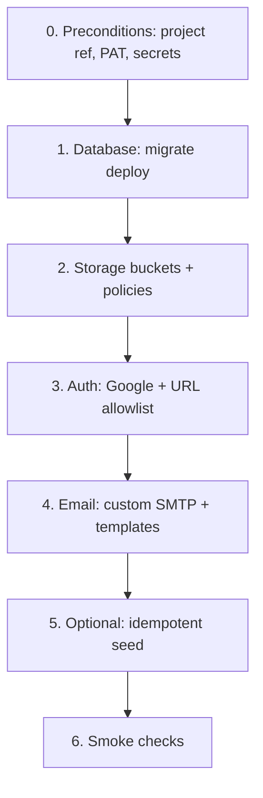

# Day-one environment setup

Status: **Plan**  
Last updated: 2026-08-15

One operator path to take a **new or empty Supabase project** to a working Alice
backend: schema applied, Storage buckets present, Auth providers configured,
and Auth mail leaving via a third-party SMTP provider.

This is **not** implemented yet. Today those steps are split across
`pnpm db migrate:deploy`, `pnpm db seed`, and dashboard clicks.

Related:

- Workflow today: [DATABASE.md](../../guides/DATABASE.md)
- Auth as-built: [AUTHENTICATION.md](../../auth/AUTHENTICATION.md) (especially §4 Google, §12 email templates)
- Attachments buckets: [ATTACHMENTS.md](../work-items/ATTACHMENTS.md)
- Profile pictures bucket: [EDIT_PROFILE.md](../profile/EDIT_PROFILE.md)
- Management API: [Auth config PATCH](https://supabase.com/docs/reference/api/v1-update-auth-service-config),
  [custom SMTP](https://supabase.com/docs/guides/auth/auth-smtp),
  [Google provider](https://supabase.com/docs/guides/auth/social-login/auth-google)

---

## Goals

- **One command** from the repo (working name: `pnpm db day-one`) that is
  idempotent and safe to re-run.
- Cover three pillars in a fixed order: **database → Auth providers → email**.
- Encode Alice-specific Auth email templates (`token_hash` + `RedirectTo`) so
  invite / reset / confirm links work with `/auth/callback`.
- Create Storage buckets the apps already expect (do not invent new names).
- Keep secrets out of git; fail closed if required env is missing.

## Non-goals (v1)

- Creating the Google Cloud OAuth **client** (Google Console stays human).
- Creating the Resend (or other SMTP) **account** and DNS records.
- Provisioning AWS / Terraform ([INFRASTRUCTURE.md](../../guides/INFRASTRUCTURE.md)).
- **Supabase Edge Functions** — Alice does not ship any today; Postgres RPCs
  live in Prisma migrations instead.
- Pointing `pnpm db migrate:reset` or destructive seeds at a shared prod
  database.
- Replacing Prisma as the source of truth for tables and indexes.

---

## Why a script

| Area                          | Today                                                                                         | Gap                                                              |
| ----------------------------- | --------------------------------------------------------------------------------------------- | ---------------------------------------------------------------- |
| Tables, indexes, grants, RPC  | `packages/db/prisma/migrations/` + `pnpm db migrate:deploy`                                   | Easy to forget grants / RPC if someone applies SQL by hand       |
| Storage buckets               | Manual dashboard (or first upload fails)                                                      | Apps assume `alice_storage_*` buckets exist                      |
| Google OAuth                  | Dashboard → Authentication → Providers                                                        | Client ID/secret never land unless someone remembers             |
| Custom SMTP                   | Dashboard → Authentication → SMTP                                                             | Built-in mailer is rate-limited and unreliable for invites       |
| Auth email templates          | Dashboard HTML; must use `token_hash` ([AUTHENTICATION.md](../../auth/AUTHENTICATION.md) §12) | Default `ConfirmationURL` breaks SSR callback (`?error=expired`) |
| Site URL + redirect allowlist | Dashboard URL configuration                                                                   | Localhost + prod origins must both be listed                     |

---

## Target flow



Phases 1–4 are required for a usable empty project. Phase 5 is opt-in
(`DAY_ONE_SEED=1`) because seed writes sample `alice.dev` users into Auth.

---

## Pillar 1 — Database (tables, indexes, functions)

**Source of truth:** Prisma schema + SQL migrations under
`packages/db/prisma/`. Do not duplicate DDL in the day-one script.

The script should:

1. Require `DIRECT_URL` (migrations) and `DATABASE_URL` (session pooler `5432`
   for later Prisma use). See [DATABASE.md](../../guides/DATABASE.md).
2. Run `pnpm db migrate:deploy` (additive only).
3. Treat **indexes** as already declared in `schema.prisma` / migration SQL —
   no second index pass.
4. Treat **Postgres functions / RPCs** as already in migrations. Today that
   includes `public.deactivate_user_guarded` (`SECURITY INVOKER`, called from
   the API via supabase-js).
5. Rely on `prisma/sql/supabase_grants.sql` already appended to migrations so
   `anon` / `authenticated` / `service_role` can use `public`.
6. Optionally `pnpm db generate` if types are missing locally (usually
   committed in `@repo/types`).

### Storage (same pillar; not Prisma)

Create or update these buckets via the [Storage Management API](https://supabase.com/docs/reference/api/v1-create-a-bucket)
(or equivalent CLI) so uploads do not 404 on a fresh project:

| Bucket                           | Public? | Used by                       |
| -------------------------------- | ------- | ----------------------------- |
| `alice_storage_attachments`      | No      | Work-item files               |
| `alice_storage_profile_pictures` | Yes     | Avatars (`getPublicUrl`)      |
| `alice_storage_chat_history`     | No      | Chat export / history objects |

Names must match `apps/api/src/config/env.ts`. After create: confirm Data API
exposure and RLS/policies match existing prod (attachments private + signed
URLs; profile pictures public).

### Edge Functions

**Out of scope.** There is no `supabase/functions` tree in this repo. If we add
Edge Functions later, day-one can grow a `supabase functions deploy` step. Do
not stub empty functions “just in case.”

---

## Pillar 2 — Auth providers (Google)

App code already calls `signInWithOAuth({ provider: 'google' })` on `/login`.
The project must have the provider **enabled** with a Web client whose
**Authorized redirect URI** is the Supabase callback:

`https://<project-ref>.supabase.co/auth/v1/callback`

(Documented in [Login with Google](https://supabase.com/docs/guides/auth/social-login/auth-google).)

The script **cannot** create that Google Cloud client. It **can** push the
client ID/secret into Auth via
`PATCH https://api.supabase.com/v1/projects/{ref}/config/auth`
with a [personal access token](https://supabase.com/docs/reference/api/introduction):

```json
{
  "external_google_enabled": true,
  "external_google_client_id": "<from Google Cloud>",
  "external_google_secret": "<from Google Cloud>"
}
```

Also set (same PATCH, or a dedicated URL-config call):

| Field            | Intent                                                                 |
| ---------------- | ---------------------------------------------------------------------- |
| `site_url`       | Canonical Site URL (prod origin in a prod project)                     |
| `uri_allow_list` | Include `http://localhost:3000/**` and the deployed web origin `/**`   |
| Email confirm    | Match product: keep confirmation on unless the env is explicitly local |

`SUPABASE_AUTH_EXTERNAL_GOOGLE_CLIENT_SECRET` in `apps/web` is only a **warn**
today (local/hosted Auth). Hosted Google config lives on the **Supabase
project**, not in Next.js public env. Do not put the Google client secret in
`NEXT_PUBLIC_*`.

Manual checklist the script should print if Google env is omitted:

1. Google Auth Platform → Clients → Web → redirect URI above.
2. Copy client ID + secret into day-one env and re-run (idempotent PATCH).

---

## Pillar 3 — Third-party email (custom SMTP)

Auth mail (signup confirm, invite, recovery, allowlist invite via Auth mailer)
must use **custom SMTP**. Built-in Supabase mail is not enough for day-one
invites. Production currently uses **Resend** (Tokyo) per
[PERFORMANCE.md](../../guides/PERFORMANCE.md) §2.10; any SMTP provider works.

Configure via the same Auth config PATCH ([custom SMTP guide](https://supabase.com/docs/guides/auth/auth-smtp)):

| Field                    | Example intent               |
| ------------------------ | ---------------------------- |
| `smtp_host`              | `smtp.resend.com`            |
| `smtp_port`              | `587`                        |
| `smtp_user`              | Provider username            |
| `smtp_pass`              | Provider API key / password  |
| `smtp_admin_email`       | `no-reply@<verified-domain>` |
| `smtp_sender_name`       | `Alice`                      |
| `external_email_enabled` | `true`                       |

Then apply **Alice email templates** so links use `token_hash` (not
`{{ .ConfirmationURL }}`). Management API fields include
`mailer_templates_invite_content`, `mailer_templates_recovery_content`,
`mailer_templates_confirmation_content`. Store HTML (or Go templates) in-repo
under something like `packages/db/auth-templates/` and PATCH them.

Required link shapes ([AUTHENTICATION.md](../../auth/AUTHENTICATION.md) §12):

| Template       | Href                                                          |
| -------------- | ------------------------------------------------------------- |
| Invite user    | `{{ .RedirectTo }}&token_hash={{ .TokenHash }}&type=invite`   |
| Reset password | `{{ .RedirectTo }}&token_hash={{ .TokenHash }}&type=recovery` |
| Confirm signup | `{{ .RedirectTo }}&token_hash={{ .TokenHash }}&type=signup`   |

Operator still verifies the sending domain at the provider (SPF/DKIM). The
script only writes SMTP credentials and templates into Auth.

---

## Proposed command and layout

Keep the entrypoint in `@repo/db` next to migrate/seed (root: `pnpm db day-one`).

```text
packages/db/
  scripts/day-one.sh          # orchestration, --help, dry-run
  src/day-one/
    auth-config.ts            # PATCH /v1/projects/{ref}/config/auth
    storage-buckets.ts        # create/update buckets
    verify.ts                 # smoke: migrate status, bucket list, auth GET
  auth-templates/             # invite / recovery / confirmation HTML
  sample.day-one.env          # names only, no secrets
```

Suggested env (never committed filled in):

| Variable                                                                   | Used for                               |
| -------------------------------------------------------------------------- | -------------------------------------- |
| `SUPABASE_ACCESS_TOKEN`                                                    | Management API PAT (`sbp_…`)           |
| `SUPABASE_PROJECT_REF`                                                     | Project ref in API URLs                |
| `DIRECT_URL` / `DATABASE_URL`                                              | Migrate                                |
| `SUPABASE_URL` / `SUPABASE_SERVICE_ROLE_KEY`                               | Optional seed + verify                 |
| `GOOGLE_AUTH_CLIENT_ID` / `GOOGLE_AUTH_CLIENT_SECRET`                      | Auth provider PATCH                    |
| `SMTP_HOST` / `SMTP_PORT` / `SMTP_USER` / `SMTP_PASS` / `SMTP_ADMIN_EMAIL` | Custom SMTP                            |
| `AUTH_SITE_URL`                                                            | `site_url`                             |
| `AUTH_URI_ALLOW_LIST`                                                      | Comma-separated redirect globs         |
| `DAY_ONE_SEED`                                                             | `1` to run `pnpm db seed` after config |

`--dry-run` should print the PATCH bodies with secrets redacted.

`--skip-auth` / `--skip-smtp` / `--skip-storage` for partial re-runs.

---

## What stays human

1. Create Supabase project (or pass an existing ref). Creating projects via
   `POST /v1/projects` can be a **later** flag; v1 assumes the project exists.
2. Google Cloud OAuth client + consent screen.
3. SMTP provider account + domain authentication.
4. Copy project URL / anon / service_role keys into `apps/web` and `apps/api`
   env (Vercel / local `.env`). The script can **print** which keys to set; it
   should not write app `.env` files unless we add an explicit `--write-env`
   later.

---

## Verification (phase 6)

Minimum checks after a successful run:

- `pnpm db migrate:status` — up to date
- Storage: three buckets exist with the expected public flags
- Auth GET config: `external_google_enabled` matches whether Google secrets were
  provided; SMTP host set when SMTP env was provided
- Optional: `inviteUserByEmail` to a mailbox you control, confirm the link hits
  `/auth/callback?token_hash=…`

Do not require a full Cypress suite in day-one v1.

---

## Rollout

| Step | Work                                                                  | Status      |
| ---- | --------------------------------------------------------------------- | ----------- |
| 0    | This plan                                                             | **Now**     |
| 1    | Auth HTML templates in-repo matching §12                              | Not started |
| 2    | Management API client (auth config + buckets) + dry-run               | Not started |
| 3    | `pnpm db day-one` wiring migrate → storage → auth → smtp              | Not started |
| 4    | Document PAT + Google + Resend operator runbook in this file (Living) | After 3     |
| 5    | Optional: create-project flag, extra OAuth providers                  | Later       |

When step 3 ships, mark this doc **Living** and add the command to
[DATABASE.md](../../guides/DATABASE.md) “Commands”.

---

## Security notes

- PAT has dashboard-equivalent power. Store it in CI secrets / local env only.
- Never log `smtp_pass`, Google secret, or `service_role`.
- Day-one must not disable RLS or ship `SECURITY DEFINER` RPCs; existing
  `deactivate_user_guarded` stays `SECURITY INVOKER`.
- Google client secret is a **server** Auth setting, not a public Next env var.
