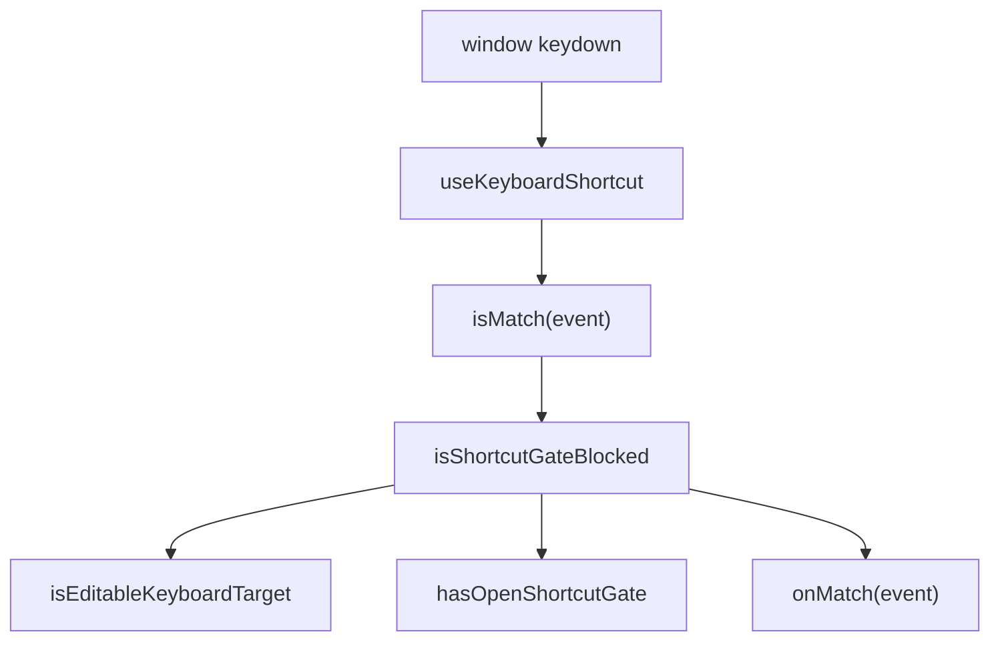

# Keyboard shortcuts

Status: **Living**

Global keyboard shortcuts across the web app are registered through a single
**shortcut gate** so they do not fire while the user is typing in a form field
or while a modal dialog / sheet is open.

Related:

- Gate + matchers: `packages/ui/src/lib/shortcut-gate.ts`
- Hook: `packages/ui/src/hooks/use-keyboard-shortcut.ts`
- Overlay markers: `DialogContent`, `SheetContent` in `@repo/ui`
- Tests: `apps/web/tests/hooks/shortcut-gate.test.tsx`

---

## Goals

- One place to register page-level shortcuts (`useKeyboardShortcut`).
- Block shortcuts when focus is in an editable control (input, textarea, select,
  contenteditable, `role="textbox"`).
- Block shortcuts when any `@repo/ui` dialog or sheet is mounted.
- Allow a shortcut that **owns** an open overlay to still toggle closed
  (`bypassGate`).

## Non-goals

- A global shortcut registry UI (help overlay / cheatsheet) — not implemented.
- Capturing shortcuts inside TipTap mention menus or other component-local
  handlers — those may still use local `keydown` listeners where needed.
- Replacing browser or OS shortcuts (Ctrl/Cmd+C, etc.).

---

## Architecture



### Shortcut gate

| Signal              | Detection                                                                                |
| ------------------- | ---------------------------------------------------------------------------------------- |
| Open dialog / sheet | `[data-shortcut-gate="open"]` on `DialogContent` / `SheetContent`                        |
| Typing in a field   | `event.target` is input, textarea, select, contenteditable, or inside `[role="textbox"]` |

Helpers in `@repo/ui/lib/shortcut-gate`:

| Export                     | Purpose                                             |
| -------------------------- | --------------------------------------------------- |
| `isShortcutGateBlocked`    | Returns whether a global shortcut should be ignored |
| `isModKey`                 | Ctrl/Cmd + letter (e.g. K, B)                       |
| `isShiftLetter`            | Shift + letter (e.g. F)                             |
| `isUnmodifiedKey`          | Plain letter (e.g. M)                               |
| `shortcutGateContentProps` | Spread onto overlay content roots                   |

### Hook

```tsx
useKeyboardShortcut(isMatch, onMatch, {
  enabled: true, // default
  bypassGate: false, // set true when this shortcut owns the open overlay
});
```

Use `useToggleKeyboardShortcut` when the handler only toggles dialog open state
(same match + `setOpen` + `bypassGate: open` pattern).

---

## Shortcut inventory

| Shortcut     | Action                             | Location                       | Gate bypass                      |
| ------------ | ---------------------------------- | ------------------------------ | -------------------------------- |
| **Shift+F**  | Toggle work-items filter dialog    | `work-items-filter-dialog.tsx` | Yes, while filter dialog is open |
| **Ctrl/⌘+K** | Focus list search input            | `search-input.tsx`             | No                               |
| **Ctrl/⌘+K** | Toggle docs search command palette | `docs-search-dialog.tsx`       | Yes, while palette is open       |
| **Ctrl/⌘+B** | Toggle sidebar                     | `@repo/ui` `sidebar.tsx`       | No                               |
| **M**        | Focus comment composer             | `comment-composer.tsx`         | No                               |

Tooltips on filter and search controls mention the relevant shortcut where
applicable.

Component-local shortcuts (not gated globally):

- Comment editor mention menu (↑/↓/Enter/Tab/Escape) — `comment-editor.tsx`
- Comment submit Ctrl/⌘+Enter — editor plugin
- Docs Mermaid fullscreen Escape — `docs-mermaid.tsx`

---

## Adding a new global shortcut

1. Pick a matcher from `shortcut-gate` (`isModKey`, `isShiftLetter`, or
   `isUnmodifiedKey`), or write a custom `isMatch` predicate.
2. Register with `useKeyboardShortcut` (or `useToggleKeyboardShortcut` for
   open/close toggles).
3. Do **not** attach a raw `window.addEventListener('keydown', …)` unless the
   handler is strictly local to one component subtree (e.g. mention autocomplete).
4. If the shortcut opens a `@repo/ui` `Dialog` or `Sheet`, use the shared
   content components so `data-shortcut-gate="open"` is applied automatically.
5. If the shortcut should close its own overlay while typing inside it, pass
   `bypassGate: open` (or use `useToggleKeyboardShortcut`).
6. Add or extend tests in `apps/web/tests/hooks/shortcut-gate.test.tsx`.

---

## Tests

- `pnpm --filter web exec vitest run tests/hooks/shortcut-gate.test.tsx`

Covers editable-target detection, gate presence, bypass behavior, and that
Shift+F does not fire while a gate is open or while an input is focused.

---

## Troubleshooting

| Symptom                                | Likely cause                                                                         |
| -------------------------------------- | ------------------------------------------------------------------------------------ |
| Shortcut fires while typing in a form  | Shortcut not using `useKeyboardShortcut`, or missing gate on custom overlay          |
| Shortcut does not close its own dialog | Missing `bypassGate: open`                                                           |
| Capital letter triggers page shortcut  | Expected when not in a field — use Shift+letter matchers only for intentional chords |
