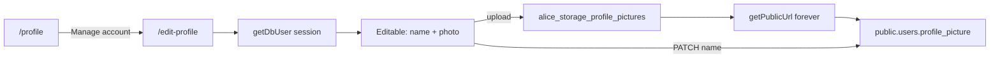

# Edit profile

Status: **Living** (photo + name wired; deferred sections remain UI-only)

Self-service account settings for the signed-in user: update `public.users`
fields that are safe to edit, including uploading a profile picture to a
dedicated Storage bucket and storing a permanent public URL on the user row.

Related:

- Feature index: [README.md](./README.md)
- Auth session helpers: `apps/web/lib/auth.ts`
- Profile create (avatar seed on insert only): `apps/web/lib/ensure-public-user.ts`
- Authentication guide: [AUTHENTICATION.md](../../auth/AUTHENTICATION.md)

---

## Goals

- Let the current user edit **available** profile fields on `/edit-profile`.
- Upload profile pictures to **`alice_storage_profile_pictures`**, then persist a
  **forever public URL** on `public.users.profile_picture`.
- Keep work-item / generic file uploads on a separate bucket:
  **`alice_storage_attachments`**.
- Render avatars from `public.users.profile_picture` only (not Auth
  `user_metadata`).

## Non-goals

- Admin editing another user’s avatar from the users registry
- Wiring work-item `attachments` rows to Storage (separate feature)
- New schema columns (phone, bio, notification prefs) in this plan
- Syncing avatar back into Supabase Auth `user_metadata`

---

## Surfaces

| Surface      | Route           | Role                                   |
| ------------ | --------------- | -------------------------------------- |
| Profile      | `/profile`      | Read-only identity + teams / worked-on |
| Edit profile | `/edit-profile` | Self-service edit (session user only)  |

`/profile` → **Manage your account** → `/edit-profile`. Identity comes from the
session (`getUser()` / `getDbUser()`); no user id is required in the URL.



---

## Storage design

| Bucket                           | Purpose                          | Visibility            | Env var                           |
| -------------------------------- | -------------------------------- | --------------------- | --------------------------------- |
| `alice_storage_attachments`      | Work-item / generic file uploads | Private (recommended) | `STORAGE_BUCKET_ATTACHMENTS`      |
| `alice_storage_profile_pictures` | User avatars                     | **Public**            | `STORAGE_BUCKET_PROFILE_PICTURES` |

### Dashboard setup (manual)

1. Create both buckets in the Supabase project Storage UI (or API).
2. Mark **`alice_storage_profile_pictures`** as **public** so `getPublicUrl`
   returns a stable forever URL.
3. Keep **`alice_storage_attachments`** private unless product requires public
   file links.
4. Set the env vars above in API / local `.env` (see `apps/api/sample.env`).

### Object path convention

```
{userId}/{timestamp}-{safeOriginalName}
```

Example: `a1b2c3d4-…/1710000000000-avatar.png`

### Forever URL

After upload, call Storage `getPublicUrl(path)` and store the resulting
`publicUrl` string on `public.users.profile_picture`. Do **not** use short-lived
signed URLs for avatars.

### Image compression / transforms

When the Supabase project has **Image Transformations** enabled, clients may
request a transformed variant of the public object URL (resize / quality) at
render time. The DB always stores the **canonical** public object URL. If
transforms are not enabled, serve the canonical URL as-is.

---

## Field matrix

| Field               | Source         | Edit on `/edit-profile` | Notes                                                    |
| ------------------- | -------------- | ----------------------- | -------------------------------------------------------- |
| `profile_picture`   | `public.users` | Yes (upload)            | Only self-service update after `ensurePublicUser` insert |
| `name`              | `public.users` | Yes                     | Trim + min length validation                             |
| `email`             | Auth + DB      | Read-only               | Change via Auth flows later                              |
| `role`              | `public.users` | Read-only               | Admin-managed                                            |
| Provider / verified | Auth metadata  | Read-only               | Display only                                             |
| Phone / bio         | —              | Deferred                | No columns yet                                           |
| Notifications       | —              | Deferred                | Mock UI only                                             |
| Security / danger   | —              | Deferred                | Mock UI only                                             |

Initial avatar on **first** `public.users` insert may come from Auth provider
metadata (`avatar_url` / `picture`) via `ensurePublicUser`. Later changes only
through this edit-profile / `POST|PATCH /api/profile` path.

---

## API sketch

### `POST /api/profile` (profile picture)

- Auth required (JWT).
- Multipart image only (e.g. `image/jpeg`, `image/png`, `image/webp`, `image/gif`).
- Size limit smaller than generic files (e.g. **2 MB**).
- Upload via shared `apps/api/src/lib/file-helpers.ts` to
  `STORAGE_BUCKET_PROFILE_PICTURES` under `{userId}/…`.
- Profile service persists forever **public** URL on `public.users.profile_picture`
  and best-effort deletes the previous object when it belonged to this bucket.
- Response: `{ success: true, url, path, user }`.

### `PATCH /api/profile` (name)

- JSON body `{ name }` — updates `public.users.name` for `id = session.user.id`
  only.
- Must **not** reuse admin-gated user update endpoints.

### Attachments upload

- `POST /api/attachments` uses `STORAGE_BUCKET_ATTACHMENTS` via
  `attachments.service` + `file-helpers.ts`.
- Web `/files` page posts to this endpoint.
- Response always includes `{ success, path, url }`. For a **private**
  attachments bucket, `url` is a **signed** URL (time-limited).

---

## Security

- Require authenticated session on upload and self-update.
- Never allow updating another user’s `profile_picture` or `name` via these
  endpoints.
- Restrict MIME types and file size for profile pictures.
- Prefer path prefix `{userId}/` so objects are namespaced per user.
- Best-effort cleanup of superseded avatar objects to avoid orphaned files.

---

## Phased rollout

| Section | Work                                                                          | Status |
| ------- | ----------------------------------------------------------------------------- | ------ |
| 0       | This document + profile README index                                          | Done   |
| 1       | Dual bucket env (`sample.env`, API `env.ts`, `turbo.json`, attachments route) | Done   |
| 2       | Profile-picture upload API + persist URL on `public.users`                    | Done   |
| 3       | Load current user on `/edit-profile` + wire photo UI                          | Done   |
| 4       | Controlled `name` input + persist; leave deferred sections unpersisted        | Done   |

---

## Implementation pointers

| Area                  | Path                                                                                    |
| --------------------- | --------------------------------------------------------------------------------------- |
| Edit page             | `apps/web/app/edit-profile/`                                                            |
| Edit data loader      | `apps/web/app/edit-profile/_components/edit-profile-data.tsx`                           |
| Profile page          | `apps/web/app/profile/`                                                                 |
| Attachments upload    | `apps/api/src/routes/api/attachments/` + `apps/api/src/lib/file-helpers.ts`             |
| Self-service profile  | `apps/api/src/routes/api/profile/` (`POST` picture, `PATCH` name via `profile.service`) |
| Ensure user on signup | `apps/web/lib/ensure-public-user.ts`                                                    |
