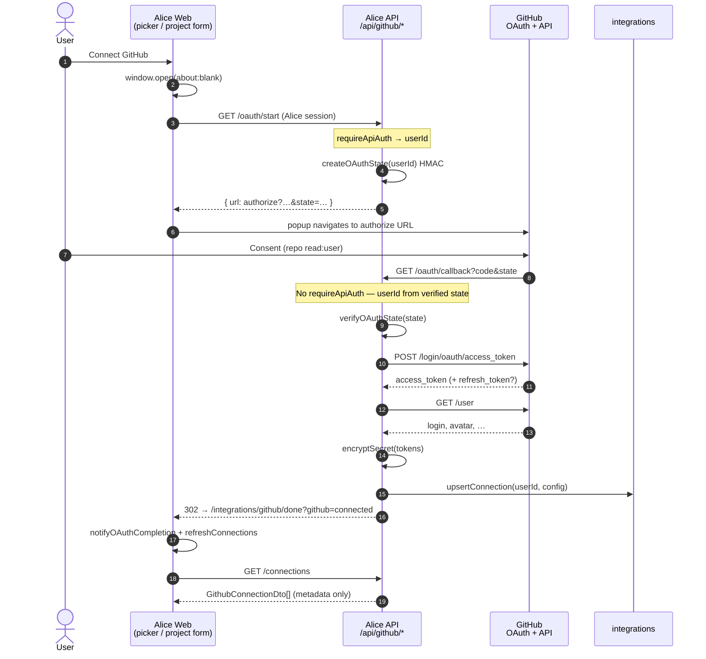

# GitHub Integration — OAuth 2.1 & Secrets Configuration

**Status:** Implemented (GitHub OAuth 2.1/OIDC with AES-256-GCM encryption-at-rest & JIT refresh)  
**Related:** [Projects README](./README.md), [JIRA_INTEGRATION.md](./JIRA_INTEGRATION.md) (shared crypto and popup UX pattern), work-item PR link/list

---

## Architecture & Model

GitHub integration enables Alice workspaces to link pull requests, commits, and branches to work items, following the same OAuth UX pattern established by the Jira integration.

| Concern                    | Approach                                                                                                                                                                                                          |
| -------------------------- | ----------------------------------------------------------------------------------------------------------------------------------------------------------------------------------------------------------------- |
| **Authentication Flow**    | **GitHub OAuth 2.0 Authorization Code Flow** with signed HMAC `state` for CSRF protection and Alice `userId` binding (no DB session row for the in-flight OAuth)                                                  |
| **Client Credentials**     | Configured via environment variables: `GITHUB_CLIENT_ID`, `GITHUB_CLIENT_SECRET`, `GITHUB_REDIRECT_URI`                                                                                                           |
| **Requested Scopes**       | Least privilege: `repo read:user`                                                                                                                                                                                 |
| **Token Storage**          | Stored in the `integrations` table (`provider: 'github'`, `category: 'productivity'`). Both `access_token` and `refresh_token` are encrypted at rest with AES-256-GCM (`v1:...`)                                  |
| **Project Binding**        | `projects.github_repo` stores the target repository path (`owner/repo`). Pull requests and repository links resolve credentials through the user's active GitHub OAuth integration                                |
| **Token Refresh**          | **Just-In-Time (JIT) refresh**: `getValidAccessToken()` validates expiration with clock skew buffer (60s) and automatically refreshes tokens via GitHub OAuth refresh endpoint before making upstream requests    |
| **Client DTO**             | Decrypted tokens are **never** returned to the browser or logged. The frontend only receives connection metadata (`GithubConnectionDto`: `id`, `name`, `status`, `account_login`, `account_avatar_url`, `scopes`) |
| **Backward Compatibility** | Legacy project-level encrypted PATs in `projects.github_token` are supported as fallback if no OAuth connection exists for the user                                                                               |

### Mental model

| Layer                  | Role                                                                                    |
| ---------------------- | --------------------------------------------------------------------------------------- |
| Alice login            | Who is connecting (`requireApiAuth` on `/oauth/start` + `userId` inside signed `state`) |
| GitHub OAuth           | Grants Alice’s OAuth app access to that GitHub account                                  |
| `integrations` row     | Encrypted tokens + account metadata (created/updated **after** callback succeeds)       |
| `projects.github_repo` | Which `owner/repo` to use (binding), not the credential itself                          |

---

## Environment Configuration

Store client credentials securely in `.env` (never commit secrets or client secrets):

```bash
# GitHub OAuth App Credentials
GITHUB_CLIENT_ID=gh_client_id_xxxxxx
GITHUB_CLIENT_SECRET=gh_client_secret_xxxxxx
# Must be the API callback (GitHub redirects the browser here), e.g.:
GITHUB_REDIRECT_URI=http://localhost:5000/api/github/oauth/callback

# Master Key for Encrypting Tokens at Rest + HMAC OAuth state (32-byte Base64)
INTEGRATION_TOKEN_ENCRYPTION_KEY=3q2+7vF9...
```

To generate a new 32-byte base64 encryption key:

```bash
node -e "console.log(require('crypto').randomBytes(32).toString('base64'))"
```

### What is a 32-byte Base64 key?

`INTEGRATION_TOKEN_ENCRYPTION_KEY` must decode from Base64 to **exactly 32 raw bytes**. That buffer is used for:

1. AES-256-GCM encryption of access/refresh tokens (`token-crypto.ts`)
2. HMAC-SHA256 signing of the OAuth `state` parameter (`oauth-state.ts`)

See also [JIRA_INTEGRATION.md](./JIRA_INTEGRATION.md) (same key).

---

## How OAuth `state` binds the Alice user (no DB flag)

**Short answer:** There is **no database flag or server-side OAuth session table**. The “shared memory” between start and callback is the `state` query string itself: a **self-contained, HMAC-signed payload** that Alice issues and later verifies cryptographically.

### What is inside `state`?

`createOAuthState` / `signOAuthState` in `apps/api/src/lib/secrets/oauth-state.ts` build:

```text
base64url(JSON({ userId, nonce, exp })) . base64url(HMAC-SHA256(body))
```

| Field     | Purpose                                                                  |
| --------- | ------------------------------------------------------------------------ |
| `userId`  | Alice user who clicked Connect (from `requireApiAuth` on `/oauth/start`) |
| `nonce`   | Random 16 bytes — uniqueness / CSRF hardness                             |
| `exp`     | Expiry (default **10 minutes**)                                          |
| signature | HMAC over the body with `INTEGRATION_TOKEN_ENCRYPTION_KEY`               |

GitHub does **not** interpret this payload. It only **echoes** the same `state` string back on the redirect to `/api/github/oauth/callback?code=…&state=…`.

### What happens on callback?

1. `verifyOAuthState(state)` recomputes the HMAC and compares with `timingSafeEqual`.
2. If the signature is wrong (tampered `userId`, forged state, wrong key) → reject.
3. If `exp` is past → reject (“try connecting again”).
4. On success, Alice **trusts `userId` from the signed payload** and upserts `integrations` for that id.

The callback route is **intentionally unauthenticated** (`requireApiAuth` is **not** used): the browser arriving from GitHub may not carry Alice’s session cookie the same way, and identity for “who started this connect” comes from verified `state`, not from re-looking-up “is this user in the system?” as a separate OAuth check.

There is **no** step that:

- Stores `state` / nonce in Postgres for later comparison, or
- Sets a “pending OAuth” flag on `users`, or
- Matches callback solely by “user exists in DB”

Existence of the user is only implied because `/oauth/start` required a live Alice session (`req.userId`). If that user were deleted before callback, upsert could fail on FK / constraints — that is incidental, not how binding works.

### Why this is enough

| Threat                                                     | Mitigation                                                                              |
| ---------------------------------------------------------- | --------------------------------------------------------------------------------------- |
| CSRF / attacker finishes OAuth into victim’s Alice account | Attacker cannot forge a valid HMAC for the victim’s `userId` without the encryption key |
| Replay of an old `state`                                   | `exp` TTL (10 minutes)                                                                  |
| Callback without Alice cookie                              | Designed that way — `state` carries identity                                            |

Implementation: `GithubService.buildAuthorizeUrl` → `createOAuthState`; `handleOAuthCallback` → `verifyOAuthState` then `upsertConnection`.

---

## End-to-end sequence



---

## OAuth UX Flow (Jira Parity)

1. **Connection Status**:
   - The project form (Step 3: Source Control) and Project Details Integrations card inspect active GitHub connections using `useGithubConnectionPicker()`.
   - If not connected, an amber "Status: Not connected" badge and a **"Connect GitHub"** button are displayed.
2. **Popup Authorization**:
   - Clicking "Connect GitHub" opens a new window/tab synchronously (`about:blank`) to prevent browser popup blockers (`useOAuthPopupManager`).
   - The client calls `GET /api/github/oauth/start` (authenticated) to obtain the signed GitHub authorization URL.
   - The popup navigates to GitHub for user consent (`prompt=select_account`).
3. **Callback & Completion**:
   - GitHub redirects to `GET /api/github/oauth/callback?code=...&state=...` on the **API**.
   - The backend validates HMAC `state`, exchanges the code for tokens, loads `/user`, encrypts tokens, upserts `integrations`.
   - The backend redirects the popup to `{FRONTEND_URL}/integrations/github/done?github=connected|denied|error`.
   - The done page (`OAuthCompletionView`) notifies the opener via `postMessage` / `BroadcastChannel` / `localStorage`, then the user can close the window.
4. **Auto-Detection**:
   - The parent listens for OAuth completion messages plus `focus` / `visibilitychange`, and refreshes connections without a full page reload.
5. **Connected State & Repository Selection**:
   - UI shows `@account_login`, avatar, green Connected badge.
   - Disconnect: `DELETE /api/github/connections/:id`.
   - Repos: `GET /api/github/repositories` (Bearer token via JIT `getValidAccessToken`), or manual `owner/repo` entry.
   - **No Personal Access Token (PAT) is entered in the UI** for the OAuth path.

---

## Source map

| Step                  | Location                                                              |
| --------------------- | --------------------------------------------------------------------- |
| Popup open + navigate | `apps/web/app/projects/_hooks/use-oauth-popup-manager.ts`             |
| Picker / refresh      | `apps/web/app/projects/_hooks/use-github-connection-picker.ts`        |
| Client API helpers    | `apps/web/app/projects/_services/projects.github.mutations.client.ts` |
| Done page             | `apps/web/app/integrations/github/done/page.tsx`                      |
| Routes                | `apps/api/src/routes/api/github/github.route.ts` (`/api/github`)      |
| OAuth + token logic   | `apps/api/src/routes/api/github/github.service.ts`                    |
| Persistence           | `apps/api/src/routes/api/github/github.repository.ts`                 |
| Signed `state`        | `apps/api/src/lib/secrets/oauth-state.ts`                             |
| Encrypt / decrypt     | `apps/api/src/lib/secrets/token-crypto.ts`                            |

---

## Security & Token Encryption

1. **Encryption at Rest**:
   - Tokens are encrypted using AES-256-GCM with a random 12-byte IV and 16-byte authentication tag: `v1:<iv>:<tag>:<ciphertext>`.
   - Implemented in `apps/api/src/lib/secrets/token-crypto.ts`.
2. **Backend-Only Decryption**:
   - Decryption and scope validation take place strictly in `GithubService` (and consumers such as work-item PR flows) on the API.
   - Decrypted tokens are never serialized to the client and must not be logged.
3. **JIT refresh**:
   - If `expires_at` is within 60s of now and a refresh token exists, Alice calls GitHub’s refresh grant, re-encrypts, and updates `integrations`.
   - Missing/failed refresh → connection marked disabled + `GithubReauthorizationRequiredError`.
4. **Error Handling**:
   - `GithubReauthorizationRequiredError`: refresh expired or user revoked consent.
   - `GithubInsufficientScopeError`: granted scopes lack repository access (`repo` / `public_repo`).
