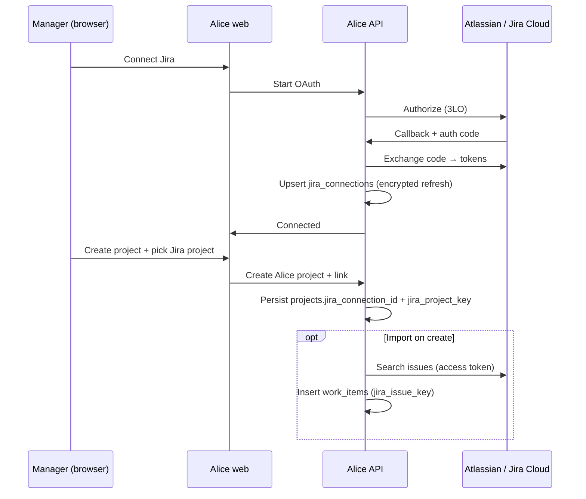

# Jira Cloud integration — Design & Implementation Plan

**Status:** Implemented (Phase 0–2); Phase 3 hardening remaining  
**Related:** [Projects README](./README.md), work items (`jira_issue_key`), [GITHUB_INTEGRATION.md](./GITHUB_INTEGRATION.md) (shared `INTEGRATION_TOKEN_ENCRYPTION_KEY`)

This document replaces the interim “paste API token / global `jira_settings`” approach with **manager-authorized Atlassian OAuth (3LO)** and a **persisted project↔Jira link**. Implement later; do **not** extend the current token UX further except for security hotfixes.

---

## 1. Goals

| Goal                  | Detail                                                                                                                                             |
| --------------------- | -------------------------------------------------------------------------------------------------------------------------------------------------- |
| Authorize per manager | The manager who creates (or links) a project consents in Atlassian; Alice stores _their_ connection.                                               |
| Persist configuration | Project remembers which Jira cloud site + project key to sync; credentials live on a connection row, not on every project as plaintext API tokens. |
| Import on create      | Optional: after Alice project create + Jira link, preview then import issues into `work_items` with `jira_issue_key`.                              |
| Safe sync             | Re-import / sync is idempotent via `(project_id, jira_issue_key)` uniqueness.                                                                      |

Non-goals for v1 of this plan:

- Jira Server / Data Center (Cloud only).
- Bi-directional write-back of Alice edits into Jira.
- Encrypt-at-rest via KMS (document as follow-up; at minimum encrypt refresh tokens with app secret).

---

## 2. Current implementation (to be removed)

Interim design from the colleague Jira work (API email + token):

| Piece                 | Location                                                                       |
| --------------------- | ------------------------------------------------------------------------------ |
| Global settings table | `jira_settings` (+ singleton migration)                                        |
| Project columns       | `projects.jira_url`, `jira_email`, `jira_token`, `jira_project_key`            |
| Env fallback          | `JIRA_API_TOKEN`, `JIRA_EMAIL` in `apps/api` `env.ts`                          |
| Routes                | `POST /api/projects/jira/preview`, `POST …/jira/import`, `PUT …/jira/settings` |
| Client UI             | Project form / project details “Jira” fields + sync                            |
| Types                 | `jira_*` on create schemas; client `Project` may omit token in responses       |
| Work items            | `work_items.jira_issue_key` (**keep**)                                         |

Credential resolution today: request body → project row → `jira_settings` → env. Hosts restricted to `*.atlassian.net`.

**This path must be swept out before building OAuth** so we do not maintain two auth models.

---

## 3. Target architecture

### 3.1 New / changed tables

**`jira_connections`** (new)

| Column                      | Type           | Notes                                    |
| --------------------------- | -------------- | ---------------------------------------- |
| `id`                        | `uuid`         | PK                                       |
| `user_id`                   | `uuid`         | Manager who authorized (FK `users`)      |
| `cloud_id`                  | `text`         | Atlassian cloud id                       |
| `site_url`                  | `text`         | e.g. `https://{subdomain}.atlassian.net` |
| `account_email`             | `text?`        | Display only                             |
| `refresh_token_enc`         | `text`         | Encrypted; never returned to clients     |
| `access_token_enc`          | `text?`        | Optional cache; prefer refresh-on-demand |
| `access_token_expires_at`   | `timestamptz?` |                                          |
| `scopes`                    | `text`         | Space-separated scopes granted           |
| `status`                    | `enum`         | `active` / `revoked` / `expired`         |
| `created_at` / `updated_at` | `timestamptz`  |                                          |

**`projects`** (replace token columns)

| Keep / add                                               | Drop                                                       |
| -------------------------------------------------------- | ---------------------------------------------------------- |
| `jira_connection_id` (FK → `jira_connections`, nullable) | `jira_token`                                               |
| `jira_project_key`                                       | `jira_email` (optional: keep display-only from connection) |
| `jira_cloud_id` (optional denormalized)                  | `jira_url` (derive from connection `site_url`)             |

**`work_items.jira_issue_key`** — keep; keep unique index on `(project_id, jira_issue_key)` WHERE NOT NULL.

**Drop** table `jira_settings` after sweep.

### 3.2 API (target)

| Endpoint                                 | Purpose                                                     |
| ---------------------------------------- | ----------------------------------------------------------- |
| `GET /api/jira/oauth/start`              | Redirect URL / state for Atlassian 3LO                      |
| `GET /api/jira/oauth/callback`           | Exchange code; upsert `jira_connections` for session user   |
| `GET /api/jira/connections`              | List current user’s connections (no secrets)                |
| `DELETE /api/jira/connections/:id`       | Revoke locally (+ optional Atlassian revoke)                |
| `GET /api/jira/connections/:id/projects` | List Jira projects visible to that connection               |
| `POST /api/projects`                     | Accept `jira_connection_id` + `jira_project_key` (optional) |
| `POST /api/projects/:id/jira/import`     | Import/sync using the project’s connection                  |
| `POST /api/projects/:id/jira/preview`    | Preview only                                                |

Remove: `GET/PUT /api/projects/jira/settings`, body/env API-token import paths.

Env (target): `ATLASSIAN_CLIENT_ID`, `ATLASSIAN_CLIENT_SECRET`, `ATLASSIAN_REDIRECT_URI`, `INTEGRATION_TOKEN_ENCRYPTION_KEY` (shared with GitHub PAT encryption — see [GITHUB_INTEGRATION.md](./GITHUB_INTEGRATION.md)). Remove reliance on `JIRA_API_TOKEN` / `JIRA_EMAIL` for product flows.

### 3.3 UX (target)

1. **Settings / Manager:** “Connect Jira” → Atlassian consent → “Connected to {site}”.
2. **Create project:** After basics, optional “Link Jira project” (dropdown of Jira projects from connection). Toggle “Import existing issues”.
3. **Project details:** Show linked key; “Sync from Jira” (async job preferred for large projects).
4. Never show or ask for API tokens in the UI.

---

## 4. Implementation order (mandatory)

### Phase 0 — Sweep current implementation

Do this **first**, in one PR (or a stacked pair: “remove UI” then “remove API/schema”).

1. **UI**
   - Remove Jira URL / email / token / key fields and sync buttons that call the interim endpoints from:
     - `apps/web/app/projects/_components/project-form.tsx`
     - `apps/web/app/projects/[id]/_components/project-details-workspace.tsx`
   - Remove related tests that assert token/settings UX.

2. **API**
   - Delete or gut handlers: `/jira/preview`, `/jira/import`, `/jira/settings` and helpers (`fetchAndParseJiraIssues`, `resolveJiraCredentials`, etc.) in `projects.route.ts` / repository.
   - Stop accepting `jira_token` / `jira_email` / `jira_url` on create/update project schemas if unused.
   - Remove `JIRA_API_TOKEN` / `JIRA_EMAIL` from product paths (`env.ts` + `turbo.json` once unused).

3. **Schema**
   - Migration: drop `projects.jira_token`, `jira_email`, `jira_url` (and `jira_project_key` only if you will re-add it with the new FK model in the same epic—otherwise keep `jira_project_key` null until Phase 1).
   - Drop table `jira_settings` (+ singleton index).
   - **Do not drop** `work_items.jira_issue_key` or its unique index (imported keys remain valid historical data).

4. **Docs / types**
   - Update this README’s “interim” blurb to “removed; see plan”.
   - Regenerate Supabase types after migrations.
   - Grep for `jira_token`, `jira_settings`, `JIRA_API_TOKEN` and clear leftovers.

5. **Verify**
   - `pnpm turbo run checktypes --filter=api --filter=web`
   - Project create/edit still works with no Jira UI.

### Phase 1 — OAuth connection

1. Register Atlassian Cloud OAuth app (3LO); configure redirect to Alice API callback.
2. Add `jira_connections` + encryption helper.
3. Implement start + callback + list + delete connection APIs.
4. Minimal UI: Connect / Disconnect Jira for managers.

### Phase 2 — Link on project create + import

1. Add `projects.jira_connection_id` (+ `jira_project_key` / `jira_cloud_id` as needed).
2. Project picker UI using connection.
3. Preview + import using refreshed access token; reuse unique `jira_issue_key` skip behavior.
4. **Client fetch timeout:** `importJiraIssues` must pass `timeoutMs` (90s, same pattern as chat `CHAT_FETCH_TIMEOUT_MS`) so default `apiFetch` 20s abort does not fail mid-import and surface as `BackendUnreachableError` (“Could not connect to the backend”).
5. Prefer background job for import if issue count is large; return `importedCount` / job id (still needed when imports regularly exceed ~90s).

### Phase 3 — Hardening

1. Token encryption / rotation; revoke on disconnect.
2. SSRF: only call Atlassian APIs with cloud id / allowed hosts (no free-form user URL for fetches).
3. Audit log: who linked which Jira project.
4. Optional: cron refresh of tokens; sync schedule.

---

## 5. Security notes

- Refresh tokens: server-only; encrypt at rest; never select into client DTOs.
- OAuth `state` parameter: CSRF-bind to session user.
- Scopes: least privilege (read issues / browse projects as needed for import).
- Connection ownership: only the owning manager (or admin) may use/delete a connection; project link must reference a connection the actor can access.

---

## 6. Testing checklist (when implementing)

- [ ] Sweep: no interim Jira UI/routes; projects CRUD green.
- [ ] OAuth happy path + denied consent.
- [ ] Link project → preview → import; second import skips duplicates.
- [ ] Import lasting >20s completes (client `timeoutMs` ≥ 90s); does not show false “Could not connect to the backend”.
- [ ] Concurrent import respects unique `(project_id, jira_issue_key)`.
- [ ] Revoke connection → import returns 4xx; no token leakage in JSON.

---

## 7. How it works (implemented)

### OAuth (3LO) flow

1. Manager clicks **Connect Jira** → web calls `GET /api/jira/oauth/start` → `{ url }`.
2. Alice opens Atlassian authorize in a **new tab** (`window.open`) so create/edit **dialogs stay open** in the original tab (scopes: `read:jira-work read:jira-user offline_access`).
3. `state` is an HMAC-signed payload (`userId`, nonce, expiry) using the same **32-byte Base64** key as GitHub encryption — see [GITHUB_INTEGRATION.md](./GITHUB_INTEGRATION.md#what-is-a-32-byte-base64-key) (`resolveIntegrationEncryptionKey`).
4. Callback `GET /api/jira/oauth/callback` verifies `state`, exchanges `code` for tokens, loads accessible resources, upserts `jira_connections` with **encrypted** refresh/access tokens.
5. Redirects the OAuth tab to `/integrations/jira/done?jira=connected` (auto-close / “Close tab”); the original tab refreshes connections on focus / when the OAuth tab closes.

### Linking + import

1. Create wizard **Imports** or details **Integrations** pick `jira_connection_id` + Jira project key.
2. Project row stores those IDs (no API email/token columns).
3. `POST /api/projects/:id/jira/preview|import` loads the connection, refreshes access token if needed, calls  
   `https://api.atlassian.com/ex/jira/{cloudId}/rest/api/3/…` with Bearer auth.
4. Import creates work items with `jira_issue_key`; duplicates skipped via unique `(project_id, jira_issue_key)`.
5. Web `importJiraIssues` uses `timeoutMs: 90_000` (mirrors chat) so the shared `getResponse` abort does not cancel a healthy long import.

### Shared web pieces (deduped)

| Piece                                                | Role                                                                  |
| ---------------------------------------------------- | --------------------------------------------------------------------- |
| `useJiraConnectionPicker`                            | Loads connections + projects for a site; starts OAuth                 |
| `JiraConnectionFields`                               | Site + project selects (+ optional Connect chrome)                    |
| `jsonErrorFromCaught` / `httpStatusFromErrorMessage` | Maps `Unauthorized…` → 403, `not found` → 404 on Jira/projects routes |

### Env

| Variable                                            | Purpose                                                             |
| --------------------------------------------------- | ------------------------------------------------------------------- |
| `ATLASSIAN_CLIENT_ID` / `_SECRET` / `_REDIRECT_URI` | Atlassian OAuth app                                                 |
| `INTEGRATION_TOKEN_ENCRYPTION_KEY`                  | Encrypt OAuth tokens + HMAC OAuth `state` (shared with GitHub PATs) |

---

## 8. References

- [Atlassian OAuth 2.0 (3LO) apps](https://developer.atlassian.com/cloud/jira/platform/oauth-2-3lo-apps/)
- [Jira Cloud REST APIs](https://developer.atlassian.com/cloud/jira/platform/rest/v3/)
- [GITHUB_INTEGRATION.md](./GITHUB_INTEGRATION.md) — encryption key format and write-only PAT contract
- Existing Alice patterns: Express routers under `apps/api/src/routes/api/`, SSR reads vs API mutations, `@repo/types` for shared DTOs.
