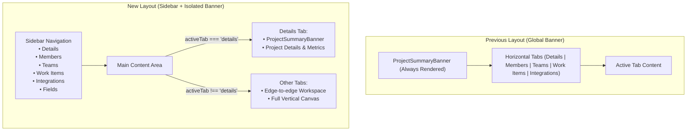

# Project Details View: Sidebar & Dynamic Fields

Status: **Living (Production)**

Comprehensive architecture, design, and technical specification for the **Project Details workspace** (`/projects/[id]`), featuring responsive **sidebar navigation**, isolating the **project summary banner** to the Details tab, managing project-aligned dynamic fields configured via **JSON Schema**, a curated **starter templates catalog** with safe removal confirmation workflows, non-intrusive **work-item integration** with graceful error boundaries, and **Alice AI Assistant** natural language schema generation.

Related:

- Feature index: [README.md](./README.md)
- User guide: [dynamic-fields.md](../../user-guide/projects/dynamic-fields.md)
- Projects workspace UI: `apps/web/app/projects/[id]/_components/project-details-workspace.tsx`
- Fields workspace UI: `apps/web/app/projects/_components/project-details/project-fields-workspace.tsx`
- Load template dialog: `apps/web/app/projects/_components/project-details/load-template-dialog.tsx`
- Starter templates catalog: `apps/web/app/projects/_components/project-details/load-template-dialog.data.ts`
- Error & confirmation dialog: `apps/web/app/projects/_components/project-details/project-fields-error-dialog.tsx`
- Alice AI generator dialog: `apps/web/app/projects/_components/project-details/generate-fields-alice-dialog.tsx`
- Dynamic field types & enums: `packages/types/src/api/v1/dynamic-fields.ts`
- Work-item dynamic fields helper: `apps/web/app/work-items/_helpers/work-item-dynamic-fields.ts`
- Work-item sidebar dynamic fields: `apps/web/app/work-items/_components/work-item-details/safe-dynamic-fields-section.tsx`
- Work-item sidebar container: `apps/web/app/work-items/_components/work-item-details/work-item-details-sidebar.tsx`
- Database schema: `packages/db/prisma/schema.prisma` (`projects.attributes_config`)
- RBAC permissions: `apps/web/lib/rbac/roles.ts` (`isManagerOrAdmin`)
- Alice AI backend: `apps/api/src/routes/api/chat/` & [AI_CHATBOT.md](../chat/AI_CHATBOT.md)
- In-app documentation browser: [docs/features/docs/README.md](../docs/README.md)

---

## 1. Executive Summary & Goals

The Project Details workspace serves as the central operational hub for managing project-specific settings, team structures, members, work items, and third-party integrations. As the capabilities of the workspace expand, the existing layout faces two usability challenges:

1. **Horizontal tab crowding**: Adding more workspace tabs horizontally compromises responsiveness on smaller viewports and creates header clutter.
2. **Vertical space consumption**: The `ProjectSummaryBanner` was previously rendered globally across all tabs, consuming valuable vertical screen space on data-dense views such as Work Items, Teams, and Integrations.

Furthermore, development teams need the ability to define **project-specific dynamic metadata** (such as _MoSCoW Rating_, _Acceptance Criteria_, _Business Value_, or _Target Environment_) that appear on work items belonging to that project, without requiring hardcoded database migrations or global system changes.

### Key Objectives & Delivered Capabilities

- **Sidebar Navigation**: Replaced the top horizontal tab bar with an intuitive, responsive vertical sidebar navigation adhering to Alice design standards (`SettingsWorkspace` pattern).
- **Banner Isolation**: Rendered the `ProjectSummaryBanner` exclusively on the `Details` tab, allowing other tabs (`Members`, `Teams`, `Work Items`, `Integrations`, `Fields`) to utilize the full available canvas area.
- **Fields Configuration Workspace**: Added a dedicated `Fields` tab allowing authorized managers and administrators to view, edit, beautify, validate, and save dynamic field definitions with optimistic concurrency control.
- **Starter Templates Catalog**: Delivered 8 production-ready agile field templates across 6 categories (Agile Prioritization, Requirements & QA, Strategy & Value, Release Management, Security & Governance, Defects & QA, DevOps & Deployment).
- **Initial Zero-Selection Default Rule**: When opening the Load Template dialog for the first time on a project with no dynamic fields configured, **zero (0) templates are pre-selected by default**. Users intentionally select only the templates relevant to their project instead of having unwanted presets imposed.
- **Safe Template Removal Confirmation**: Deselecting an existing template that has values stored in project work items triggers an interactive warning modal (`ProjectFieldsErrorDialog`) detailing the affected work items and their values before confirming removal.
- **Standardized Types & Enums**: Exported strict TypeScript enums and Zod schemas from `@repo/types` (`DynamicFieldTypeEnum`, `DynamicFieldFormatEnum`, `TypeofEnum`, `SchemaValidationStatusEnum`, `TemplateFieldCategoryEnum`, etc.).
- **Non-Intrusive Work-Item Integration**: Rendered configured dynamic fields optionally on work items. Dynamic fields **must never** become mandatory work-item validation rules or impede work-item creation, edits, or status transitions.
- **Graceful Degradation & Error Boundaries**: Isolated dynamic field rendering with `DynamicFieldsErrorBoundary` and fallback parsing to ensure that broken schemas never crash the work item page or core functionality.
- **Alice AI Assistant**: Enabled users to describe custom fields in natural language (e.g. _"I want every work-item to optionally have a MoSCoW rating and acceptance criteria"_), allowing Alice to generate or edit the JSON Schema with automated validation before saving.

---

## 2. Information Architecture & Navigation

### 2.1 Workspace Hierarchy

The redesigned Project Details layout separates navigation from content:

```text
Project Details Workspace (/projects/[id])
├── Sidebar Navigation (Left, md:w-56)
│   ├── Details      (Icon: Info)
│   ├── Members      (Icon: Users)
│   ├── Teams        (Icon: Network)
│   ├── Work Items   (Icon: ClipboardPenLine)
│   ├── Integrations (Icon: Plug)
│   └── Fields       (Icon: SlidersHorizontal)
│
└── Content Canvas (Right / Full Area)
    ├── Details      → ProjectSummaryBanner + ProjectDetailsTab
    ├── Members      → ProjectMembersTab (Edge-to-edge content area)
    ├── Teams        → ProjectTeamsPanel (Edge-to-edge content area)
    ├── Work Items   → WorkItemsWorkspace (Edge-to-edge content area)
    ├── Integrations → ProjectIntegrationsTab (Edge-to-edge content area)
    └── Fields       → ProjectFieldsWorkspace (Edge-to-edge content area)
```

### 2.2 Navigation State & URL Synchronization

The active tab is tracked using the `tab` URL query parameter, preserving bookmarkability, deep linking, and browser back/forward history:

| Tab ID         | URL Route                                        | Minimum Viewer Role     | Description                                         |
| :------------- | :----------------------------------------------- | :---------------------- | :-------------------------------------------------- |
| `details`      | `/projects/[id]` or `/projects/[id]?tab=details` | Member                  | Overview, metrics, branding banner, start/end dates |
| `members`      | `/projects/[id]?tab=members`                     | Member                  | Project member roster and assignments               |
| `teams`        | `/projects/[id]?tab=teams`                       | Member                  | Teams associated with the project                   |
| `work-items`   | `/projects/[id]?tab=work-items`                  | Member                  | Flat/hierarchical work-item table & backlog         |
| `integrations` | `/projects/[id]?tab=integrations`                | Member (Edit: Manager+) | Jira Cloud & GitHub repository links                |
| `fields`       | `/projects/[id]?tab=fields`                      | Member (Edit: Manager+) | Dynamic fields JSON Schema configuration            |

The helper `parseProjectDetailsTab` in `apps/web/lib/search-params.ts` is extended to support `'fields'`:

```typescript
export type ProjectDetailsTab =
  'details' | 'members' | 'teams' | 'work-items' | 'integrations' | 'fields';

export function parseProjectDetailsTab(tab?: string | null): ProjectDetailsTab {
  if (
    tab === 'members' ||
    tab === 'teams' ||
    tab === 'work-items' ||
    tab === 'integrations' ||
    tab === 'fields'
  ) {
    return tab;
  }
  return 'details';
}
```

### 2.3 UI & Responsive Design Patterns

The sidebar follows the established layout pattern from `apps/web/app/settings/_components/settings-workspace.tsx`:

- **Desktop (`md:` breakpoint and above)**:
  - Fixed-width sidebar (`md:w-56` or `md:w-60`) docked to the left with `border-r border-border`.
  - Content area occupies `flex-1 min-w-0 overflow-y-auto`.
  - Selected tab highlighted with `bg-muted text-foreground font-medium`.
  - Inactive tabs use `text-muted-foreground hover:bg-muted/60 hover:text-foreground`.
- **Mobile (`< md` breakpoint)**:
  - Responsive horizontal scroll strip or collapsible navigation header with clean touch targets.
  - Seamless viewport adaptation without layout shifts or horizontal clipping.

---

## 3. Project Banner Isolation

In the previous design, `ProjectSummaryBanner` rendered above the tab container, consuming over 200px of vertical space on every screen.

### Implementation Change

1. Remove `ProjectSummaryBanner` from the outer shell of `apps/web/app/projects/[id]/_components/project-details-workspace.tsx`.
2. Move `<ProjectSummaryBanner project={project} canEditBranding={isManagerOrAdmin} />` into the `details` tab container (`<TabsContent value="details">`).
3. For all other tabs (`work-items`, `teams`, `members`, `integrations`, `fields`), the tab content mounts directly at the top of the canvas.



---

## 4. Dynamic Fields Data Model & Standard Enums

Dynamic fields allow projects to adapt to diverse agile methodologies (Scrum, Kanban, SAFe, Shape Up) without requiring database migrations or code modifications.

### 4.1 Storage Location

Dynamic field configurations are stored on the `projects` table using the existing JSONB column:

```prisma
model projects {
  id                String        @id @default(dbgenerated("gen_random_uuid()")) @db.Uuid
  name              String
  key               String        @unique
  // ...
  attributes_config Json?         // <-- Stores the Project Dynamic Fields JSON Schema
  workflow_config   Json?
  // ...
}
```

> [!NOTE]
> Reusing `projects.attributes_config` avoids new database migrations. The column is already nullable JSONB in PostgreSQL, generated in Prisma Client, and supported across existing mock factories and tests.

### 4.2 Standard TypeScript Enums (`@repo/types`)

All field types, formats, categories, and keys are standardized in `packages/types/src/api/v1/dynamic-fields.ts`:

```typescript
export enum DynamicFieldTypeEnum {
  STRING = 'string',
  NUMBER = 'number',
  INTEGER = 'integer',
  BOOLEAN = 'boolean',
  ARRAY = 'array',
  OBJECT = 'object',
}

export enum DynamicFieldFormatEnum {
  DATE = 'date',
  URI = 'uri',
  MULTILINE = 'multiline',
}

export enum DynamicFieldInputTypeEnum {
  DATE = 'date',
  URL = 'url',
  TEXT = 'text',
}

export enum TypeofEnum {
  OBJECT = 'object',
  STRING = 'string',
  NUMBER = 'number',
  BOOLEAN = 'boolean',
  UNDEFINED = 'undefined',
  FUNCTION = 'function',
}

export enum SchemaValidationStatusEnum {
  VALID = 'valid',
  INVALID = 'invalid',
  UNVALIDATED = 'unvalidated',
}

export enum TemplateFieldCategoryEnum {
  AGILE_PRIORITIZATION = 'Agile Prioritization',
  REQUIREMENTS_QA = 'Requirements & QA',
  STRATEGY_VALUE = 'Strategy & Value',
  RELEASE_MANAGEMENT = 'Release Management',
  SECURITY_GOVERNANCE = 'Security & Governance',
  DEFECTS_QA = 'Defects & QA',
  DEVOPS_DEPLOYMENT = 'DevOps & Deployment',
}

export enum TemplateFieldKeyEnum {
  MOSCOW_RATING = 'moscowRating',
  ACCEPTANCE_CRITERIA = 'acceptanceCriteria',
  BUSINESS_VALUE = 'businessValue',
  RELEASE_NOTES_INCLUDED = 'releaseNotesIncluded',
  SECURITY_CLASSIFICATION = 'securityClassification',
  COMPLIANCE_TIER = 'complianceTier',
  SEVERITY = 'severity',
  ENVIRONMENT = 'environment',
}

export enum DynamicFieldConfirmationModeEnum {
  WARNING = 'warning',
  ERROR = 'error',
  INFO = 'info',
}
```

### 4.3 Zod Schema Validation

Configurations are validated client-side and server-side using `ProjectFieldsConfigSchema`:

```typescript
import { z } from 'zod';
import { DynamicFieldTypeEnum } from './dynamic-fields';

export const DynamicFieldPropertySchema = z.object({
  type: z.enum([
    DynamicFieldTypeEnum.STRING,
    DynamicFieldTypeEnum.NUMBER,
    DynamicFieldTypeEnum.INTEGER,
    DynamicFieldTypeEnum.BOOLEAN,
    DynamicFieldTypeEnum.ARRAY,
  ]),
  title: z.string().min(1, 'Title is required'),
  description: z.string().optional(),
  enum: z
    .array(z.string().min(1, 'Enum options cannot be empty'))
    .min(1, 'Enum must contain at least one option')
    .optional(),
  items: z
    .object({
      type: z.enum([
        DynamicFieldTypeEnum.STRING,
        DynamicFieldTypeEnum.NUMBER,
        DynamicFieldTypeEnum.INTEGER,
        DynamicFieldTypeEnum.BOOLEAN,
      ]),
      enum: z.array(z.string().min(1)).optional(),
    })
    .optional(),
  format: z.string().optional(),
  default: z.unknown().optional(),
  'x-component': z.string().optional(),
});

export const ProjectFieldsConfigSchema = z.object({
  $schema: z.string().optional(),
  type: z.literal('object'),
  title: z.string().optional(),
  description: z.string().optional(),
  properties: z.record(
    z.string().regex(/^[a-zA-Z0-9_-]+$/, {
      message:
        'Field identifier must only contain letters, numbers, hyphens, and underscores',
    }),
    DynamicFieldPropertySchema
  ),
  additionalProperties: z.boolean().optional().default(true),
});

export type DynamicFieldProperty = z.infer<typeof DynamicFieldPropertySchema>;
export type ProjectFieldsConfig = z.infer<typeof ProjectFieldsConfigSchema>;
```

### 4.4 Standard JSON Schema Structure

Configurations adhere to standard JSON Schema (compatible with Draft-07 and Draft 2020-12):

```json
{
  "$schema": "https://json-schema.org/draft/2020-12/schema",
  "type": "object",
  "title": "Project Dynamic Work-Item Fields",
  "description": "Custom metadata fields configured for project work items",
  "properties": {
    "moscowRating": {
      "type": "string",
      "title": "MoSCoW Rating",
      "description": "Agile MoSCoW prioritization category",
      "enum": ["Must", "Should", "Could", "Won't"]
    },
    "acceptanceCriteria": {
      "type": "string",
      "title": "Acceptance Criteria",
      "description": "Conditions that must be met for this work item to be accepted",
      "format": "multiline"
    }
  },
  "additionalProperties": true
}
```

### 4.5 Field Evolution Matrix

| Field Kind        | JSON Schema Representation                | UI Form Component            | Storage Representation         |
| :---------------- | :---------------------------------------- | :--------------------------- | :----------------------------- |
| **Short Text**    | `type: "string"`                          | Single-line `Input`          | `string`                       |
| **Long Text**     | `type: "string", format: "multiline"`     | Multiline `Textarea`         | `string`                       |
| **Single Select** | `type: "string", enum: [...]`             | Single-select `Select`       | `string` (matching option)     |
| **Multi-Select**  | `type: "array", items: { enum: [...] }`   | Tag selector / Pill badges   | `string[]`                     |
| **Number**        | `type: "number", minimum: X, maximum: Y`  | Numeric `Input` (float)      | `number`                       |
| **Integer**       | `type: "integer", minimum: X, maximum: Y` | Numeric `Input` (int)        | `number`                       |
| **Boolean**       | `type: "boolean", default: false`         | `Switch` toggle              | `boolean`                      |
| **Date**          | `type: "string", format: "date"`          | Date `Input` (`type="date"`) | ISO date string (`YYYY-MM-DD`) |
| **URL / Link**    | `type: "string", format: "uri"`           | URL `Input` (`type="url"`)   | URI string                     |

---

## 5. Fields Workspace UI & Starter Template System

The `ProjectFieldsWorkspace` provides an end-to-end configuration environment with visual preview cards, a developer-friendly code editor, and starter template tools:

```text
+-----------------------------------------------------------------------------------------------+
| Dynamic Fields (Icon: SlidersHorizontal)                                                      |
| Configure custom metadata fields for work items in this project using standard JSON Schema.   |
|                                                                                               |
| [ 🔄 Load Template ] [ 📋 Beautify ] [ ✓ Validate ] [ ✨ Generate with Alice ] [ 💾 Save ]    |
|                                                                                               |
| [ ✓ Valid Schema: Ready to save (Auto-dismissing)                                           ] |
|                                                                                               |
| Configured Fields (3) - Rendered preview of fields defined in the schema                      |
| +-------------------------+ +-------------------------+ +-----------------------------------+ |
| | MoSCoW Rating           | | Acceptance Criteria     | | Include in Release Notes          | |
| | Key: moscowRating       | | Key: acceptanceCriteria | | Key: releaseNotesIncluded         | |
| | Type: string            | | Type: string (multiline)| | Type: boolean                     | |
| | Options: Must, Should...| | Conditions for accep... | | Customer release notes flag       | |
| +-------------------------+ +-------------------------+ +-----------------------------------+ |
|                                                                                               |
| JSON Schema Editor                                                                            |
| +----+--------------------------------------------------------------------------------------+ |
| |  1 | {                                                                                    | |
| |  2 |   "$schema": "https://json-schema.org/draft/2020-12/schema",                           | |
| |  3 |   "type": "object",                                                                  | |
| |  4 |   "title": "Project Dynamic Work-Item Fields",                                       | |
| |  5 |   "properties": { ... }                                                              | |
| |  6 | }                                                                                    | |
| +----+--------------------------------------------------------------------------------------+ |
+-----------------------------------------------------------------------------------------------+
```

### 5.1 Starter Templates Catalog

Defined in `apps/web/app/projects/_components/project-details/load-template-dialog.data.ts`, the catalog provides 8 industry-standard agile field templates across 6 categories:

| Category                  | Field Title              | Property Key             | Type & Specifications                                                  |
| :------------------------ | :----------------------- | :----------------------- | :--------------------------------------------------------------------- |
| **Agile Prioritization**  | MoSCoW Rating            | `moscowRating`           | `string`, `enum: ["Must", "Should", "Could", "Won't"]`                 |
| **Requirements & QA**     | Acceptance Criteria      | `acceptanceCriteria`     | `string`, `format: "multiline"`                                        |
| **Strategy & Value**      | Business Value           | `businessValue`          | `number`, `minimum: 1`, `maximum: 100`                                 |
| **Release Management**    | Include in Release Notes | `releaseNotesIncluded`   | `boolean`, `default: false`                                            |
| **Security & Governance** | Security Classification  | `securityClassification` | `string`, `enum: ["Public", "Internal", "Confidential", "Restricted"]` |
| **Security & Governance** | Compliance Tier          | `complianceTier`         | `string`, `enum: ["Tier 1", "Tier 2", "Tier 3", "Tier 4"]`             |
| **Defects & QA**          | Defect Severity          | `severity`               | `string`, `enum: ["Blocker", "Critical", "Major", "Minor", "Trivial"]` |
| **DevOps & Deployment**   | Target Environment       | `environment`            | `string`, `enum: ["Development", "Staging", "UAT", "Production"]`      |

### 5.2 Default Template Selection Behavior

> [!IMPORTANT]
> **Initial Zero-Selection Default Rule**: When opening the `LoadTemplateDialog` for the first time on a project with **no existing dynamic fields** (`existingKeySet.size === 0`), the dialog initializes with **0 templates pre-selected** (`selectedKeys = new Set()`).
>
> This gives project managers a clean slate to intentionally select only the templates relevant to their team's workflow instead of imposing unsolicited default configurations.
>
> If a project already has fields configured, opening the dialog automatically pre-selects the templates currently present in that project.

### 5.3 Safe Template Removal Flow & Confirmation

To prevent accidental data loss, removing a template that already has values assigned to work items is protected by a safety confirmation modal:

1. When a manager deselects a template field already present in the project, `handleToggle` invokes `findWorkItemsWithFieldValues(loadedWorkItems, key)`.
2. If any work item has existing values for that field, deselecting is intercepted:
3. A `ProjectFieldsErrorDialog` confirmation popup appears:
   - **Title**: `Remove Field Template: <Field Title>`
   - **Description**: _Work item values will be removed under this template. Existing values assigned in work items for this field will no longer be available once this template is unselected and saved._
   - **Affected Items List**: Monospace list showing each affected item and its assigned value:
     ```text
     • PROJ-12 (Fix login race condition): Must
     • PROJ-45 (Update payment gateway): Should
     ```
   - **Action Buttons**: `Cancel` (keeps the template selected) or `OK` (confirms deselecting).
4. Similarly, clicking **Deselect All** checks all currently selected fields in the project and displays a consolidated confirmation modal if any work items contain assigned values.

### 5.4 Applying Templates & Feedback

When templates are applied via `onApplyTemplates(fieldsToAdd, keysToRemove)`:

- Selected template properties are merged into the existing schema while preserving existing custom fields.
- Deselected template keys are cleanly pruned from `properties`.
- The schema is re-formatted with 2-space indentation.
- A concise status banner displays contextual feedback:
  - `Added X template fields. Review and save when ready.`
  - `Removed Y template fields. Review and save when ready.`
  - `Updated templates: added X and removed Y fields. Review and save when ready.`

### 5.5 Code Editor & Line Numbering

The built-in JSON editor provides a developer-grade editing experience:

- **Synchronized Line Numbers**: Gutter with synchronized vertical scrolling.
- **Tab Key Handling**: Pressing `Tab` inserts 2 spaces at the cursor position without losing focus.
- **Syntax Error Line Highlighting**: Automatically extracts line numbers matching `line (\d+)` from JSON syntax or validation errors and highlights the offending line in red.
- **Beautify JSON**: Re-indents the entire JSON configuration to clean 2-space formatting.
- **Real-Time Validation**: Validates syntax against `ProjectFieldsConfigSchema`, showing an emerald green confirmation banner that auto-dismisses after 4.5 seconds.
- **Optimistic Concurrency Control**: On save, sends `expectedUpdatedAt` alongside `attributes_config` to prevent concurrent overwrite collisions.

---

## 6. Error Handling & Dialog Architecture (`ProjectFieldsErrorDialog`)

All schema validation errors, syntax errors, permission checks, and template removal confirmations route through the reusable `ProjectFieldsErrorDialog` component (`apps/web/app/projects/_components/project-details/project-fields-error-dialog.tsx`):

### 6.1 Intelligent Error Categorization

The dialog dynamically adapts its title, description, and iconography based on error content:

- **Permission Denied**: Triggered when a non-manager attempts to save (`"Only project managers and administrators can edit and save dynamic field configurations."`).
- **JSON Syntax Error**: Triggered by malformed JSON during parsing or beautification (`"The schema contains invalid JSON syntax. Please correct the syntax before proceeding."`).
- **Schema Validation Error**: Triggered when the JSON does not satisfy `ProjectFieldsConfigSchema` (`"The dynamic fields configuration must adhere to the Project Fields JSON Schema standard."`).
- **Template Removal Confirmation**: Configured with `showCancel={true}` and custom confirm text to safeguard against accidental deletion of configured templates.

### 6.2 Visual Layout & Accessibility

- Built using standard `@repo/ui` Dialog primitives (`Dialog`, `DialogContent`, `DialogHeader`, `DialogTitle`, `DialogDescription`, `DialogFooter`).
- Uses `dismissOnOutsideClick={false}` to prevent accidental dismissal during critical confirmation flows.
- Displays error traces and affected work-item lists in a scrollable monospace card (`max-h-48 overflow-y-auto font-mono text-xs whitespace-pre-wrap`).

---

## 7. Work-Item Integration & Storage Architecture

### 7.1 Strict Invariant: Dynamic Fields are NOT Validation Rules

> [!IMPORTANT]
> Configured dynamic fields provide supplementary metadata. They **must never become mandatory validation rules** for work items.
>
> - Work items can be created, updated, and closed with empty or missing dynamic fields.
> - Work-item creation forms always succeed even when zero dynamic fields are filled.
> - Work-item status transitions (`Draft` → `New` → `ToDo` → `InProgress` → `Testing` → `Done`) are never gated on dynamic field presence.

### 7.2 Two-Tier Storage Specification

Dynamic field values are stored directly within work items using a resilient two-tier architecture:

1. **Primary Format (TipTap JSON Document Attributes)**:
   Stored within the TipTap ProseMirror document structure at `doc.attrs.dynamicFields: Record<string, unknown>`:
   ```json
   {
     "type": "doc",
     "attrs": {
       "dynamicFields": {
         "moscowRating": "Must",
         "acceptanceCriteria": "Given valid credentials, user can login successfully.",
         "releaseNotesIncluded": true,
         "businessValue": 85
       }
     },
     "content": [
       {
         "type": "paragraph",
         "content": [
           { "type": "text", "text": "Work item description body..." }
         ]
       }
     ]
   }
   ```
2. **Backward-Compatibility Fallback (Text Marker)**:
   For plain text descriptions or legacy documents, fields are extracted from a standardized text marker:
   ```text
   [Dynamic Fields]
   moscowRating: Must
   businessValue: 85
   ```

### 7.3 Shared Extraction & Mutation Helpers

Implemented in `apps/web/app/work-items/_helpers/work-item-dynamic-fields.ts`:

- `extractDynamicFieldValues(description)`: Reads dynamic fields from `doc.attrs.dynamicFields` or parses the text marker fallback.
- `patchWorkItemDynamicFields(currentDescription, key, value)`: Immutably sets or deletes a field value in `doc.attrs.dynamicFields`, automatically pruning null or empty values.
- `findWorkItemsWithFieldValues(workItems, fieldKey)`: Scans project work items to identify items that have active values configured for a specific field key.

### 7.4 Work-Item Details Sidebar (`WorkItemSidebar`)

In `apps/web/app/work-items/_components/work-item-details/work-item-details-sidebar.tsx`, dynamic fields are rendered in a dedicated collapsible section:

```tsx
<SidebarCollapsibleSection
  title="Additional Fields"
  open={additionalFieldsOpen}
  onOpenChange={setAdditionalFieldsOpen}
  collapsedHint={`${configuredFieldsCount} project fields`}
>
  <SafeDynamicFieldsSection
    schema={project?.attributes_config}
    values={dynamicFieldValues}
    onFieldChange={handleDynamicFieldChange}
    readOnly={readOnly}
  />
</SidebarCollapsibleSection>
```

### 7.5 Inline Editing Components

`safe-dynamic-fields-section.tsx` provides customized inline editors for every supported field kind:

- **Enums**: Dropdown `Select` with a "None / Clear" option.
- **Booleans**: Instant `Switch` toggle with Yes/No text.
- **Numbers / Integers**: Numeric `Input` with Save (`Check`) and Cancel (`X`) buttons, supporting `Enter` and `Escape` keyboard shortcuts.
- **Arrays with Enums**: Multi-selection badge pills toggling values on click.
- **Multiline Strings**: Expandable `Textarea` with a `Ctrl+Enter` shortcut to save.
- **Date & URL**: Formatted inputs with format validation.

### 7.6 Graceful Degradation & Error Boundary

Corrupted schemas or unknown component types **never crash the work-item view**. If parsing fails, `SafeDynamicFieldsSection` catches the error and returns `null` or renders `DynamicFieldsErrorNotice` via `DynamicFieldsErrorBoundary`.

---

## 8. Alice AI Assistant Integration

Managers can configure custom dynamic fields using conversational natural language via Google Gemini (`apps/api/src/routes/api/chat/`).

### 8.1 User Flow

1. A manager clicks **"Generate with Alice"** on the Fields tab to open `GenerateFieldsAliceDialog`.
2. The user selects a starter suggestion chip or enters a natural language prompt:
   - _"MoSCoW rating and acceptance criteria"_
   - _"Security classification and compliance tier"_
   - _"Customer impact score and release notes flag"_
   - _"Defect severity, reproduction steps, and browser"_
3. Alice transforms the request into a compliant JSON Schema using `generateFieldsSchemaWithAlice(prompt, currentSchema)`.
4. The generated schema is loaded into the JSON editor for inspection, beautification, and validation.
5. The user reviews the visual cards and clicks **"Save Changes"**.

### 8.2 Security & Validation Guardrail

The AI bot **does not write directly to the database**. All AI-generated schemas must pass through client-side Zod validation and server-side authorization before persistence.

---

## 9. Role-Based Access Control (RBAC)

| Role        | View Field Configuration | Edit / Save Schema | Load Starter Templates | Populate Values on Work Items |
| :---------- | :----------------------: | :----------------: | :--------------------: | :---------------------------: |
| **Admin**   |           Yes            |      **Yes**       |        **Yes**         |              Yes              |
| **Manager** |           Yes            |      **Yes**       |        **Yes**         |              Yes              |
| **Member**  | Yes (Read-only summary)  | No (Hidden/Locked) |  No (Hidden / Locked)  |     Yes (Optional input)      |

- **Client side**: When viewed by a Member, action buttons (`Load Template`, `Beautify`, `Generate with Alice`, `Save Changes`) are disabled or hidden, and an amber view-only banner is displayed (`Lock` icon).
- **Server side**: Server actions and PUT endpoints verify `isManagerOrAdmin(currentUserRole)` and check project membership before updating `projects.attributes_config`.

---

## 10. Verification & Test Plan

| Scope                       | Test Location                                                     | Tested Scenarios                                                                                                           |
| :-------------------------- | :---------------------------------------------------------------- | :------------------------------------------------------------------------------------------------------------------------- |
| **Tab Navigation**          | `apps/web/tests/projects/project-details-sidebar-fields.test.tsx` | Sidebar renders all 6 tabs; `parseProjectDetailsTab` parses `'fields'`; query param updates without reload                 |
| **Banner Isolation**        | `apps/web/tests/projects/project-details-sidebar-fields.test.tsx` | `ProjectSummaryBanner` renders exclusively on `?tab=details`; absent on `work-items`, `teams`, `members`, `fields`         |
| **Template Zero-Selection** | `apps/web/tests/projects/project-details-sidebar-fields.test.tsx` | Unconfigured project initializes with 0 templates selected; existing templates pre-select correctly                        |
| **Removal Warning Modal**   | `apps/web/tests/projects/project-details-sidebar-fields.test.tsx` | Deselecting template with existing work-item values shows `ProjectFieldsErrorDialog` with item titles and values           |
| **Schema Validation**       | `apps/web/tests/projects/project-details-sidebar-fields.test.tsx` | Malformed JSON syntax and invalid schema structures block save and highlight offending line numbers                        |
| **Optimistic Concurrency**  | `apps/web/tests/projects/update-project-fields-action.test.ts`    | `updateProjectFieldsConfig` sends `attributes_config` and `expectedUpdatedAt` to prevent concurrent overwrite collisions   |
| **Work-Item Integration**   | `apps/web/tests/work-items/work-item-dynamic-fields.test.tsx`     | `Additional Fields` renders in sidebar; fields populate `doc.attrs.dynamicFields`; missing fields do not block save/status |
| **Graceful Degradation**    | `apps/web/tests/work-items/work-item-dynamic-fields.test.tsx`     | Corrupted or malformed schema returns fallback notice without throwing or crashing the parent work item view               |

---

## 11. Implementation Status & Checklist

All core architecture requirements, user experience enhancements, and testing goals are fully implemented and verified in production:

- [x] **Sidebar Navigation**: Refactored `ProjectDetailsWorkspace` to a left-docked sidebar (`md:w-56`) with all 6 tabs (`details`, `members`, `teams`, `work-items`, `integrations`, `fields`).
- [x] **Banner Isolation**: Isolated `ProjectSummaryBanner` strictly inside `<TabsContent value="details">`.
- [x] **Dynamic Fields Tab**: Created `ProjectFieldsWorkspace` with JSON Schema editor, synchronized line numbers, tab indentation, and error line highlighting.
- [x] **Visual Summary Cards**: Rendered live preview cards above the editor summarizing field names, types, badges, enums, and descriptions.
- [x] **Starter Templates Catalog**: Built `LoadTemplateDialog` with 8 industry-standard agile field templates across 6 categories.
- [x] **Initial Zero-Selection Default**: Configured `LoadTemplateDialog` so unconfigured projects start with 0 pre-selected templates.
- [x] **Safe Removal Confirmation Dialog**: Implemented `ProjectFieldsErrorDialog` warning popup when deselecting templates with active work-item values.
- [x] **Beautify & Validation**: Added one-click JSON beautification and real-time Zod meta-schema validation with auto-dismissing feedback banner.
- [x] **Alice AI Assistant**: Integrated `GenerateFieldsAliceDialog` with Gemini chat backend for natural language schema generation.
- [x] **Typed Enums & Schemas**: Standardized `DynamicFieldTypeEnum`, `TemplateFieldCategoryEnum`, `TemplateFieldKeyEnum`, and Zod schemas in `@repo/types`.
- [x] **Work-Item Storage & Integration**: Implemented TipTap ProseMirror document attribute storage (`doc.attrs.dynamicFields`), fallback text markers, and inline editing in `WorkItemSidebar`.
- [x] **Non-Validation Invariant**: Enforced that dynamic fields are strictly optional metadata that never block work-item creation, edits, or status transitions.
- [x] **Documentation Sync**: Synchronized technical specification and user guides across `docs/` and `apps/web/content/docs/`.
