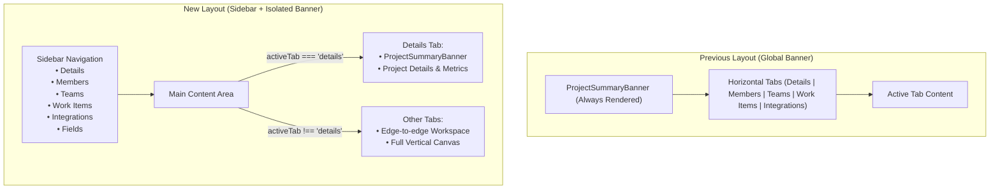
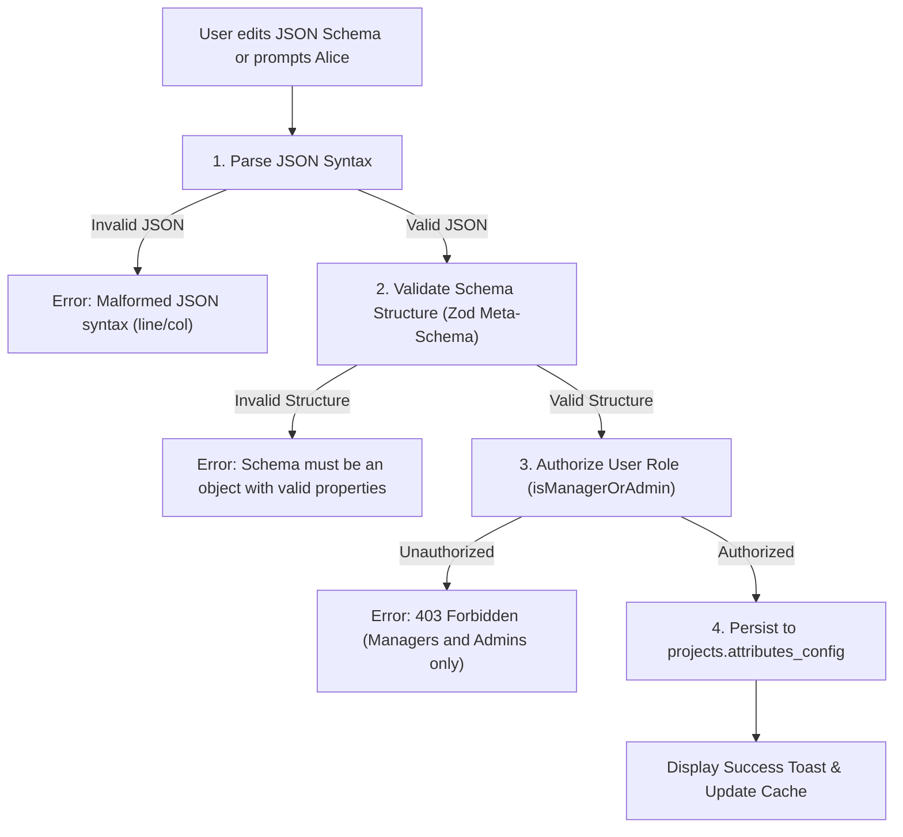

# Project Details View: Sidebar & Dynamic Fields

Status: **Living**

Comprehensive architecture, design, and user specification for refactoring the **Project Details view** (`/projects/[id]`) from horizontal tabs to a responsive **sidebar navigation**, isolating the **project banner** to the Details tab, introducing a new **Fields tab** for project-aligned dynamic fields configured via **JSON Schema**, and integrating optional dynamic fields into **work items** with **Alice Assistant (bot)** support.

Related:

- Feature index: [README.md](./README.md)
- Projects workspace UI: `apps/web/app/projects/[id]/_components/project-details-workspace.tsx`
- Project reads & tab params: `apps/web/app/projects/_services/projects.reads.workspace.server.ts`
- Work item details UI: `apps/web/app/work-items/_components/work-item-details/work-item-details.tsx`
- Work item sidebar: `apps/web/app/work-items/_components/work-item-details/work-item-details-sidebar.tsx`
- Alice AI assistant: `apps/api/src/routes/api/chat/` & [AI_CHATBOT.md](../chat/AI_CHATBOT.md)
- Database schema: `packages/db/prisma/schema.prisma` (`projects.attributes_config`)
- RBAC permissions: `apps/web/lib/rbac/roles.ts` (`isManagerOrAdmin`)
- In-app documentation browser: [docs/features/docs/README.md](../docs/README.md)

---

## 1. Executive Summary & Goals

The Project Details workspace serves as the central operational hub for managing project-specific settings, team structures, members, work items, and third-party integrations. As the capabilities of the workspace expand, the existing layout faces two usability challenges:

1. **Horizontal tab crowding**: Adding more workspace tabs horizontally compromises responsiveness on smaller viewports and creates header clutter.
2. **Vertical space consumption**: The `ProjectSummaryBanner` is currently rendered globally across all tabs, consuming valuable vertical screen space on data-dense views such as Work Items, Teams, and Integrations.

Furthermore, development teams need the ability to define **project-specific dynamic metadata** (such as _MoSCoW Rating_, _Acceptance Criteria_, _Risk Score_, or _Component Target_) that appear on work items belonging to that project, without requiring hardcoded schema alterations or global system changes.

### Key Objectives

- **Sidebar Navigation**: Replace the top horizontal tab bar with an intuitive, responsive vertical sidebar navigation adhering to Alice design standards (`SettingsWorkspace` pattern).
- **Banner Isolation**: Render the `ProjectSummaryBanner` exclusively on the `Details` tab, allowing other tabs (`Dashboard`, `Work Items`, `Teams`, `Integrations`, `Fields`) to utilize the full available content area.
- **Fields Configuration Tab**: Add a new `Fields` tab allowing authorized managers and administrators to view, edit, validate, and save dynamic field definitions.
- **JSON Schema Storage**: Store field definitions using an extensible JSON Schema standard in the pre-existing `projects.attributes_config` JSONB column.
- **Strict Schema Validation**: Validate all JSON Schemas before persistence, preventing malformed configurations while providing actionable error messages.
- **Non-Intrusive Work-Item Integration**: Render configured dynamic fields optionally on work items. Dynamic fields **must never** become mandatory work-item validation rules or impede work-item creation and status transitions.
- **Graceful Failure**: Isolate dynamic field rendering with error boundaries and fallback parsing to ensure that broken schemas never crash the work item page or core functionality.
- **Alice AI Assistant**: Enable users to describe custom fields in natural language (e.g. _"I want every work-item to optionally have a MoSCoW rating and acceptance criteria"_), allowing Alice to generate or edit the JSON Schema with automated validation before saving.

---

## 2. Information Architecture & Navigation

### 2.1 Workspace Hierarchy

The redesigned Project Details layout separates navigation from content:

```text
Project Details Workspace (/projects/[id])
├── Sidebar Navigation (Left)
│   ├── Details (Icon: Info)
│   ├── Members (Icon: Users)
│   ├── Teams (Icon: Network)
│   ├── Work Items (Icon: ClipboardPenLine)
│   ├── Integrations (Icon: Plug)
│   └── Fields (Icon: SlidersHorizontal / ListFilter) [NEW]
│
└── Content Canvas (Right / Full Area)
    ├── Details      → ProjectSummaryBanner + ProjectDetailsTab
    ├── Members      → ProjectMembersTab (Edge-to-edge content area)
    ├── Teams        → ProjectTeamsPanel (Edge-to-edge content area)
    ├── Work Items   → WorkItemsWorkspace (Edge-to-edge content area)
    ├── Integrations → ProjectIntegrationsTab (Edge-to-edge content area)
    └── Fields       → ProjectFieldsWorkspace (Edge-to-edge content area) [NEW]
```

### 2.2 Navigation State & URL Synchronization

The active tab is tracked using the `tab` URL query parameter, preserving bookmarkability, deep linking, and browser back/forward history:

| Tab ID         | URL Route                                        | Minimum Viewer Role     | Description                                                                                                                                                                            |
| :------------- | :----------------------------------------------- | :---------------------- | :------------------------------------------------------------------------------------------------------------------------------------------------------------------------------------- |
| `details`      | `/projects/[id]` or `/projects/[id]?tab=details` | Member                  | Banner (key, timeline, owner, branding) + linked summary cards to other tabs                                                                                                           |
| `members`      | `/projects/[id]?tab=members`                     | Member                  | Project member roster and assignments                                                                                                                                                  |
| `teams`        | `/projects/[id]?tab=teams`                       | Member                  | Teams associated with the project                                                                                                                                                      |
| `work-items`   | `/projects/[id]?tab=work-items`                  | Member                  | Flat/hierarchical work-item table & backlog. Loads project sprints (active list, up to 100) so the **Sprint** column and filter dialog can resolve/filter by `sprint_id` (`?sprint=`). |
| `integrations` | `/projects/[id]?tab=integrations`                | Member (Edit: Manager+) | Jira Cloud & GitHub repository links                                                                                                                                                   |
| `fields`       | `/projects/[id]?tab=fields`                      | Member (Edit: Manager+) | Dynamic fields JSON Schema configuration [NEW]                                                                                                                                         |

The helper `parseProjectDetailsTab` in `apps/web/lib/search-params.ts` is extended to support `'fields'`:

```typescript
export type ProjectDetailsTab =
  'details' | 'members' | 'teams' | 'work-items' | 'integrations' | 'fields';

export function parseProjectDetailsTab(tab?: string | null): ProjectDetailsTab {
  if (
    tab === 'members' ||
    tab === 'teams' ||
    tab === 'work-items' ||
    tab === 'integrations' ||
    tab === 'fields'
  ) {
    return tab;
  }
  return 'details';
}
```

### 2.3 UI & Responsive Design Patterns

The sidebar follows the established layout pattern from `apps/web/app/settings/_components/settings-workspace.tsx`:

- **Desktop (`md:` breakpoint and above)**:
  - Fixed-width sidebar (`md:w-56` or `md:w-60`) docked to the left with `border-r border-border`.
  - Content area occupies `flex-1 min-w-0 overflow-y-auto`.
  - Selected tab highlighted with `bg-muted text-foreground font-medium`.
  - Inactive tabs use `text-muted-foreground hover:bg-muted/60 hover:text-foreground`.
- **Mobile (`< md` breakpoint)**:
  - Responsive horizontal scroll strip or collapsible navigation header with clean touch targets.
  - Seamless viewport adaptation without layout shifts or horizontal clipping.

---

## 3. Project Banner Isolation

In the previous design, `ProjectSummaryBanner` rendered above the tab container, consuming over 200px of vertical space on every screen.

### Implementation Change

1. Remove `ProjectSummaryBanner` from the outer shell of `apps/web/app/projects/[id]/_components/project-details-workspace.tsx`.
2. Move `<ProjectSummaryBanner project={project} canEditBranding={isManagerOrAdmin} />` into the `details` tab container (`<TabsContent value="details">`).
3. For all other tabs (`work-items`, `teams`, `members`, `integrations`, `fields`), the tab content mounts directly at the top of the canvas.



---

## 4. Dynamic Fields JSON Schema Model

Dynamic fields allow projects to adapt to diverse agile methodologies (Scrum, Kanban, SAFe, Shape Up) without requiring code modifications.

### 4.1 Storage Location

Dynamic field configurations are stored on the `projects` table using the existing JSONB column:

```prisma
model projects {
  id                String        @id @default(dbgenerated("gen_random_uuid()")) @db.Uuid
  name              String
  key               String        @unique
  // ...
  attributes_config Json?         // <-- Reused: Stores the Project Dynamic Fields JSON Schema
  workflow_config   Json?
  // ...
}
```

> [!NOTE]
> Reusing `projects.attributes_config` avoids new database migrations or schema synchronization risks. The column is already nullable JSONB in PostgreSQL, generated in Prisma Client, and supported across existing mock factories and tests.

### 4.2 Standard JSON Schema Structure

The configuration follows the standard JSON Schema specification (compatible with Draft-07 and Draft 2020-12):

```json
{
  "$schema": "https://json-schema.org/draft/2020-12/schema",
  "type": "object",
  "title": "Project Dynamic Work-Item Fields",
  "description": "Custom metadata fields configured for project work items",
  "properties": {
    "moscowRating": {
      "type": "string",
      "title": "MoSCoW Rating",
      "description": "Agile MoSCoW prioritization category",
      "enum": ["Must", "Should", "Could", "Won't"]
    },
    "acceptanceCriteria": {
      "type": "string",
      "title": "Acceptance Criteria",
      "description": "Conditions that must be met for this work item to be accepted",
      "format": "multiline"
    }
  },
  "additionalProperties": true
}
```

### 4.3 Field Evolution Matrix

The schema engine is designed to support the full range of standard field types:

| Field Kind        | JSON Schema Type                  | Keywords & Extensions                              | UI Form Component                       |
| :---------------- | :-------------------------------- | :------------------------------------------------- | :-------------------------------------- |
| **Short Text**    | `"type": "string"`                | `minLength`, `maxLength`                           | Standard single-line `Input`            |
| **Long Text**     | `"type": "string"`                | `format: "multiline"` or `x-component: "textarea"` | Multi-line `Textarea`                   |
| **Single Select** | `"type": "string"`                | `enum: ["Option 1", "Option 2"]`                   | Single-select `DropdownMenu` / `Select` |
| **Multi-Select**  | `"type": "array"`                 | `items: { "type": "string", "enum": [...] }`       | Multi-badge Select / Tag Selector       |
| **Number**        | `"type": "number"` or `"integer"` | `minimum`, `maximum`, `multipleOf`                 | Numeric `Input` (`type="number"`)       |
| **Boolean**       | `"type": "boolean"`               | `default: false`                                   | `Checkbox` or `Switch` toggle           |
| **Date**          | `"type": "string"`                | `format: "date"`                                   | Date Picker Popover                     |
| **URL / Link**    | `"type": "string"`                | `format: "uri"`                                    | `Input` with link validator and icon    |
| **User Pick**     | `"type": "string"`                | `format: "uuid"`, `x-component: "user-select"`     | Project Member selector                 |

---

## 5. Validation Architecture

To ensure system stability, JSON Schemas are strictly validated before persistence. An invalid schema is **never saved to the database**.



### 5.1 Validation Rules

1. **Root Object Check**: The root of the configuration must be a JSON object with `"type": "object"`.
2. **Properties Dictionary**: The `properties` field must be an object containing property definitions.
3. **Identifier Validity**: Property keys must be valid alphanumeric or camelCase identifiers (e.g. `moscowRating`, `acceptance_criteria`).
4. **Valid Property Types**: Each property must specify a recognized `type` (`string`, `number`, `integer`, `boolean`, `array`).
5. **Enum Array Verification**: If `enum` is declared, it must be a non-empty array of strings or numbers without duplicates.
6. **Array Items Verification**: If `type: "array"` is declared, `items` must be an object specifying the item type.

### 5.2 Zod Meta-Schema Implementation

```typescript
import { z } from 'zod';

export const DynamicFieldPropertySchema = z.object({
  type: z.enum(['string', 'number', 'integer', 'boolean', 'array']),
  title: z.string().min(1, 'Title is required'),
  description: z.string().optional(),
  enum: z.array(z.string().min(1)).min(1).optional(),
  items: z
    .object({
      type: z.enum(['string', 'number', 'integer', 'boolean']),
      enum: z.array(z.string().min(1)).optional(),
    })
    .optional(),
  format: z.string().optional(),
  default: z.unknown().optional(),
  'x-component': z.string().optional(),
});

export const ProjectFieldsConfigSchema = z.object({
  $schema: z.string().optional(),
  type: z.literal('object'),
  title: z.string().optional(),
  description: z.string().optional(),
  properties: z.record(
    z.string().regex(/^[a-zA-Z0-9_-]+$/),
    DynamicFieldPropertySchema
  ),
  additionalProperties: z.boolean().optional().default(true),
});

export type ProjectFieldsConfig = z.infer<typeof ProjectFieldsConfigSchema>;
```

---

## 6. Work-Item Integration & Non-Validation Invariant

### 6.1 Strict Invariant: Dynamic Fields are NOT Validation Rules

> [!IMPORTANT]
> Configured dynamic fields provide supplementary metadata. They **must never become mandatory validation rules** for work items.
>
> - Work items can be created, updated, and closed with empty or missing dynamic fields.
> - Work item creation forms must succeed even when zero dynamic fields are filled.
> - Default work-item status transitions (`Draft` → `New` → `ToDo` → `InProgress` → `Testing` → `Done`) are never gated on dynamic field presence.

### 6.2 Work Item Display & Sidebar

On the Work Item details page (`/work-items/[id]`), dynamic fields are rendered in a dedicated **Additional Fields** collapsible section in `WorkItemSidebar` or beneath the primary description:

```text
+----------------------------------------------------------------+
| Work Item: ALICE-104                                           |
| Title: Implement OAuth flow for third-party tools              |
| Status: InProgress | Priority: High | Assignee: Alex Rivera    |
| Description: (TipTap ProseMirror Document)                     |
|                                                                |
| ────────────────────────────────────────────────────────────── |
| Additional Fields                                              |
|   MoSCoW Rating:       [ Must ▼ ]                              |
|   Acceptance Criteria: User can complete 3LO and token persists|
+----------------------------------------------------------------+
```

### 6.3 Graceful Failure & Error Boundary

If a project's schema is corrupted, contains invalid syntax, or references unknown component types, it must **never crash the work-item view**.

Defensive fallback pattern:

```typescript
export function SafeDynamicFieldsSection({
  schema,
  values,
  onFieldChange,
  readOnly,
}: SafeDynamicFieldsSectionProps) {
  try {
    const validatedSchema = ProjectFieldsConfigSchema.safeParse(schema);
    if (!validatedSchema.success || !validatedSchema.data.properties) {
      return null; // Gracefully omit without breaking the parent view
    }

    return (
      <DynamicFieldsErrorBoundary fallback={<DynamicFieldsErrorNotice />}>
        <DynamicFieldsRenderer
          config={validatedSchema.data}
          values={values}
          onFieldChange={onFieldChange}
          readOnly={readOnly}
        />
      </DynamicFieldsErrorBoundary>
    );
  } catch (error) {
    console.error('Failed to parse or render dynamic fields:', error);
    return null;
  }
}
```

---

## 7. Role-Based Access Control (RBAC)

Access to configure dynamic fields follows the existing project permission model:

| Role        |   View Configuration    |   Edit / Save Schema   | Use Fields on Work Items |
| :---------- | :---------------------: | :--------------------: | :----------------------: |
| **Admin**   |           Yes           |        **Yes**         |           Yes            |
| **Manager** |           Yes           |        **Yes**         |           Yes            |
| **Member**  | Yes (Read-only summary) | No (Disabled / Hidden) |  Yes (Populate values)   |

Permissions are verified using `isManagerOrAdmin(role)` from `apps/web/lib/rbac/roles.ts`:

- **Client side**: The Fields tab hides editing controls and JSON code editors for non-managers, displaying a read-only field summary.
- **Server side**: Server actions and Express API endpoints strictly enforce authorization via `requireRole('manager')` or verify project membership ownership before updating `projects.attributes_config`.

---

## 8. Alice AI Assistant Integration

The application contains an existing **Alice Assistant** integration (`apps/api/src/routes/api/chat/`) powered by Google Gemini. This integration is extended to assist managers with configuring project fields using natural language.

### 8.1 User Flow

1. A manager opens the **Fields** tab on a project.
2. The user clicks **"Generate with Alice"** or opens the Alice drawer.
3. The user describes their requirement in conversational language:
   > _"I want every work-item in this project to optionally have a MoSCoW rating and acceptance criteria."_
4. Alice Assistant maps the natural language request into a valid, compliant JSON Schema:
   ```json
   {
     "type": "object",
     "properties": {
       "moscowRating": {
         "type": "string",
         "title": "MoSCoW Rating",
         "enum": ["Must", "Should", "Could", "Won't"]
       },
       "acceptanceCriteria": {
         "type": "string",
         "title": "Acceptance Criteria",
         "format": "multiline"
       }
     }
   }
   ```
5. The generated schema is automatically loaded into the **Fields Editor** for user inspection.
6. The user can review, manually adjust, and click **"Validate & Save"**.

### 8.2 Security & Safety Guardrail

The AI bot **does not bypass validation or write directly to the database**. All AI-generated output must flow through the exact same client-side and server-side Zod validation pipeline as manual user edits.

---

## 9. Visual UI/UX Layout Specification

### 9.1 Fields Tab Layout

The `Fields` tab provides two synchronized editing modes:

```text
+-------------------------------------------------------------------------------+
| Project: Mobile App (MOB)                                                      |
| [ Details ] [ Members ] [ Teams ] [ Work Items ] [ Integrations ] [ Fields* ] |
+-------------------------------------------------------------------------------+
| Configure Dynamic Fields                                                      |
| Define custom fields for work items in this project using JSON Schema.        |
|                                                                               |
| [ ✨ Generate with Alice ] [ 📋 Beautify JSON ] [ ✓ Validate ] [ 💾 Save ]    |
|                                                                               |
| +-----------------------------------+ +-------------------------------------+ |
| | Visual Field Summary              | | JSON Schema Editor                  | |
| |                                   | |                                     | |
| | • MoSCoW Rating                   | | {                                   | |
| |   Type: Select (Must, Should...)  | |   "type": "object",                 | |
| |                                   | |   "properties": {                   | |
| | • Acceptance Criteria             | |     "moscowRating": {               | |
| |   Type: Multiline Text            | |       "type": "string",             | |
| |                                   | |       "enum": ["Must", "Should"]    | |
| | [ + Add Field Shortcut ]          | |     }                               | |
| |                                   | |   }                                 | |
| |                                   | | }                                   | |
| +-----------------------------------+ +-------------------------------------+ |
|                                                                               |
| Real-time Validation Status:                                                  |
| ✓ Valid Schema: Ready to save                                                 |
+-------------------------------------------------------------------------------+
```

---

## 10. Verification & Test Plan

| Scope                    | Test Case                                        | Target Output                                                                    |
| :----------------------- | :----------------------------------------------- | :------------------------------------------------------------------------------- |
| **Sidebar Navigation**   | Switch between all 6 tabs                        | URL query updates to `?tab=<id>`, content swaps smoothly without reloading       |
| **Banner Isolation**     | Verify banner visibility                         | Banner appears only on `?tab=details`; absent on `work-items`, `teams`, `fields` |
| **Schema Validation**    | Attempt to save invalid JSON or unsupported type | Save blocked; clear error message displayed identifying the issue                |
| **Persistence**          | Manager saves valid schema                       | Schema saved to `projects.attributes_config`; reloaded on page refresh           |
| **RBAC Enforcement**     | Member visits `?tab=fields`                      | Edit/save buttons disabled; read-only summary presented                          |
| **Work-Item Creation**   | Create work-item without dynamic fields          | Work item creates successfully with standard required fields only                |
| **Graceful Degradation** | Inject corrupted schema object                   | Work item page renders normally; corrupt fields gracefully omitted               |
| **In-App Docs**          | Navigate to `/docs` in browser                   | Document appears under Projects section; renders Mermaid diagrams & tables       |

---

## 11. Implementation Checklist (Next Phase)

- [ ] Update `apps/web/lib/search-params.ts` to include `'fields'` in `ProjectDetailsTab`.
- [ ] Refactor `apps/web/app/projects/[id]/_components/project-details-workspace.tsx` to use sidebar navigation.
- [ ] Move `ProjectSummaryBanner` inside `TabsContent value="details"`.
- [ ] Create `ProjectFieldsWorkspace` component with JSON Schema editor, visual cards, and validation banner.
- [ ] Implement `ProjectFieldsConfigSchema` Zod validation utility in shared package.
- [ ] Implement project attributes save action in `apps/web/app/projects/[id]/_components/actions.ts`.
- [ ] Extend `WorkItemSidebar` with `SafeDynamicFieldsSection`.
- [ ] Add Alice chat prompt guidance for generating project fields JSON schema.
- [ ] Run test suite (`vitest`, `cypress`) and linting (`eslint`, `tsc`).
