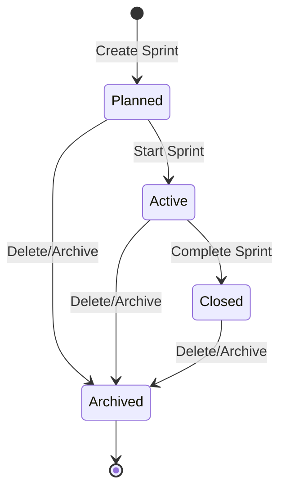

# Sprints Feature Documentation

Status: **Implemented**

Sprints in ALICE are time-boxed iterations within a project that group work items, track team velocity, and measure progress using burn-down metrics and completion reports.

---

## 1. Documentation Index

| Document                                 | Description                                                                                          | Status      |
| :--------------------------------------- | :--------------------------------------------------------------------------------------------------- | :---------- |
| [BURNDOWN_CHART.md](./BURNDOWN_CHART.md) | Burndown chart design, ideal line computation, work logs integration, and team capacity calculations | Implemented |
| [ARD.md](../../product/ARD.md) (SPR-1)   | Product architecture decision records for sprint management                                          | Living      |
| [TRD.md](../../architecture/TRD.md)      | Technical requirements document for sprints & work items                                             | Living      |

---

## 2. Sprint Lifecycle & Status State Machine

A sprint moves through four standardized lifecycle states defined by `SprintStatus`:

| Status         | Meaning & Business Rules                                                                                                                                                |
| :------------- | :---------------------------------------------------------------------------------------------------------------------------------------------------------------------- |
| **`planned`**  | Newly created sprint. Work items can be assigned from the backlog. Start and end dates can be scheduled.                                                                |
| **`active`**   | The sprint is in progress. Only one sprint per project may be active concurrently. The actual-remaining burndown line updates dynamically day by day.                   |
| **`closed`**   | The sprint is finalized. Velocity and completion rates are computed and locked. Unfinished work items can be rolled over to the next sprint or returned to the backlog. |
| **`archived`** | Soft-deleted sprint record. Retained for audit purposes but omitted from active boards and dropdown selectors.                                                          |

---

## 3. UX Surfaces

| Surface                   | Route                  | Behavior                                                                                                                                              |
| :------------------------ | :--------------------- | :---------------------------------------------------------------------------------------------------------------------------------------------------- |
| **Sprints Registry**      | `/sprints`             | Displays sprints grouped by status tabs (`Active`, `Planned`, `Closed`). Allows creating new sprints, editing dates, and starting/completing sprints. |
| **Backlog Planning**      | `/backlog`             | Split-view backlog manager allowing team members to drag or assign backlog work items into planned and active sprints.                                |
| **Sprint Summary Report** | `/sprints/[id]/report` | In-depth retrospective report displaying total story points, completed vs incomplete items, scope changes, and the interactive burndown chart.        |
| **Alice Assistant**       | `/chat` & Drawer       | Conversational interface where Alice can invoke `list_sprints` and `create_sprint` via natural language.                                              |

---

## 4. API Endpoints

All sprint routes require authentication (`requireApiAuth`) and project membership:

| Method   | Path                        | Description                                                               |
| :------- | :-------------------------- | :------------------------------------------------------------------------ |
| `GET`    | `/api/sprints`              | List sprints for a project (`projectId` query param), filtered by status. |
| `POST`   | `/api/sprints`              | Create a new sprint in `planned` status.                                  |
| `GET`    | `/api/sprints/:id`          | Get sprint details by ID.                                                 |
| `PATCH`  | `/api/sprints/:id`          | Update sprint metadata (`name`, `goal`, `startDate`, `endDate`).          |
| `PATCH`  | `/api/sprints/:id/status`   | Transition sprint status (`active`, `closed`, `archived`).                |
| `DELETE` | `/api/sprints/:id`          | Soft-delete/archive sprint and handle uncompleted work items.             |
| `GET`    | `/api/sprints/:id/burndown` | Retrieve calculated burndown series (ideal vs actual remaining points).   |
| `GET`    | `/api/sprints/:id/report`   | Retrieve sprint completion statistics and metrics.                        |

---

## 5. Database Schema

Defined in `packages/db/prisma/schema.prisma`:

### Model: `sprints`

| Field        | Type           | Attributes                           | Description                               |
| :----------- | :------------- | :----------------------------------- | :---------------------------------------- |
| `id`         | `UUID`         | `@id`, `@default(gen_random_uuid())` | Primary key                               |
| `name`       | `String`       |                                      | Sprint name (e.g. "Sprint 14")            |
| `goal`       | `String?`      |                                      | Objective of the sprint                   |
| `project_id` | `UUID`         | FK → `projects.id`                   | Associated project                        |
| `start_date` | `DateTime`     | `@db.Date`                           | Scheduled start date                      |
| `end_date`   | `DateTime`     | `@db.Date`                           | Scheduled end date                        |
| `status`     | `SprintStatus` | `@default(planned)`                  | `planned`, `active`, `closed`, `archived` |
| `created_by` | `UUID?`        | FK → `users.id`                      | Audit creator                             |
| `created_at` | `DateTime`     | `@default(now())`                    | Timestamp                                 |
| `updated_by` | `UUID?`        | FK → `users.id`                      | Audit updater                             |
| `updated_at` | `DateTime`     | `@updatedAt`                         | Timestamp                                 |

### Relations

- `project`: Belongs to `projects` (Cascade delete).
- `work_items`: One-to-many relationship with `work_items.sprint_id`.
- `done_at`: Work items transition timestamp used to plot the actual burndown curve when work logs are absent.

---

## 6. Alice AI Chatbot Integration

Alice interacts with sprints through dedicated function-calling tools:

1. **`list_sprints`**:
   - Queries active, planned, or closed sprints for a specified project.
   - Provides context when users ask: _"What sprints are currently active?"_ or _"List all sprints for project Alpha."_
2. **`create_sprint`**:
   - Allows users to create sprints conversatonally:
     > _"Create Sprint 12 for Project Mobile from October 1 to October 15 with goal 'Launch Auth flow'"_
   - Returns deep links in the chat thread to jump directly to the newly created sprint.

---

## 7. Testing

### Automated Test Coverage

- Repository tests: `apps/api/tests/sprints/`
- Service & calculations: `apps/api/tests/sprints/` (burndown math, velocity, edge cases)
- Web components: `apps/web/tests/sprints/`
