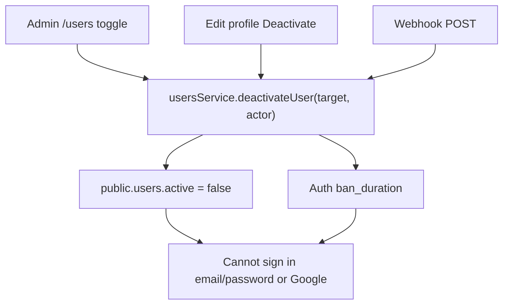

# Account deactivation (offboarding)

## Document metadata

| Field        | Value                                           |
| ------------ | ----------------------------------------------- |
| Project      | Alice (Jira Teams)                              |
| Area         | Auth + Users — deactivate / Auth ban            |
| Version      | 0.3                                             |
| Status       | **Phase 1 implemented** (webhook still planned) |
| Last updated | 2026-08-03                                      |

Related:

- [USER_MANAGEMENT.md](./USER_MANAGEMENT.md) — admin registry activate/deactivate (as-built today)
- [AUTHENTICATION.md](../../auth/AUTHENTICATION.md) — sign-in gates, `active` + Auth ban
- [ACCESS_ALLOWLIST.md](../access/ACCESS_ALLOWLIST.md) — admission only (not changed by this plan)
- [RBAC_AUTHORIZATION_SKELETON.md](../../auth/RBAC_AUTHORIZATION_SKELETON.md) — roles after admission

---

## 1. Problem

When someone leaves the company, IdP / org policy may take up to ~2 weeks to delete the identity. Alice still needs an **immediate** way to stop email/password and Google sign-in for that person — without removing the whole domain from the access allowlist.

**Non-goal:** deny-lists or other allowlist schema changes. Admission stays domain/email allow; offboarding uses **account deactivation**.

---

## 2. Kill switch (single effect)

All paths must produce the same outcome:

1. `public.users.active = false`
2. Supabase Auth `ban_duration` set (same as today’s admin toggle: `87600h`) so sessions / password / OAuth cannot continue effectively
3. App gates already treat inactive rows as unsigned-in (`getUser()` / middleware behaviour)

Reactivation remains **admin-only** (existing activate flow). Self-service and webhooks must **never** re-enable an account.

---

## 3. Three invocation paths

| #   | Path                      | Who                             | When                                 | Status                                                                    |
| --- | ------------------------- | ------------------------------- | ------------------------------------ | ------------------------------------------------------------------------- |
| 1   | **Admin deactivate**      | `role === admin` via `/users`   | HR/manager notified; ops day-one     | **Implemented** — `PATCH /api/users/:id/toggle-active` → `deactivateUser` |
| 2   | **Self-deactivate**       | Signed-in user via Edit profile | Voluntary leave / “close my account” | **Implemented** — same toggle-active API (`actor=self`)                   |
| 3   | **Webhook / machine API** | External system + shared secret | Automated HRIS / IdP / Zapier later  | **Planned** (phase 2)                                                     |



---

## 4. Shared helper (locked)

**Home:** `apps/api/src/routes/api/users/users.service.ts`  
(Web stays thin: Server Actions / `apiFetch` → API. Kill switch needs service-role Auth admin — already on the API.)

```ts
type DeactivateActor =
  | { type: 'admin'; actorId: string }
  | { type: 'self'; actorId: string }
  | { type: 'webhook'; source: string }; // e.g. 'hris' | 'zapier'

async function deactivateUser(
  targetUserId: string,
  actor: DeactivateActor,
  options?: {
    expectedUpdatedAt?: string; // required for admin/self UI optimistic lock
  }
): Promise<UserRow>;
```

### Behaviour (all actors)

1. Load target `public.users` row; 404-style error if missing.
2. If `active === false` already → **idempotent success** (return row; ensure Auth still banned — best-effort re-apply ban).
3. Apply actor authz (table below).
4. **Last-admin guard:** if target is `role === 'admin'` and `active`, and no _other_ `active` admin exists → reject (`Cannot deactivate the last active admin.`). Applies to **self** and **webhook**. Admin path already blocks self-deactivate; deactivating _another_ last-admin is also rejected.
5. Update `public.users.active = false` (`updated_by` = `actorId` for admin/self; for webhook use a well-known system actor or leave `updated_by` null / service user — decide at implement; prefer nullable + log `source`).
6. `supabase.auth.admin.updateUserById(id, { ban_duration: '87600h' })`.
7. Log: `warn. user deactivated actor=<type> target=<id> source=<…>`.

### Actor rules

| Actor     | Authz at call site                       | May deactivate self? | May reactivate?         | Optimistic lock           |
| --------- | ---------------------------------------- | -------------------- | ----------------------- | ------------------------- |
| `admin`   | `requireAdmin(actorId)` then call helper | **No**               | Yes (separate activate) | Yes (`expectedUpdatedAt`) |
| `self`    | `targetUserId === actorId` (session)     | **Yes**              | **No**                  | Yes                       |
| `webhook` | Shared-secret middleware (no user JWT)   | N/A                  | **No**                  | No                        |

### Activate stays separate

`toggleUserActive(..., active: true)` (or rename to `activateUser`) remains admin-only and does **not** go through `deactivateUser`.  
`toggleUserActive(..., active: false)` becomes a thin wrapper: self-lockout check → `deactivateUser(id, { type: 'admin', actorId }, { expectedUpdatedAt })`.

---

## 5. Path details

### 5.1 Admin (as-built → thin refactor)

- UI unchanged: `/users` registry.
- Route unchanged: `PATCH /api/users/:id/toggle-active` with `{ active, expectedUpdatedAt }`.
- Service: deactivate branch calls `deactivateUser`; activate branch keeps unban + `active: true`.

### 5.2 Self-deactivate (phase 1) — implemented

| Decision      | Choice                                                                                                                |
| ------------- | --------------------------------------------------------------------------------------------------------------------- |
| Transport     | **Same API** as admin: `PATCH /api/users/:id/toggle-active` with `{ active: false, expectedUpdatedAt }`               |
| Frontend      | Edit profile Danger zone → confirm email → Server Action `deactivateMyAccount` → API → `signOut` → `/?account=closed` |
| Authz         | API treats `actorId === targetUserId` as `self`; otherwise requires admin                                             |
| Confirm       | Client + Server Action require typed email match                                                                      |
| After success | `/?account=closed` banner on home                                                                                     |

Admin registry and edit-profile are **different UI mechanisms** over one kill-switch route.

### 5.3 Webhook (phase 2) — sketch locked, build later

| Decision         | Choice                                                                                                                                           |
| ---------------- | ------------------------------------------------------------------------------------------------------------------------------------------------ |
| Route            | `POST /api/webhooks/users/deactivate` (separate router; not under `requireApiAuth`)                                                              |
| Auth             | Header `Authorization: Bearer <USERS_DEACTIVATE_WEBHOOK_SECRET>` (or `X-Alice-Webhook-Secret`). Rotate via env. HMAC body signature optional v2. |
| Lookup           | Prefer **`email`** (normalized lowercase); optional `user_id` if both sent they must match one row                                               |
| Unknown user     | **`404`** with stable `{ error: 'User not found.' }` — do not leak whether email is allowlisted                                                  |
| Already inactive | **`200`** `{ user, deactivated: false, reason: 'already_inactive' }`                                                                             |
| Fresh deactivate | **`200`** `{ user, deactivated: true }`                                                                                                          |
| Admin notify     | **No** in v1 (avoid notification spam / half-built prefs). Log only; revisit if HR asks                                                          |
| IP allowlist     | Optional env list; skip until caller IP is known                                                                                                 |

**Do not implement** until a concrete integrator exists. Sketch + env name reserved: `USERS_DEACTIVATE_WEBHOOK_SECRET`.

---

## 6. What stays out of scope

- Changing `access_allowlist` (no email deny-list)
- IdP / SCIM auto-provisioning
- Soft-delete / PII anonymization
- Self-reactivation
- New dedicated `/account-closed` page (phase 1 uses `/?account=closed`)
- In-app admin notification on webhook deactivate (phase 2+)

---

## 7. Delivery order

1. **Document** — done (§1–3)
2. **Sketch** — done (this version)
3. **Implement phase 1**
   - Extract `deactivateUser` in API users service
   - Refactor admin deactivate onto it
   - Add `POST /api/users/me/deactivate` + edit-profile Danger zone + `/?account=closed` banner
   - Tests per §8
4. **Implement phase 2** — webhook router when a caller is ready

---

## 8. Test plan

| Case                               | Expect                                                         |
| ---------------------------------- | -------------------------------------------------------------- |
| Admin deactivates member           | `active=false`, Auth banned, cannot login                      |
| Admin cannot deactivate self       | Error (existing)                                               |
| User self-deactivates              | Same kill switch; session cleared; lands on `/?account=closed` |
| Self confirm email mismatch        | 400; no change                                                 |
| Self cannot reactivate             | No endpoint                                                    |
| Last active admin self-deactivate  | 403/400 with last-admin message                                |
| Webhook valid secret + email       | Deactivates; second call 200 idempotent                        |
| Webhook bad secret                 | 401; no DB change                                              |
| Webhook unknown email              | 404                                                            |
| Deactivated user Google / password | No app access                                                  |

---

## 9. Open questions — resolved

| Question                                    | Decision                                                                             |
| ------------------------------------------- | ------------------------------------------------------------------------------------ |
| Self-deactivate: Server Action only vs API? | **Same** `toggle-active` API; web Server Action + edit-profile dialog as the self UI |
| Webhook lookup key?                         | **Email primary**; optional `user_id` must agree                                     |
| Account-closed UX?                          | **`/?account=closed`** banner on home (no new page in phase 1)                       |
| Webhook notify admins?                      | **No** for v1; structured logs only                                                  |

---

## 10. Implementation file map (phase 1)

| Area                | Touch                                                                                 |
| ------------------- | ------------------------------------------------------------------------------------- |
| API service         | `users.service.ts` — `deactivateUser`, refactor `toggleUserActive`                    |
| API route           | `users.route.ts` — `POST /me/deactivate` (register **before** `/:id` routes)          |
| API schema          | `users.schemas.ts` — `deactivateMeSchema`                                             |
| Web action / client | edit-profile action or service calling API                                            |
| Web UI              | `edit-profile-view.tsx` — Danger zone + confirm dialog                                |
| Web home            | `app/page.tsx` / home component — read `account=closed` query                         |
| Docs                | Mark this file **Implemented** for phase 1 when shipped; keep webhook section Planned |

Phase 2 add: `apps/api/src/routes/api/webhooks/users-deactivate.route.ts` + env wiring.

---

## 11. Security notes

- Never authorize deactivation from client-only checks.
- Webhook secret is server-only (API `env`); never `NEXT_PUBLIC_*`.
- Self path must not accept an arbitrary `userId` — always the authenticated subject.
- Keep allowlist admission independent; deactivation does not remove domain rows.
