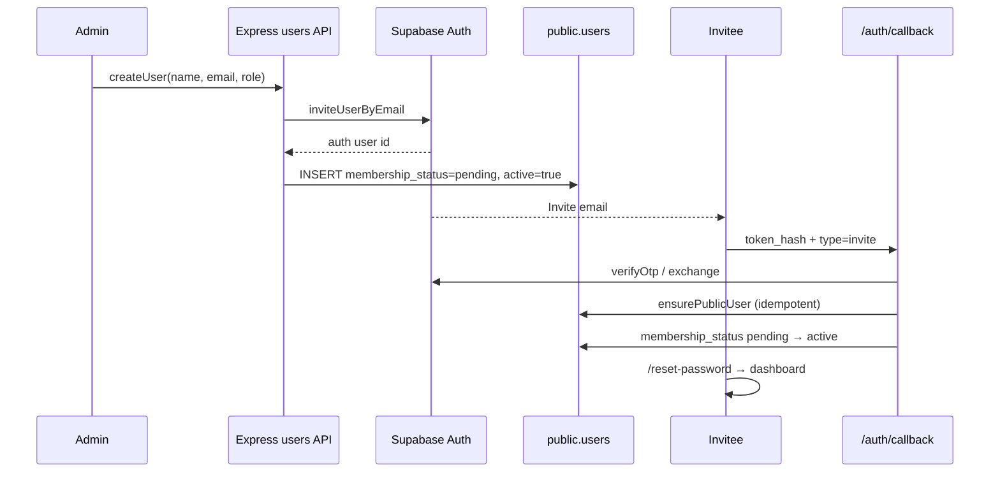

# User membership status (pending → active)

## Document metadata

| Field        | Value                                           |
| ------------ | ----------------------------------------------- |
| Project      | Alice                                           |
| Area         | Auth + Users — invite onboarding vs kill switch |
| Version      | 0.1                                             |
| Status       | **Living**                                      |
| Last updated | 2026-08-21                                      |

Related:

- [USER_MANAGEMENT.md](./USER_MANAGEMENT.md) — registry UI, invite flow (as-built: `active: true` on create)
- [ACCOUNT_DEACTIVATION.md](./ACCOUNT_DEACTIVATION.md) — offboarding kill switch (`active = false` + Auth ban)
- [AUTHENTICATION.md](../../auth/AUTHENTICATION.md) — invite callback, `ensurePublicUser`, `getUser()`
- [RBAC_AUTHORIZATION_SKELETON.md](../../auth/RBAC_AUTHORIZATION_SKELETON.md) — role gates after admission
- [ACCESS_ALLOWLIST.md](../access/ACCESS_ALLOWLIST.md) — domain/email admission (orthogonal)

---

## 1. Problem

Admin invite creates a `public.users` row immediately and hard-codes **`active: true`**. In the registry the invitee looks **Active** before they have opened the invite email, set a password, or otherwise completed Auth onboarding.

That is confusing and mixes two different ideas:

| Idea                         | Today                         | Should be                                  |
| ---------------------------- | ----------------------------- | ------------------------------------------ |
| Finished join / usable       | Implied by `active: true`     | Explicit **membership** (pending → active) |
| Not offboarded / not banned  | `active` boolean kill switch  | Keep **`active`** for deactivate only      |
| Email verified / invite done | Only in Supabase `auth.users` | Source of truth for **when** to promote    |

**Non-goals**

- Live-syncing `public.users` from `auth.users` on every `getUser()` / page load
- Replacing `RecordStatus` (`users.status`) with pending — that enum is soft-lifecycle for rows, not invite onboarding
- Collapsing pending into `active: false` (that already means deactivated)
- Changing access-allowlist admission rules

---

## 2. Decision (locked)

Keep **three orthogonal concerns**:

```text
auth.users          → identity + verification (email_confirmed / invite accepted)
public.users.membership_status → app onboarding (pending | active)
public.users.active            → kill switch (true | false) — unchanged semantics
```

### 2.1 New field

| Piece                                                         | Choice                                                                                      |
| ------------------------------------------------------------- | ------------------------------------------------------------------------------------------- |
| Column                                                        | `membership_status` on `public.users`                                                       |
| Type                                                          | Postgres/Prisma enum `UserMembershipStatus` = `pending` \| `active`                         |
| Default for **new admin invites**                             | `pending`                                                                                   |
| Default for **self-signup / Google** (via `ensurePublicUser`) | `active` when Auth session is already confirmed; otherwise `pending` until confirm callback |
| Existing rows (migration)                                     | Backfill **`active`** (joined users already in prod/dev are treated as joined)              |

Do **not** overload:

- `active` boolean
- `status` (`RecordStatus`)

### 2.2 Product gates

A user may use the product only when:

```text
membership_status === 'active'  AND  active === true
```

| Registry badge | Condition                                                |
| -------------- | -------------------------------------------------------- |
| **Pending**    | `membership_status = pending` and `active = true`        |
| **Active**     | `membership_status = active` and `active = true`         |
| **Inactive**   | `active = false` (deactivated), regardless of membership |

Assignee dropdowns, chat `list_users`, and similar “pick a teammate” lists should include only **Active** (membership active + kill switch on), not Pending.

### 2.3 Last-admin guard

Count only admins with **`membership_status = active` AND `active = true`**.  
A pending invited admin does **not** count toward “another active admin” for deactivation.

### 2.4 Aligning with Auth (promotion, not polling)

**Promote** `pending → active` only at Auth entry points Alice already owns:

1. `/auth/callback` after successful invite / signup confirm / OAuth exchange (and after `ensurePublicUser`)
2. Optionally inside `ensurePublicUser` when the Auth user is already confirmed

**Do not** call `auth.admin.getUserById` on every RSC `getUser()` to re-check verification.

**Promotion predicate (conceptual):**

```text
Auth user has a usable confirmed identity for this app
  (invite accepted / email confirmed / OAuth email trusted)
→ SET membership_status = 'active' WHERE id = authUser.id AND membership_status = 'pending'
```

Idempotent: already-`active` membership stays `active`.

### 2.5 “Verified off the bat”

| Path                                         | At `public.users` insert                                                     | After first successful join callback |
| -------------------------------------------- | ---------------------------------------------------------------------------- | ------------------------------------ |
| Admin `inviteUserByEmail`                    | `membership_status = pending`                                                | → `active`                           |
| Self-signup (confirm email **on**)           | `pending` until confirm callback                                             | → `active`                           |
| Self-signup (confirm email **off**) / Google | may insert as `active` immediately if Auth already treats email as confirmed | —                                    |

“Verified off the bat” means **after** Auth has confirmed the identity for that session — **not** at the moment of `inviteUserByEmail` (Auth user exists before the invitee clicks the link).

---

## 3. Flow (target)



Deactivate remains unchanged: `active = false` + Auth ban ([ACCOUNT_DEACTIVATION.md](./ACCOUNT_DEACTIVATION.md)). A pending user can still be deactivated (kill switch); badge shows Inactive.

---

## 4. Implementation slices (ordered)

| Step | Work                  | Notes                                                   |
| ---- | --------------------- | ------------------------------------------------------- |
| 0    | This plan             | Done                                                    |
| 1    | Schema                | Done — `add_user_membership_status`                     |
| 2    | API create            | Done — invite inserts `pending`                         |
| 3    | `ensurePublicUser`    | Done — insert + `promoteMembershipIfReady`              |
| 4    | Auth callback         | Done — via `ensurePublicUser` after verify              |
| 5    | App gates             | Done — `getUser` / `getDbUser`                          |
| 6    | Registry UI           | Done — Pending / Active / Inactive                      |
| 7    | Downstream lists      | Done — dropdown users, chat snapshot, admin notify list |
| 8    | Last-admin SQL/helper | Done — RPC + `countOtherActiveAdmins`                   |
| 9    | Docs                  | Done — Living                                           |
| 10   | Tests                 | Unit coverage for ensure/promote + registry fixtures    |

---

## 5. Schema sketch

```prisma
enum UserMembershipStatus {
  pending
  active
}

model users {
  // …
  active             Boolean               @default(true)  // kill switch — unchanged
  membership_status  UserMembershipStatus  @default(active) // backfill existing as active
  status             RecordStatus          @default(active) // soft lifecycle — unchanged
  // …
}
```

Default `@default(active)` keeps `ensurePublicUser` / seeds safe; **admin invite path explicitly writes `pending`**.

---

## 6. API / web touchpoints (expected)

| Area                                  | Change                           |
| ------------------------------------- | -------------------------------- |
| `users.repository.create`             | Accept / set `membership_status` |
| `users.service.createUser`            | Always `pending` for invite      |
| `ensurePublicUser`                    | Insert + promote rules           |
| `apps/web/app/auth/callback/route.ts` | Promote after verify             |
| `apps/web/lib/auth.ts`                | Gate on membership + kill switch |
| `/users` registry                     | Badge + filters                  |
| Chat / work-item assignee sources     | Filter membership active         |

Resend invite and “cancel pending invite” (delete Auth + row) are **optional follow-ups**, not required for the first cut.

---

## 7. Testing checklist (when implementing)

- [ ] Admin invite → registry shows **Pending**, `active = true`
- [ ] Invitee completes callback → **Active**; can open dashboard
- [ ] Pending user with valid Auth session still blocked by `getUser()` until promoted (or promotion runs in same callback before redirect)
- [ ] Deactivated pending or active user → **Inactive**; cannot sign in
- [ ] Self-signup / Google confirmed path lands **Active**
- [ ] Last-admin guard ignores pending admins
- [ ] Assignee / chat user lists omit pending

---

## 8. Open questions (resolve at implement if needed)

1. **Self-signup with email confirmation required:** insert pending on signup response, or only create `public.users` at confirm callback? Prefer: create at first Auth user existence (`ensurePublicUser`) as pending, promote on confirm — matches invite.
2. **Resend invite** on Pending rows — phase 1.1?
3. Rename kill-switch column `active` → `is_enabled` later for clarity — **out of scope** for this plan (large call-site churn).

---

## 9. Explicit non-goals (this plan)

- Polling Auth Admin API from RSC on every request
- Using `RecordStatus.inactive` as “pending invite”
- Auto-delete stale pending invites (TTL job)
- Webhook HRIS integration for membership (separate from deactivation webhook)
