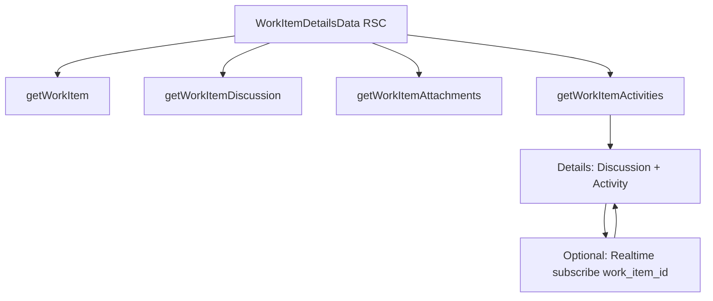

# Work-item activity feed

Status: **Plan**

Timeline of field and related-entity changes on a work item, shown on
`/work-items/[id]` **alongside** Discussion (comments). Complements the
per-user `notifications` inbox; does not replace it.

Related:

- Feature index: [README.md](./README.md)
- Attachments: [ATTACHMENTS.md](./ATTACHMENTS.md)
- Audit columns: [AUDIT_COLUMNS.md](../../database/AUDIT_COLUMNS.md)
- Notifications (inbox): `notifications` model + `apps/web/app/dashboard/_components/dashboard-notifications.tsx`
- Schema today: `work_items`, `comments`, `attachments` in `packages/db/prisma/schema.prisma`
- Novu removed — realtime is Supabase client channels + table writes

---

## Goals

- Show a chronological **Activity** stream on work-item details (who changed
  what, when) next to Discussion.
- Persist events in Postgres so history survives reloads and is queryable.
- Prefer writers that cannot be skipped when data changes (API paths and/or
  DB triggers).
- Optionally live-update the open details page via Supabase Realtime on the
  activity table filtered by `work_item_id`.

## Non-goals (v1)

- Replacing `notifications` (assign / mention inbox stays user-targeted)
- Full audit of every column on every related table (start with `work_items`
  core fields + high-signal side effects)
- Diffing TipTap description JSON in the UI (log “description updated” only
  unless we later add structured patches)
- Email / push delivery (out of scope; inbox + in-app only)
- Reintroducing Novu or another third-party notification SaaS

---

## Notifications vs activity

| | **Notifications** | **Activity** |
| --- | --- | --- |
| Audience | One user (`user_id`) | Anyone viewing the work item |
| Purpose | “Something needs your attention” | “What happened on this item” |
| Examples | Assigned to you; mentioned in a comment | Status → Done; assignee changed; attachment added |
| Table (today / planned) | `notifications` (exists) | `activities` (planned) |
| UI | Header inbox | Work-item details (with Discussion) |

Creating an activity row does **not** automatically create a notification.
Notification writers stay explicit (e.g. assign / mention) and may reference
the same `related_item_id`.

---

## Proposed schema

Table name: `activities`.

| Column | Type | Notes |
| --- | --- | --- |
| `id` | UUID PK | `gen_random_uuid()` |
| `work_item_id` | UUID FK → `work_items` | `ON DELETE CASCADE` |
| `actor_id` | UUID FK → `users` | Who caused the change; nullable if system/trigger without actor |
| `action` | enum / text | e.g. `created`, `updated`, `attached`, `detached`, `commented` |
| `field` | text nullable | e.g. `status`, `assignee_id`, `sprint_id`, `title` |
| `old_value` | text / jsonb nullable | Serialized prior value (ids resolved to labels at read time or stored as display strings) |
| `new_value` | text / jsonb nullable | Serialized new value |
| `meta` | jsonb nullable | Extra context (attachment name, comment id, etc.) |
| `created_at` | timestamptz | Event time (immutable; no `updated_at` required) |

Optional: standard `created_by` if we want consistency with [AUDIT_COLUMNS.md](../../database/AUDIT_COLUMNS.md); for an append-only log, `actor_id` + `created_at` may be enough.

### Action enum (draft)

```text
created | field_changed | attachment_added | attachment_removed | commented
```

`field_changed` uses `field` + `old_value` / `new_value`. Side effects that are
not a single column on `work_items` use dedicated actions + `meta`.

Indexes:

- `(work_item_id, created_at DESC)` for details feed
- optional `(actor_id, created_at DESC)` for “my recent changes”

RLS: authenticated users who can read the work item can `SELECT`; inserts via
service role / trusted API (and triggers running as security definer if used).

---

## How events get written

Two complementary approaches; lock one primary for v1.

### A. Application writers (API / services)

On successful mutations in Express (work-item PATCH, attachment create/delete,
comment create), insert one or more activity rows in the same request path.

| Pros | Cons |
| --- | --- |
| Easy to attach `actor_id` from JWT | Easy to forget a code path |
| Fits existing DI / service layer | Direct Supabase RSC writes bypass API |

### B. Postgres triggers

`AFTER UPDATE` on `work_items` (and optionally `attachments` / `comments`)
compares `OLD`/`NEW` and inserts activity rows.

| Pros | Cons |
| --- | --- |
| Hard to skip if the row changes | Actor attribution needs `updated_by` (or session GUC) set correctly |
| Covers non-API writers | Harder to test; migration ownership in `packages/db` |

**Recommended direction (to lock in implementation):**

1. **v1:** Application writers on known API paths + ensure `updated_by` is always
   set on `work_items` updates (already audit practice).
2. **v1.1 / hardening:** Trigger on `work_items` for core fields as a safety net
   (dedupe or “source of truth” policy TBD if both fire).

Do **not** log every `updated_at`-only touch as activity.

---

## Data loading (details page)

Follow the same fan-out as Discussion and Attachments ([PERFORMANCE.md](../../guides/PERFORMANCE.md)):

```ts
const [workItem, initialComments, initialAttachments, initialActivities] =
  await Promise.all([
    getWorkItem(workItemId),
    getWorkItemDiscussion(workItemId),
    getWorkItemAttachments(workItemId),
    getWorkItemActivities(workItemId), // RSC / server reader — metadata only
  ]);
```

- Prefer RSC/server reader over Express GET on the hot path for the list.
- Paginate or `LIMIT` (e.g. latest 50) if feeds grow large; “Load more” later.



---

## UI (work-item details)

Today Discussion is a section under the main column (`CommentsFeed` in
`workItem-details.tsx`). Activity should sit **with** that conversation area,
not in the sidebar.

**Locked UI direction:** Tabs — replace the current `Discussion ({n})` heading
inside `CommentsFeed` with a shared tab bar.

| Option | Shape |
| --- | --- |
| **A. Tabs** (chosen) | Tab bar is the section chrome: `Discussion` \| `Activity` (counts optional on labels) |
| **B. Stacked sections** | Discussion then Activity (or reverse) — rejected for v1 |
| **C. Combined stream** | Single feed mixing comments + activity — defer |

### Tab bar replaces Discussion heading

Today `CommentsFeed` renders a heading like `Discussion ({stats.active})`
(`apps/web/app/comments/_components/comments-feed.tsx`). For Activity:

1. **Hide / remove** that standalone `Discussion (n)` heading on the work-item
   details page (do not leave both a heading and tabs).
2. **Replace it** with a tab bar as the only section title control, e.g.:
   - `Discussion` (optional count badge)
   - `Activity` (optional count badge)
3. Tab bar row layout: tabs on the left; **maximize icon button on the right**
   (see Fullscreen below) — mirror description commands bar (`ml-auto` on the
   button).
4. Active tab shows either the existing comments UI or the activity list.
5. Empty states stay per tab (“No comments yet” / “No activity yet”).

Prefer shared tabs from `@repo/ui` if a Tabs primitive already exists; otherwise
compose with existing button/toggle patterns without inventing a one-off chrome.

### Fullscreen / maximize (like description)

Match the work-item **description** maximize pattern
(`workItem-description-editor.tsx`, `workItem-description-editor-commandsBar.tsx`):

1. **Tab bar chrome:** one row — Discussion \| Activity tabs on the left;
   **right corner:** icon-only `Button` (`size="icon"`, `variant="ghost"`,
   `className="ml-auto …"`) with `Maximize2` when inline and `Minimize2` when
   fullscreen — same control as description editor mode (not a text label).
2. `title` / accessible label: e.g. “Maximize section” / “Minimize section”.
3. When maximized, expand the **whole section** (active tab + its content), not
   only the comment composer or activity list in isolation.
4. Use the same UX mechanics as description:
   - `fixed inset-0 z-50` viewport takeover
   - lock `document.body` scroll while open
   - toggle back to inline layout on minimize
5. Preserve the **active tab** (Discussion vs Activity) across maximize/minimize
   so users stay in conversation or observation mode.
6. Goal: full-fidelity engagement — long threads, replies, and activity history
   without fighting the cramped details column.

Reuse or extract a small shared “section maximize” hook/wrapper if description
and this section would duplicate layout logic; keep behavior and button placement
consistent.

Row rendering (v1):

- Relative time + actor avatar/name
- Humanized line: e.g. `Alex changed status from To do to Done`
- No need for full JSON viewer; link to attachment/comment when `meta` has ids

Realtime (optional v1):

- Client channel on `activities` with filter `work_item_id=eq.<id>`
- Same pattern as dashboard inbox listening on `notifications`

---

## API / DI notes

- New domain slice can follow [DI.md](../../architecture/DI.md): repository +
  service + `createXRouter` when Express endpoints exist; list may stay RSC-only.
- Reuse `notificationsService` only for user-targeted notify side effects, not
  for writing activity rows.

---

## Rollout checklist

1. Agree schema; add Prisma `activities` model + migration.
2. Server reader `getWorkItemActivities` + wire into details `Promise.all`.
3. Write activity on work-item PATCH (field diffs) and create.
4. Write activity on attachment add/remove (and optionally comment create as
   `commented` — or rely on Discussion only and skip comment activities in v1).
5. **UI chrome:** hide `Discussion (n)` heading; introduce Discussion \| Activity
   tab bar in its place on work-item details (`CommentsFeed` / details shell).
6. Activity list panel behind the Activity tab.
7. **Fullscreen:** maximize/minimize the whole Discussion \| Activity section
   (mirror description editor pattern) for full-fidelity conversation and
   observation.
8. Optional Realtime subscription.
9. Optional trigger safety net; docs → **Living**.

---

## Open decisions

| Topic | Candidates | Notes |
| --- | --- | --- |
| UI layout | Tabs (locked) | Heading `Discussion (n)` → tab bar |
| Fullscreen | Match description maximize | Icon button (`Maximize2` / `Minimize2`) on **right** of tab bar row |
| Tab counts | Show counts vs labels only | Optional; can mirror old `(n)` on Discussion tab |
| Comment events | Activity row vs Discussion-only | Prefer Discussion-only in v1 to avoid duplicate noise |
| Value storage | Raw ids vs display strings | Prefer store ids + resolve labels on read; fallback string for deleted users |
| Writers | API-only vs API + trigger | Prefer API-first |
| Description | Log opaque “updated” vs omit | Prefer opaque “description updated” |

Lock remaining items in this doc’s **Locked decisions** section when implementation starts.
