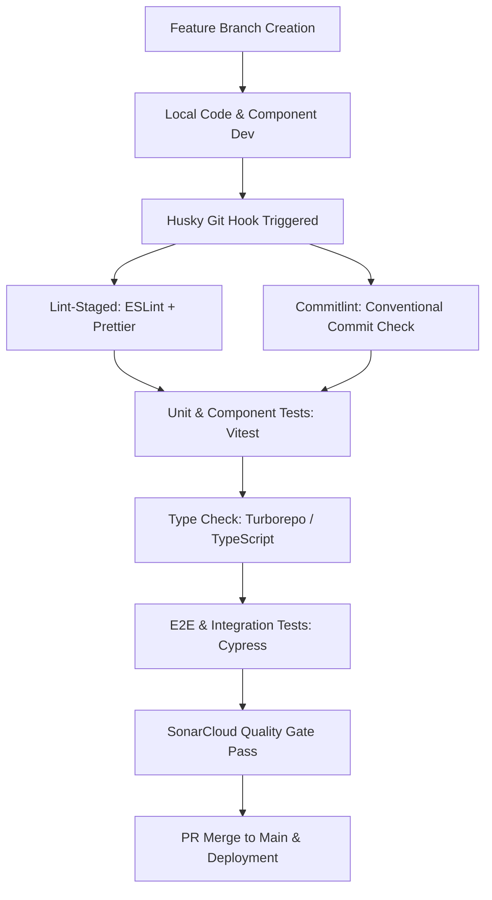

# Project Development & Testing Flow Guide

**Status**: Living  
**Audience**: Software Engineers, QA Engineers, DevOps  
**Last Updated**: July 2026

---

## 1. Overview

This document defines the development management flow and testing architecture for **Alice** (branded as **Jira Teams**). It outlines how features are specified, developed, linted, tested, and validated across the monorepo using **Vitest** for unit/component testing and **Cypress** for end-to-end integration testing.

---

## 2. Project Development & Management Flow

Alice is managed as a high-performing monorepo using **pnpm workspaces** and **Turborepo**. The development lifecycle follows a standardized workflow from initial code change to production build:



### 2.1 Commit & Branch Management

- **Conventional Commits**: Commit messages are enforced using `@commitlint/cli` and `commitizen` (`cz-conventional-changelog`). Developers run `pnpm commit` to interactively construct standard commits (`feat:`, `fix:`, `docs:`, `refactor:`, `test:`).
- **Git Hooks (Husky & lint-staged)**: On git commit, `husky` runs `lint-staged`, executing ESLint, Prettier, and TypeScript checks on staged files before allowing the commit.

### 2.2 Monorepo Task Orchestration (Turborepo)

Turborepo (`turbo.json`) manages task dependencies across workspace packages and applications:

- `pnpm dev`: Runs local development servers concurrently (`apps/web` on `:3000`, `apps/api` on `:5000`).
- `pnpm test`: Runs unit tests across all workspace apps/packages.
- `pnpm lint`: Enforces zero ESLint warnings across apps and packages.
- `pnpm checktypes`: Runs TypeScript `tsc --noEmit` across all apps and packages.
- `pnpm build`: Builds types (`@repo/types`), UI components (`@repo/ui`), database client (`@repo/db`), API server (`apps/api`), and Next.js web application (`apps/web`).

---

## 3. Testing Architecture

Testing is split into two primary layers to balance execution speed and integration reliability.

```
apps/web/
├── tests/                           # Unit & Component Tests (Vitest + RTL)
│   ├── setup.ts                     # Testing Library setup & mock resets
│   ├── teams/
│   │   ├── team-form.test.tsx       # Team creation/management unit tests
│   │   └── team-registry.test.tsx   # Team listing & member management tests
│   ├── projects/
│   │   ├── project-form.test.tsx    # Project create/edit modal tests
│   │   └── project-registry.test.tsx# Project table, search, filters tests
│   ├── sprints/
│   │   ├── sprint-form.test.tsx     # Sprint creation modal tests
│   │   └── sprint-list.test.tsx     # Sprint management & status filter tests
│   └── users/
│       ├── user-form.test.tsx       # User creation & edit form tests
│       └── user-registry.test.tsx   # User directory & active toggle tests
└── cypress/                         # Integrated / E2E Tests (Cypress)
    ├── e2e/
    │   ├── home.cy.ts               # Core app navigation & header checks
    │   └── sprints.cy.ts            # Sprint lifecycle & work item assignment E2E
    └── support/                     # Cypress custom commands & helpers
```

### 3.1 Unit & Component Testing Layer

- **Framework**: [Vitest](https://vitest.dev/) with `happy-dom` environment and `@testing-library/react`.
- **Configuration**: Defined in [apps/web/vitest.config.ts](../../apps/web/vitest.config.ts).
- **Setup & Mocks**: Global test setup is handled in [apps/web/tests/setup.ts](../../apps/web/tests/setup.ts), extending `@testing-library/jest-dom` and performing `vi.clearAllMocks()` after each test execution.
- **Service Mocking Strategy**: Feature components mock API services (e.g. `@/app/projects/_services/projects.service`) using Vitest `vi.fn()` to isolate UI components from network calls.

### 3.2 Integration & End-to-End Testing Layer

- **Framework**: [Cypress](https://www.cypress.io/).
- **Configuration**: Configured in [apps/web/cypress.config.ts](../../apps/web/cypress.config.ts).
- **Multi-Service Orchestration**: Uses `start-server-and-test` to automatically launch web (`:3000`) and API (`:5000`) dev servers before executing headless Cypress test suites (`pnpm test:e2e`).
- **Database & Fixture Cleanup**: Includes Node event tasks in `cypress.config.ts` (`cleanTestSprints`) to clean up test-generated data in Supabase Postgres after test suite execution.

---

## 4. Feature & Testing Matrix

The table below maps all project features to their implementation paths, descriptions, unit test suites, and integrated test suites:

| Feature                    | Path                                                                                                                     | Description                                                                                                                            | Unit Test Paths                                                                                        | Integrated Test Paths                                                     |
| :------------------------- | :----------------------------------------------------------------------------------------------------------------------- | :------------------------------------------------------------------------------------------------------------------------------------- | :----------------------------------------------------------------------------------------------------- | :------------------------------------------------------------------------ |
| **Users Management**       | `apps/web/app/users`<br>`apps/web/app/users/_components/`<br>`apps/web/app/users/_services/users.service.ts`             | User registry directory, role assignment (Admin, Manager, Member), user status toggle (active/inactive), and profile management.       | `apps/web/tests/users/user-form.test.tsx`<br>`apps/web/tests/users/user-registry.test.tsx`             | `apps/web/cypress/e2e/home.cy.ts`                                         |
| **Team Management**        | `apps/web/app/_components/team-*`<br>`apps/web/app/users/_components/team-form.tsx`                                      | Team creation, member lookup and assignment, team registry listing, and team lead configuration.                                       | `apps/web/tests/teams/team-form.test.tsx`<br>`apps/web/tests/teams/team-registry.test.tsx`             | `apps/web/cypress/e2e/home.cy.ts`                                         |
| **Projects Management**    | `apps/web/app/projects`<br>`apps/web/app/projects/_components/`<br>`apps/web/app/projects/_services/projects.service.ts` | Project creation, project key generator, manager allocation, project list search/filtering, and project details configuration.         | `apps/web/tests/projects/project-form.test.tsx`<br>`apps/web/tests/projects/project-registry.test.tsx` | `apps/web/cypress/e2e/home.cy.ts`                                         |
| **Sprints Management**     | `apps/web/app/sprints`<br>`apps/web/app/sprints/_components/`<br>`apps/web/app/sprints/_services/sprints.service.ts`     | Sprint planning, start/complete sprint lifecycle, sprint duration dates, goal tracking, and sprint list filters.                       | `apps/web/tests/sprints/sprint-form.test.tsx`<br>`apps/web/tests/sprints/sprint-list.test.tsx`         | `apps/web/cypress/e2e/sprints.cy.ts`                                      |
| **Work Items & Backlog**   | `apps/web/app/work-items`<br>`apps/web/app/backlog`<br>`apps/web/app/work-items/_components/`                            | Work item creation (Story, Task, Bug, Epic), estimation, sprint allocation, backlog prioritization, and TipTap rich text descriptions. | `apps/web/tests/sprints/sprint-list.test.tsx`                                                          | `apps/web/cypress/e2e/sprints.cy.ts`                                      |
| **Kanban / Active Board**  | `apps/web/app/board`<br>`apps/web/app/board/_components/`                                                                | Interactive kanban board visualization, drag-and-drop column transitions (To Do, In Progress, Done), and assignee quick-filters.       | `apps/web/tests/sprints/sprint-list.test.tsx`                                                          | `apps/web/cypress/e2e/sprints.cy.ts`                                      |
| **Dashboard & Metrics**    | `apps/web/app/dashboard`<br>`apps/web/app/dashboard/_components/`                                                        | Analytics summary, role-based dashboard views (Admin/Manager/Member), velocity tracking, and sprint overview widgets.                  | `apps/web/tests/teams/team-registry.test.tsx`                                                          | `apps/web/cypress/e2e/home.cy.ts`                                         |
| **Auth & RBAC Middleware** | `apps/web/app/login`<br>`apps/web/app/signup`<br>`apps/web/proxy.ts`<br>`apps/web/app/auth/`                             | Supabase Auth integration, OAuth, magic links, session cookies, password reset, and Next.js middleware route protection.               | `apps/web/tests/setup.ts`                                                                              | `apps/web/cypress/e2e/home.cy.ts`                                         |
| **Backend API Service**    | `apps/api/src/`<br>`apps/api/src/routes/`<br>`apps/api/src/controllers/`                                                 | Express REST API server providing backend endpoints, Zod input validation, Novu notification integration, and Supabase DB calls.       | `apps/api` (Vitest configured)                                                                         | `apps/web/cypress/e2e/sprints.cy.ts`<br>`apps/web/cypress/e2e/home.cy.ts` |
| **Shared UI Components**   | `packages/ui/src/`<br>`packages/ui/src/components/`                                                                      | Shared Shadcn & Radix UI accessible component primitives (Buttons, Dialogs, Tables, Form fields, Dropdowns).                           | Workspace unit testing via `@repo/ui`                                                                  | All Cypress E2E flows                                                     |
| **Database & ORM Schema**  | `packages/db/prisma/`<br>`packages/db/src/`                                                                              | Database schema definitions, Prisma ORM queries, Supabase Postgres migrations, and database seed scripts.                              | Schema validation scripts                                                                              | Cypress DB Cleanup Tasks (`cleanTestSprints`)                             |
| **Shared Types & DTOs**    | `packages/types/src/`<br>`packages/types/src/generated/`                                                                 | TypeScript interfaces, Zod validation schemas, and shared type contracts between web and API services.                                 | Typecheck (`pnpm checktypes`)                                                                          | End-to-end type safety verification                                       |

---

## 5. Execution Runbook

### 5.1 Running Unit & Component Tests

To execute unit tests across the web application using Vitest:

```bash
# Run unit tests across all workspace packages
pnpm test

# Run unit tests specifically for the web app
pnpm --filter web test

# Run unit tests in interactive watch mode
pnpm --filter web vitest
```

### 5.2 Running Integration & E2E Tests

To execute Cypress integration tests:

```bash
# Run full E2E test suite in headless mode (starts dev server automatically)
pnpm test:e2e

# Open Cypress Interactive Test Runner for visual debugging
pnpm cypress:open
```

### 5.3 Code Quality & Static Analysis Checks

Run code formatting, linting, and type checking across all monorepo projects:

```bash
# Run TypeScript type check across all projects
pnpm checktypes

# Run ESLint check across all projects
pnpm lint

# Format all files using Prettier
pnpm format
```

---

## 6. Continuous Integration & Quality Gates

- **Pre-commit Checks**: Local git hooks run `lint-staged` on staged files.
- **SonarCloud Integration**: Static security analysis and coverage reporting configured via `sonar-project.properties` and `.sonarcloud.properties`.
- **CI Build Pipeline**: Automated builds run `pnpm checktypes`, `pnpm lint`, `pnpm test`, and `pnpm test:e2e` before allowing PR merges to `main`.
